# 一、什么是集群技术？（Cluster）

集群是一种计算机系统，它通过一组松散集成的计算机软件和/或硬件连接起来高度紧密地协作完成计算工作。在某种意义上，他们可以被看作是一台计算机。集群系统中的单个计算机通常称为节点，通常通过局域网连接，但也有其它的可能连接方式。集群计算机通常用来改进单个计算机的计算速度和/或可靠性。一般情况下集群计算机比单个计算机，比如工作站或超级计算机性能价格比要高得多。


>  高并发解决方案：
>
> 1. 换高性能服务器（采用更快的cup，增加更多的内存）。
> 2. 增加服务器，多台服务器来完成相同的服务。


# 二、集群技术的目的

1. 增强可靠性

   集群技术使系统在<font color=red>故障发生时仍可以继续工作</font>，将系统停运时间减到最小。集群系统在提高系统的可靠性的同时，也大大减小了故障损失。

2. 提高性能

   一些计算密集型应用，如:科学研究、天气预报、核试验模拟等，需要计算机要有很强的运算处理能力，现有的技术，即使普通的大型机其计算也很难胜任。这时，一般都使用计算机集群技术，集中几十台甚至上百台计算机的运算能力来满足要求。<font color=red>提高处理性能一直是集群技术研究的一个重要目标之一。</font>

3. 提高可扩展性
   用户若想扩展系统能力，不得不购买更高性能的服务器，才能获得额外所需的CPU和存储器。如果采用集群技术，则只需要将新的服务器加入集群中即可，对于客户来看，是<font color=red>完全透明</font>的，服务无论从连续性还是性能上都几乎没有变化，好像系统在不知不觉中完成了升级。

4. 降低成本
   通常一套较好的集群配置，其软硬件开销要超过10W美元。但与价值上百万美元的专用超级计算机相比已属相当便宜。在达到同样性能的条件下，采用计算机集群比采用同等运算能力的大型计算机具有<font color=red>更高的性价比</font>。


# 三、集群系统的分类

1. 高性能计算集群(HPC High-Performance Cluster)
   也叫<font color=red>科学集群</font>，充分利用集群中的每一台计算机的资源，实现复杂运算的并行计算，以解决复杂的科学问题。通常用于科学计算领域，比如基因分析，化学分析等。
2. 高可用性集群(HAC High-Availability Cluster)
   高可用性集群的主要目的是为了使集群的整体服务尽可能持续可用，当主服务器故障时，备份服务器能够自动接管主服务器的工作，并及时切换过去，以实现对用户的<font color=red>不间断、不停机服务</font>。
3. 负载均衡集群(LBC LoadBalancing Cluster)
   负载均衡集群的每个节点都可以承担一定的处理负载，并且可以实现处理负载在节点之间的<font color=red>动态分配</font>，以实现负载均衡。集群中所有的节点都处于活动状态，它们分摊系统的工作负荷（将大量的并发请求分担到多个处理节点。由于单个处理节点的故障不影响整个服务，负载均衡集群同时也实现了高可用性）。


# 四、分布式集群系统
分布式是指将不同的业务分布在不同的地方。集群指的是将几台服务器集中在一起，实现同一业务。分布式中的每一个节点，都可以做集群。而集群并不一定就是分布式的。

举例:就比如新浪网，访问的人多了，他可以做一个群集，前面放一个响应服务器，后面几台服务器完成同一业务，如果有业务访问的时候，响应服务器看哪台服务器的负载压力小，就将给哪一台去完成。

而分布式，从窄意上理解，也跟集群差不多，但是它的组织比较松散;不像集群，有一个组织性，一台服务器垮了，其它的服务器可以顶上来。分布式的每一个节点，都完成不同的业务，一个节点垮了，哪这个业务就不可访问了。


> - 分布式:一个业务分拆多个子业务，部署在不同的服务器上;
> - 集群:同一个业务，部署在多个服务器上。
> - 分布式系统是以缩短单个任务的执行时间来提升效率的，而集群系统则是通过提高单位时间内执行的任务数来提升效率。


# 五、服务器集群系统
服务器集群系统就是指通过集群技术将很多服务器集中起来一起进行同一种服务，在客户端看来就像是只有一个服务器。

现在的中大型企业都用到了服务器集群系统，比如:百度、新浪、网易、腾讯、淘宝、京东等等。

然而，对于服务器集群系统来说，用户访问的域名网址都是一样的，那么用户的具体访问请求会交给集群中的哪个服务器来处理?如果有海量访问请求，那么集群系统到底怎么分配这些请求任务给集群中的每台服务器?并且保证等待时间在用户承受范围完成响应?同时也要保证服务器能够承受这么大处理量? 


# 六、负载均衡

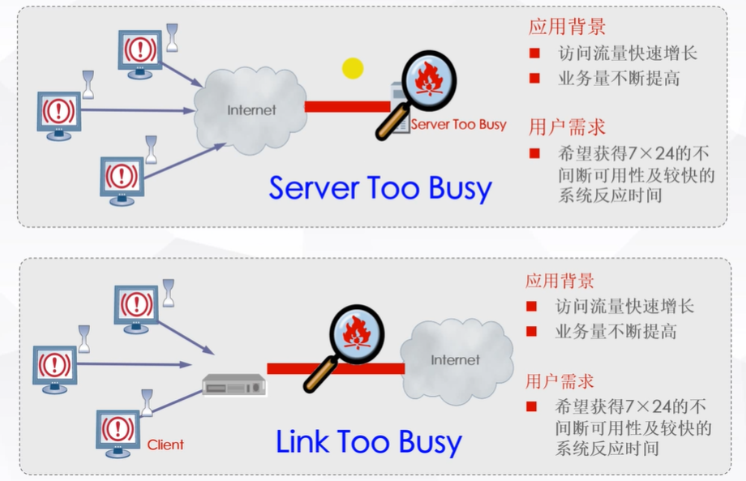


# 七、什么是负载均衡(Load Balance)?

当一台服务器的单位时间内的访问量越大的时候，服务器的压力会越大。当一台服务器压力大得超过自身的承受能力的时候，服务器会崩溃。为了避免服务器崩溃，让用户有更好地体验，我们通常通过负载均衡的方式来分担服务器的压力。那么什么是负载均衡呢?当用户访问我们网站的时候，先访问一个中间服务器，再让这个中间服务器在服务器集群中选择一个压力较小的服务器，然后将该访问请求引入该选择的服务器。这样，用户的每次访问，都会保证服务器集群中的每个服务器的压力趋于平衡，分担了服务器的总体压力，避免了服务器崩溃的情况。


# 八、解决方案

- **服务器负载均衡**

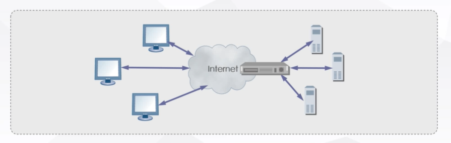

多台服务器组成一个群组，它们通过网络设备相连接。这些服务器提供相同或相似的网络服务。服务器群组前布局一个负载均衡设备，负责根据已配置均衡策略将用户请求在服务器群组中的分发，为用户提供服务，并对服务器可用性的维护。

1. 调度算法
   根据配置规则，将客户端请求智能地分发到后端应用服务器
2. 健康性检查算法
   实时监控服务器运行状态


- **链路负载均衡**

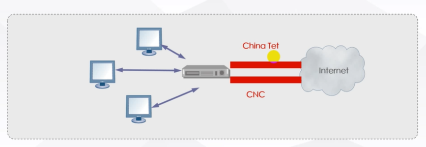

通过带宽或就近性等算法，在多条链路中进行负载均衡，选择最优的链路，提高访问速度。


# 九、负载均衡的分类（地理结构）

**本地负载均衡技术**
本地负载均衡技术是对本地服务器集群进行负载均衡处理。该技术通过对服务器进行性能优化，使流量能够平均分配在服务器群中的各个服务器上，其能有效地解决数据流量过大、网络负荷过重的问题，并且不需花费昂贵开支购置性能卓越的服务器，充分利用现有设备，避免服务器单点故障造成数据流量的损失。

**全局负载均衡技术(广域负载均衡)**
全局负载均衡技术适用于拥有多个地域的服务器集群的大型网站系统。全局负载均衡技术是对分布在全国各个地区的多个服务器进行负载均衡处理，该技术可以通过对访问用户的IP地理位置判定，自动转向地域最近点的服务器集群。也可用于子公司分散站点分布广的大公司通过Intranet（企业内部互联网）来达到资源统一合理分配的目的。


# 十、负载均衡的实现方式


**软件负载均衡技术**

该技术适用于一些中小型网站系统，可以满足一般的均衡负载需求。软件负载均衡技术是指在服务器集群中的代理服务器上安装一个相应的负载均衡软件来实现的一种负载均衡技术。软件可以很方便的安装在服务器上，并且能实现一定的负载均衡功能。软件负载均衡技术配置简单、操作也方便，最重要的是成本很低。


**硬件负载均衡技术**

由于硬件负载均衡技术需要额外的增加负载均衡器，成本比较高，适用于流量高的大型网站系统。不过在现在较有规模的企业、政府网站，一般来说都会部署有硬件负载均衡设备（原因:1.硬件设备更稳定旳2效率高、更合规达标）硬件负载均衡技术是在多台服务器间安装相应的负载均衡设备(负载均衡器)来完成均衡负载技术，与软件负载均衡技术相比，能达到更好的负载均衡效果。


# 十一、负载均衡算法(常用)

- 轮询（Round Robin)
- 加权轮询（Weighted Round Robin)
- 最少连接（Least Connections）
- 加权最少连接（Weighted Least Connections)
- 随机（Random）
- 加权随机Weighted Random）
- 源地址散列(Source Hashing)
- 源地址端口散列（Source&Port Hashing)
- 目的地址散列（Destination Hashing)


# 十二、实现机制
任何的负载均衡技术都要想办法建立某种一对多的映射机制:一个请求的入口映射到多个处理请求的节点，从而实现分而治之(Divide and Conquer)，这种映射机制使得多个物理存在对外体现为一个虚拟的整体，对服务的请求者屏蔽了内部的结构。

采用不同的机制建立映射关系，可以形成不同的负载均衡技术，常见的包括:

- DNS
- CDN
- IP负载均衡


# 十三、IP负载均衡

- IP负载均衡是基于特定的TCP/IP技术实现的负载均衡;可以使用硬件设备，也可以使用软件实现。
- 硬件设备的主要产品是F5-BIG-IP-GTM（简称F5);
- 软件产品主要有LVS、HAProxy、NginX。其中LVS、HAProxy可以工作在4-7层，NginX工作在7层。
- 硬件负载均衡设备可以将核心部分做成芯片，性能和稳定性更好，而且商用产品的可管理性、文档和服务都比较好。唯一的问题就是价格比较高。
- 软件负载均衡通常是开源软件，自由度较高，但学习成本和管理成本会比较大。


# 十四、LVS实现负载均衡（系统&内核）

LVS(Linux Virtual Server，Linux虚拟服务器），目前已经集成到Linux内核中。

基于不同的网络技术，LVS支持多种负载均衡机制。包括:VS/NAT（基于网络地址转换技术）、VS/TUN（基于IP隧道技术）和VS/DR（基于直接路由技术）。

此外，为了适应不同的需要，淘宝开发了VS/FULLNAT，从本质上来说也是基于网络地址转换技术。最近还有一个基干VS/FIUILINAT的DNAT模块。

不管使用哪种机制，LVS都不直接处理请求，而是将请求转发到后面真正的服务器(Real Server)。不同的机制，决定了响应包如何返回到客户端。

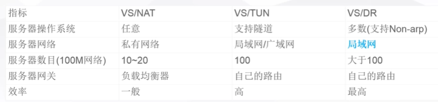


# 十五、负载均衡集群

> Apache2.4 （门面服务器，静态资源处理） + Tomcat8集群 （业务处理）
>
> 基于HTTP重定向的web服务系统

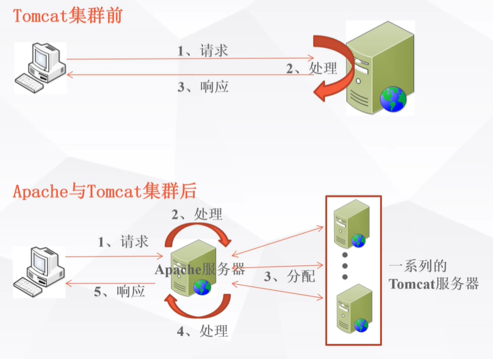


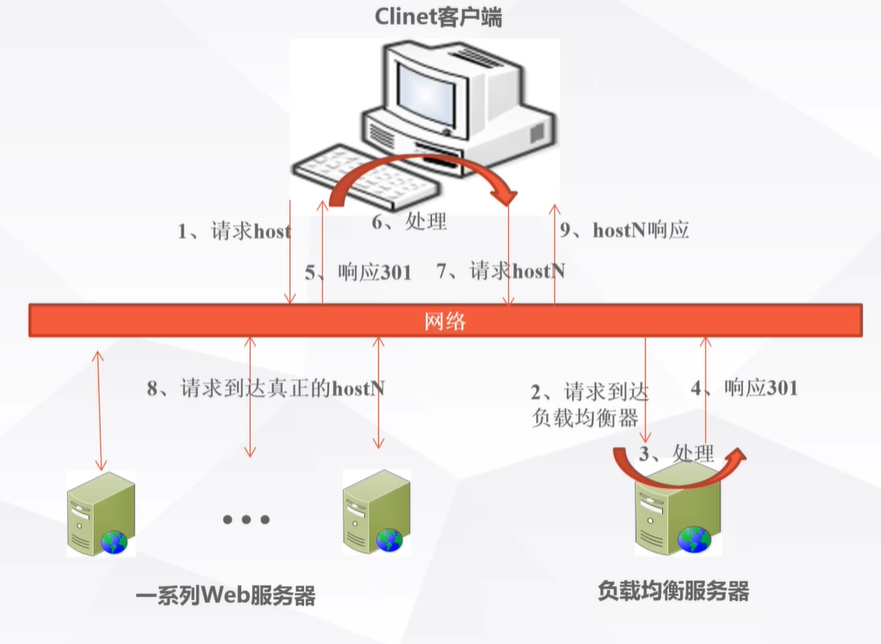


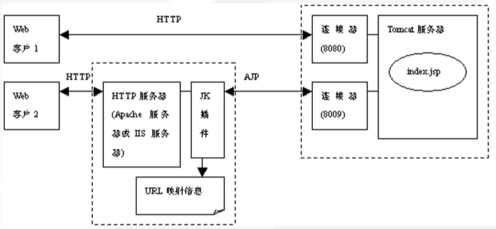


# 十六、Apache+Tomcat负载均衡集群配置


## Win10


1. **下载安装文件**

   - httpd-2.4.41-win64-VC14.zip

     https://www.apachelounge.com/download/VC14/

   - tomcat-connectors-1.2.40-windows-x86_64-httpd-2.4.x.zip

     http://archive.apache.org/dist/tomcat/tomcat-connectors/jk/binaries/windows/

   - apache-tomcat-8.5.11-windows-x64.zip

     https://archive.apache.org/dist/tomcat/tomcat-8/v8.5.11/bin/

   > 如果版本不对应，可能会出现错误。导致不能正常配置。

2. **安装apache服务器**

   1. 打开conf文件夹，找到` Define SRVROOT`，对应的路径填写apache服务安装的路径。找到`ServerName`配置域名为localhost。

      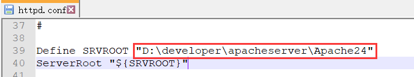

      

      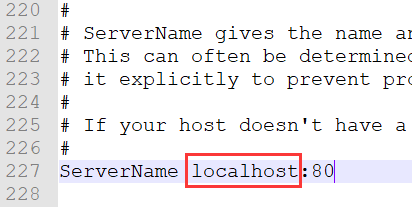

      

   2. 通过管理员身份打开cmd窗口，执行安装命令。

      | 操作           | 命令               |
      | -------------- | ------------------ |
      | 启动           | httpd -k start     |
      | 停止           | httpd -k stop      |
      | 重启           | httpd -k restart   |
      | 安装           | httpd -k install |
      | 卸载           | httpd -k uninstall |
      | 测试配置语法   | httpd -t           |
      | 版本详细信息   | httpd -V           |
      | 命令行选项列表 | httpd -h           |

   3. 安装成功，浏览器访问`localhost:80`，出现`It works`字样，表示安装成功。

   4. 安装过程中可能出现的问题

      - 端口占用问题

        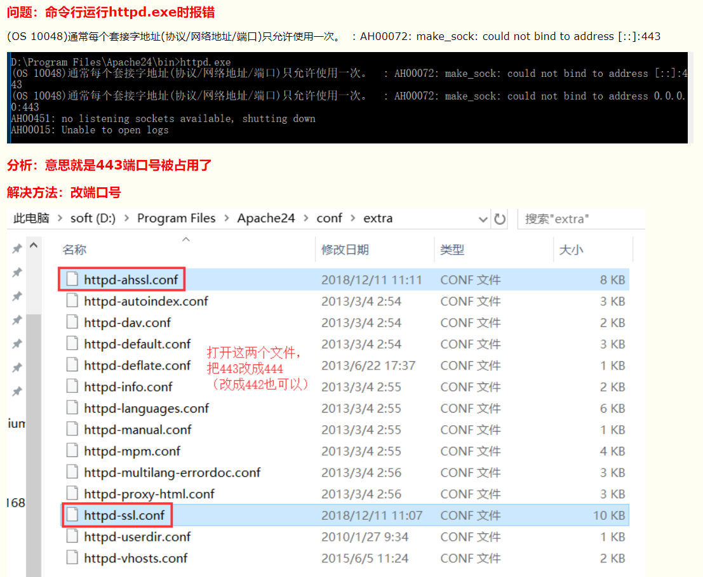

      - 缺失dll文件

        https://www.microsoft.com/zh-CN/download/details.aspx?id=48145

        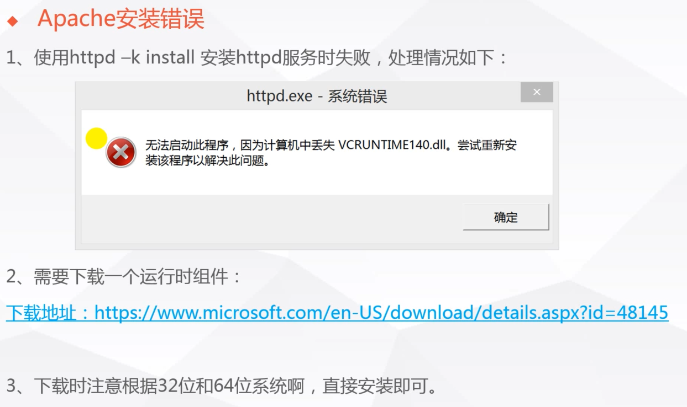

3. **部署Tomcat集群**

   1. server.xml

      ```
      # 拷贝三份tomcat文件依次设置
      
      1. <Server port="7005" shutdown="SHUTDOWN">... # port 7005,8005,9005
      
      2. <Connector port="7080" protocol="HTTP/1.1"... # port 7080,8080,9080
      
      3. <Connector protocol="AJP/1.3"
                     address="::1"
                     port="7009" # port 7009,8009,9009
                     redirectPort="8443" />...
                     
      4. <Cluster className="org.apache.catalina.ha.tcp.SimpleTcpCluster"/>
      
      5. <Engine name="Catalina" defaultHost="localhost" jvmRoute="tomcat1">
      ```

   2. web.xml

      ```
      <distributable/>
      ```

   3. index.jsp

      ```jsp
      <%@ page language="java" contentType="text/html; charset=UTF-8"
          pageEncoding="UTF-8"%>
      <%@ page language="java" import="java.util.*" pageEncoding="UTF-8"%>
      <%@ page import="java.text.SimpleDateFormat"%>
      <!DOCTYPE html>
      <html>
      	<head>
      		<meta charset="UTF-8">
      		<title>Insert title here</title>
      	</head>
      	<body>
      		<%
      			// 如果有新的session属性设置
      			String dataName = request.getParameter("dataName");
      			if (dataName != null && !dataName.isEmpty()) {
      				String dataValue = request.getParameter("dataValue");
      				session.setAttribute(dataName, dataValue);
      			}
      		%>
      		
      		Server Info:
      		<% 
      			String date = new SimpleDateFormat("yvyy-MM-dd hh:mmn:ss").format(new Date());
      			out.println("<br>[ "+request.getLocalAddr()+" :" +request.getLocalPort()+"]" + date + "<br><br>");
      		%>
      		
      		session info:
      		<%
      			out.println("<br> Session Id : " + session.getId() + "<br>");
      			Enumeration e = session.getAttributeNames();
      			while(e.hasMoreElements()) {
      				String name = (String)e.nextElement();
      				String value = (String)session.getAttribute(name);
      				out.print(name + " = " + value + "<br>");
      			}
      		%>
      		
      		<form action="index.jsp" method="post">
      			dataName : <input type="text" name="dataName">
      			<br>
      			dataValue : <input type="text" name="dataValue">
      			<br>
      			<input type="submit" value="提交">
      		</form>
      	</body>
      </html>
      ```

4. **apache负载均衡配置**

   1. 解压`tomcat-connectors-1.2.40-windows-x86_64-httpd-2.4.x.zip`压缩包，获得`mod_jk.so`文件，并拷贝到`%APACHE_HOME%\modules`目录下。

   2. 在conf目录下创建workers.properties文件

      ```properties
      worker.list=controller,tomcat1,tomcat2,tomcat3
      # 1
      worker.tomcat1.port=7009
      worker.tomcat1.host=127.0.0.1
      worker.tomcat1.type=ajp13
      worker.tomcat1.lbfactor=1
      # 2
      worker.tomcat2.port=8009
      worker.tomcat2.host=127.0.0.1
      worker.tomcat2.type=ajp13
      worker.tomcat2.lbfactor=1
      # 3
      worker.tomcat3.port=9009
      worker.tomcat3.host=127.0.0.1
      worker.tomcat3.type=ajp13
      worker.tomcat3.lbfactor=1
      # controller
      worker.controller.type=lb
      worker.controller.balanced_workers=tomcat1,tomcat2,tomcat3
      worker.controller.sticky_session=false
      ```

   3. 在conf目录下创建mod_jk.conf文件

      ```
      LoadModule jk_module modules/mod_jk.so
      JkWorkersFile D:\developer\apacheserver\Apache24\conf\workers.properties
      JkMount /* controller
      ```

   4. 编辑conf目录下的httpd.conf文件，在文件最后添加如下内容

      ```
      httpd.conf
      ```

5. 负载均衡集群搭建成功，访问localhost:80端口访问tomcat中的内容。


## CentOS