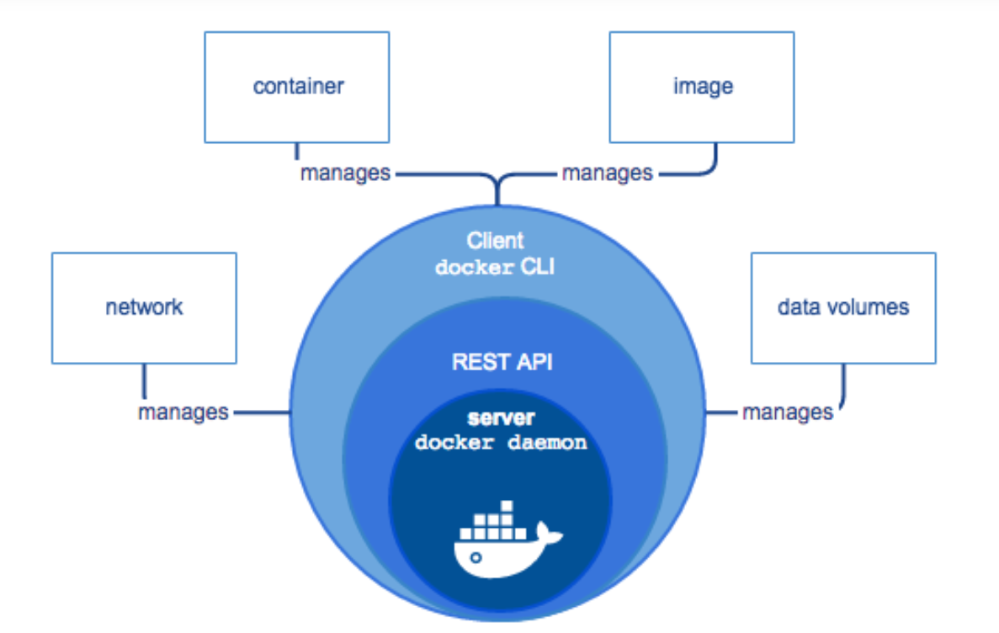
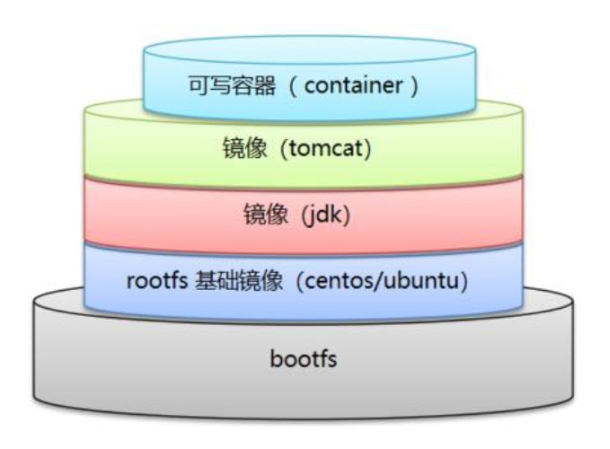
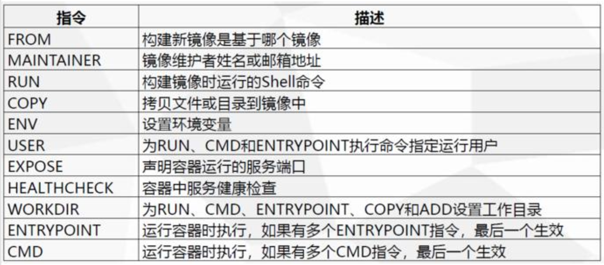

# 常用命令

```shell
# 启动docker
systemctl start docker

# 停止docker
systemctl stop docker

# 重启docker
systemctl restart docker

# 查看docker状态
systemctl status docker

# 开机启动
systemctl enable docker

# 查看容器
docker images

# 

```


# 国内源

```json
{
  "registry-mirrors": [
    "https://registry.docker-cn.com",
    "http://hub-mirror.c.163.com",
    "https://docker.mirrors.ustc.edu.cn"
  ]
}

http://mirrors.aliyun.com/docker-ce/linux/centos/docker-ce.repo
```

Docker中国区官方镜像
https://registry.docker-cn.com

网易
http://hub-mirror.c.163.com

ustc 
https://docker.mirrors.ustc.edu.cn

中国科技大学
https://docker.mirrors.ustc.edu.cn


# oracle

```shell
docker run -d -p 1521:1521 --name oracle registry.aliyuncs.com/helowin/oracle_11g

[root@localhost ~]# docker ps
CONTAINER ID        IMAGE                                      COMMAND
a151f9478f94        registry.aliyuncs.com/helowin/oracle_11g   "/bin/sh -c '/home/o…"   

docker start oracle

docker exec -it oracle bash
```


启动Oracle

```shell
# 前提启动容器
systemctl start docker

# 1. 启动Oracle
docker start oracle

# 2. 进入容器
docker exec -it oracle bash
docker exec -it idxxx /bin/bash

# 3. 刷新配置
source ~/.bash_profile
```


# 一、安装与卸载Docker

```
# 删除可能的内置docker
sudo yum remove docker \
                  docker-client \
                  docker-client-latest \
                  docker-common \
                  docker-latest \
                  docker-latest-logrotate \
                  docker-logrotate \
                  docker-engine
                  
# 需要的安装包
sudo yum install -y yum-utils


# 设置镜像
sudo yum-config-manager \
    --add-repo \
    https://download.docker.com/linux/centos/docker-ce.repo
# 阿里镜像
sudo yum-config-manager \
    --add-repo \
    http://mirrors.aliyun.com/docker-ce/linux/centos/docker-ce.repo

# 更新yum件包索引
yum makecache fast

# 安装docker
sudo yum install docker-ce docker-ce-cli containerd.io

# 启动
sudo systemctl start docker

# 测试
sudo docker run hello-world

# 查看
docker images

# 卸载
sudo yum remove docker-ce docker-ce-cli containerd.io

# 删除docker下载的资源
sudo rm -rf /var/lib/docker
```


# 阿里镜像加速

> https://cr.console.aliyun.com/cn-hangzhou/instances/mirrors

```shell
sudo mkdir -p /etc/docker
sudo tee /etc/docker/daemon.json <<-'EOF'
{
  "registry-mirrors": ["https://hn3mnwj7.mirror.aliyuncs.com"]
}
EOF
sudo systemctl daemon-reload
sudo systemctl restart docker
```


# 二、常用命令

> 官网地址：https://docs.docker.com/engine/reference/run/

## 帮助命令

```shell
docker version		# 显示docker的版本信息
docker info			# 显示docker的系统信息，包括镜像和容器的数量
docker 命令 --help	# 帮助命令
```


## 镜像命令

**查看**

docker images

查看所有镜像

```shell
[root@localhost ~]# docker images
REPOSITORY          TAG                 IMAGE ID            CREATED             SIZE
hello-world         latest              bf756fb1ae65        4 months ago        13.3kB

# 解释
REPOSITORY		镜像的仓库源
TAG				镜像的标签
IMAGE ID		镜像的id
CREATED			创建时间
SIZE			镜像的大小

# 参数
Options:
  -a, --all             显示所有镜像
      --digests         显示摘要
  -f, --filter filter   Filter output based on conditions provided
      --format string   Pretty-print images using a Go template
      --no-trunc        Don't truncate output
  -q, --quiet           Only show numeric IDs
```


**搜索**

docker search

```shell
docker search mysql

docker search mysql --filter=STARS=3000 # 会寻找大于3000的
```

**下载**

docker采用分层下载

```shell
docker pull mysql[:tag]
docker pull mysql
docker pull docker.io/library/mysql:latest
docker pull mysql:5.7
```

```shell
[root@iZhnut6qtyqg4bZ /]# docker pull mysql
Using default tag: latest # 如果不指定版本就是latest
latest: Pulling from library/mysql
bb79b6b2107f: Pull complete 	# 分层下载，docker image的核心 联合文件系统
49e22f6fb9f7: Pull complete 
842b1255668c: Pull complete 
9f48d1f43000: Pull complete 
c693f0615bce: Pull complete 
8a621b9dbed2: Pull complete 
0807d32aef13: Pull complete 
a56aca0feb17: Pull complete 
de9d45fd0f07: Pull complete 
1d68a49161cc: Pull complete 
d16d318b774e: Pull complete 
49e112c55976: Pull complete 
Digest: sha256:8c17271df53ee3b843d6e16d46cff13f22c9c04d6982eb15a9a47bd5c9ac7e2d # 签名
Status: Downloaded newer image for mysql:latest
docker.io/library/mysql:latest # 真实地址

# 等价
docker pull mysql
docker pull docker.io/library/mysql:latest # 真实地址
```


**删除**

```shell
docker rmi -f 容器id
docker rmi -f 容器id 容器id ...
docker rm -f $(docker ps -aq) # 删除全部，也可以通过filter进行条件删除
docker ps -a -q|xargs docker rm # 删除所有容器
```


## 容器命令

> 有了镜像才可以创建容器，linux，下载一个contos7镜像

```shell
docker pull contos:7
```

**新建容器并启动**

```shell
docker run [OPTIONS] IMAGE[:TAG|@DIGEST] [COMMAND] [ARG...]

# 参数说明
--name="Name"		容器名字，用来区分容器
-d					后台方式运行
-it					使用交互方式运行，进入容器查看内容
-P					（大写）随机指定容器的端口
-p					（小写）指定容器端口
	-p ip:主机端口:容器端口
	-p 主机端口:容器端口
	-p 容器端口

# 测试contos
docker run -it contos /bin/bash
```

**查看运行中的容器**

```shell
docker ps	# 列出当前正在运行的容器
docker ps -a # 列出当前正在运行的容器+带出历史运行过的容器
-n=?	# -n=5 显示最近运行过的5个容器
-q	# 只显示容器编号
```

**退出容器**

```shell
exit # 直接容器停止并退出
Ctrl + P + Q # 退出不停止
```

**启动和停止容器**

```shell
docker start id
docker restart id
docker stop id
docker kill id # 强制停止
```


# 常用其他命令

**后台启动容器**

```shell
# 命令 docker run -d 镜像名
docker run -d centos
# 问题 docker ps， 发现centOS已经停止了
# 常见的坑，docker容器使用后台运行，就必须要有一个前台进程，docker发现没有应用就会自动停止
# nginx，容器启动后，发现自己没有提供服务，就会立刻停止，就是没有程序了
```


**日志**

```shell
# shell脚本
docker run -d centos /bin/sh -c "while true;do echo kangshen;sleep 1;done"
# 查看运行的进程
docker ps

# 显示日志 10条
docker logs -tf --tail 10 id
```


**查看容器中的进程信息**

```shell
[root@localhost ~]# docker top cc136c8b4fad
UID                 PID                 PPID                C                   STIME	....
root                10025               10009               0                   20:29	....
root                10623               10025               0                   20:38	....

```


**查看容器信息**

```shell
docker inspect --help

Usage:	docker inspect [OPTIONS] NAME|ID [NAME|ID...]

Return low-level information on Docker objects # 返回docker容器的底层信息

Options:
  -f, --format string   Format the output using the given Go template
  -s, --size            Display total file sizes if the type is container
      --type string     Return JSON for specified type

# 查看容器信息
docker inspect cc136c8b4fad
[
    {
        "Id": "cc136c8b4fad6e6c4bca460b72249e15c580fb5d25813b1d1762c3931c93d25b",
        "Created": "2020-05-19T12:29:35.905047324Z",
        "Path": "/bin/sh",
        "Args": [
            "-c",
            "while true;do echo kangshen;sleep 1;done"
        ],
        "State": {
            "Status": "running",
            "Running": true,
            "Paused": false,
            "Restarting": false,
            "OOMKilled": false,
            "Dead": false,
            "Pid": 10025,
            "ExitCode": 0,
            "Error": "",
            "StartedAt": "2020-05-19T12:29:36.230701883Z",
            "FinishedAt": "0001-01-01T00:00:00Z"
        },
        "Image": "sha256:470671670cac686c7cf0081e0b37da2e9f4f768ddc5f6a26102ccd1c6954c1ee",
        "ResolvConfPath": "/var/lib/docker/containers/cc136c8b4fad6e6c4bca460b72249e15c580fb5d25813b1d1762c3931c93d25b/resolv.conf",
        "HostnamePath": "/var/lib/docker/containers/cc136c8b4fad6e6c4bca460b72249e15c580fb5d25813b1d1762c3931c93d25b/hostname",
        "HostsPath": "/var/lib/docker/containers/cc136c8b4fad6e6c4bca460b72249e15c580fb5d25813b1d1762c3931c93d25b/hosts",
        "LogPath": "/var/lib/docker/containers/cc136c8b4fad6e6c4bca460b72249e15c580fb5d25813b1d1762c3931c93d25b/cc136c8b4fad6e6c4bca460b72249e15c580fb5d25813b1d1762c3931c93d25b-json.log",
        "Name": "/pensive_swartz",
        "RestartCount": 0,
        "Driver": "overlay2",
        "Platform": "linux",
        "MountLabel": "",
        "ProcessLabel": "",
        "AppArmorProfile": "",
        "ExecIDs": null,
        "HostConfig": {
            "Binds": null,
            "ContainerIDFile": "",
            "LogConfig": {
                "Type": "json-file",
                "Config": {}
            },
            "NetworkMode": "default",
            "PortBindings": {},
            "RestartPolicy": {
                "Name": "no",
                "MaximumRetryCount": 0
            },
            "AutoRemove": false,
            "VolumeDriver": "",
            "VolumesFrom": null,
            "CapAdd": null,
            "CapDrop": null,
            "Capabilities": null,
            "Dns": [],
            "DnsOptions": [],
            "DnsSearch": [],
            "ExtraHosts": null,
            "GroupAdd": null,
            "IpcMode": "private",
            "Cgroup": "",
            "Links": null,
            "OomScoreAdj": 0,
            "PidMode": "",
            "Privileged": false,
            "PublishAllPorts": false,
            "ReadonlyRootfs": false,
            "SecurityOpt": null,
            "UTSMode": "",
            "UsernsMode": "",
            "ShmSize": 67108864,
            "Runtime": "runc",
            "ConsoleSize": [
                0,
                0
            ],
            "Isolation": "",
            "CpuShares": 0,
            "Memory": 0,
            "NanoCpus": 0,
            "CgroupParent": "",
            "BlkioWeight": 0,
            "BlkioWeightDevice": [],
            "BlkioDeviceReadBps": null,
            "BlkioDeviceWriteBps": null,
            "BlkioDeviceReadIOps": null,
            "BlkioDeviceWriteIOps": null,
            "CpuPeriod": 0,
            "CpuQuota": 0,
            "CpuRealtimePeriod": 0,
            "CpuRealtimeRuntime": 0,
            "CpusetCpus": "",
            "CpusetMems": "",
            "Devices": [],
            "DeviceCgroupRules": null,
            "DeviceRequests": null,
            "KernelMemory": 0,
            "KernelMemoryTCP": 0,
            "MemoryReservation": 0,
            "MemorySwap": 0,
            "MemorySwappiness": null,
            "OomKillDisable": false,
            "PidsLimit": null,
            "Ulimits": null,
            "CpuCount": 0,
            "CpuPercent": 0,
            "IOMaximumIOps": 0,
            "IOMaximumBandwidth": 0,
            "MaskedPaths": [
                "/proc/asound",
                "/proc/acpi",
                "/proc/kcore",
                "/proc/keys",
                "/proc/latency_stats",
                "/proc/timer_list",
                "/proc/timer_stats",
                "/proc/sched_debug",
                "/proc/scsi",
                "/sys/firmware"
            ],
            "ReadonlyPaths": [
                "/proc/bus",
                "/proc/fs",
                "/proc/irq",
                "/proc/sys",
                "/proc/sysrq-trigger"
            ]
        },
        "GraphDriver": {
            "Data": {
                "LowerDir": "/var/lib/docker/overlay2/4b364920bcadd8f1d1d18b7cb2ef4fa7830f652e9cb9d3f132d460bc0ffacf47-init/diff:/var/lib/docker/overlay2/b0bfc7634bcb28e78f7936ccf20da9e54260fea425d8ca1f78cbcfc3ea25f61b/diff",
                "MergedDir": "/var/lib/docker/overlay2/4b364920bcadd8f1d1d18b7cb2ef4fa7830f652e9cb9d3f132d460bc0ffacf47/merged",
                "UpperDir": "/var/lib/docker/overlay2/4b364920bcadd8f1d1d18b7cb2ef4fa7830f652e9cb9d3f132d460bc0ffacf47/diff",
                "WorkDir": "/var/lib/docker/overlay2/4b364920bcadd8f1d1d18b7cb2ef4fa7830f652e9cb9d3f132d460bc0ffacf47/work"
            },
            "Name": "overlay2"
        },
        "Mounts": [],
        "Config": {
            "Hostname": "cc136c8b4fad",
            "Domainname": "",
            "User": "",
            "AttachStdin": false,
            "AttachStdout": false,
            "AttachStderr": false,
            "Tty": false,
            "OpenStdin": false,
            "StdinOnce": false,
            "Env": [
                "PATH=/usr/local/sbin:/usr/local/bin:/usr/sbin:/usr/bin:/sbin:/bin"
            ],
            "Cmd": [
                "/bin/sh",
                "-c",
                "while true;do echo kangshen;sleep 1;done"
            ],
            "Image": "centos",
            "Volumes": null,
            "WorkingDir": "",
            "Entrypoint": null,
            "OnBuild": null,
            "Labels": {
                "org.label-schema.build-date": "20200114",
                "org.label-schema.license": "GPLv2",
                "org.label-schema.name": "CentOS Base Image",
                "org.label-schema.schema-version": "1.0",
                "org.label-schema.vendor": "CentOS",
                "org.opencontainers.image.created": "2020-01-14 00:00:00-08:00",
                "org.opencontainers.image.licenses": "GPL-2.0-only",
                "org.opencontainers.image.title": "CentOS Base Image",
                "org.opencontainers.image.vendor": "CentOS"
            }
        },
        "NetworkSettings": {
            "Bridge": "",
            "SandboxID": "abc34c47767cf176c88fef83024bacf212a5f5411bfbf7e839aabbba02269601",
            "HairpinMode": false,
            "LinkLocalIPv6Address": "",
            "LinkLocalIPv6PrefixLen": 0,
            "Ports": {},
            "SandboxKey": "/var/run/docker/netns/abc34c47767c",
            "SecondaryIPAddresses": null,
            "SecondaryIPv6Addresses": null,
            "EndpointID": "907b50c7ae5212ac7c0c7792480fd24be4f5125c4f63d92d150c993717026957",
            "Gateway": "172.17.0.1",
            "GlobalIPv6Address": "",
            "GlobalIPv6PrefixLen": 0,
            "IPAddress": "172.17.0.2",
            "IPPrefixLen": 16,
            "IPv6Gateway": "",
            "MacAddress": "02:42:ac:11:00:02",
            "Networks": {
                "bridge": {
                    "IPAMConfig": null,
                    "Links": null,
                    "Aliases": null,
                    "NetworkID": "7febe007cc5bea7ae062191d224725a3f6a19c98c9eebe034bde16ab7fce3da6",
                    "EndpointID": "907b50c7ae5212ac7c0c7792480fd24be4f5125c4f63d92d150c993717026957",
                    "Gateway": "172.17.0.1",
                    "IPAddress": "172.17.0.2",
                    "IPPrefixLen": 16,
                    "IPv6Gateway": "",
                    "GlobalIPv6Address": "",
                    "GlobalIPv6PrefixLen": 0,
                    "MacAddress": "02:42:ac:11:00:02",
                    "DriverOpts": null
                }
            }
        }
    }
]
```


**进入正在运行的容器**

```shell
# 命令1
# 进入容器后开启一个新的终端，可以在里面操作（常用）
docker exec -it id bashshell

# 测试
docker exec -it cc136c8b4fad /bin/bash

# 命令2
# 进入容器正在执行的终端，不会启动新的终端
docker attach id
```


**从容器内拷贝文件到主机上**

```shell
docker attach 6c80f0ecd4ee
cd /home/
touch hello.java
# docker 容器转到后台运行
docker cp 6c80f0ecd4ee:/home/hello.java /home/ # 容器到主机

# 主机到容器
# docker cp a.txt 6c80f0ecd4ee:/home/

[root@localhost ~]# ll /home/
总用量 0
-rw-r--r--. 1 root root 0 5月  19 21:11 hello.java
```


# 三、基础实践


## 安装 Nginx

```shell
# 安装nginx镜像
docker pull nginx

docker images
REPOSITORY          TAG                 IMAGE ID            CREATED             SIZE
nginx               latest              9beeba249f3e        4 days ago          127MB
centos              latest              470671670cac        4 months ago        237MB

# 启动nginx
docker run -d --name nginx01 -p 3344:80 nginx
ee98c1d1774376aa206e8915a9641ac1f1e2c573a199147bbd62fc92a3b1ba9b

# 查看运行
docker ps
CONTAINER ID        IMAGE               COMMAND                  CREATED             STATUS 
ee98c1d17743        nginx               "nginx -g 'daemon of…"   10 seconds ago      Up 7 seconds

# 测试
curl localhost:3344
<!DOCTYPE html>
<html>
<head>
<title>Welcome to nginx!</title>
<style>
    body {
        width: 35em;
        margin: 0 auto;
        font-family: Tahoma, Verdana, Arial, sans-serif;
    }
</style>
</head>
<body>
<h1>Welcome to nginx!</h1>
<p>If you see this page, the nginx web server is successfully installed and
working. Further configuration is required.</p>

<p>For online documentation and support please refer to
<a href="http://nginx.org/">nginx.org</a>.<br/>
Commercial support is available at
<a href="http://nginx.com/">nginx.com</a>.</p>

<p><em>Thank you for using nginx.</em></p>
</body>
</html>

# 进入容器
docker exec -it nginx01 /bin/bash

whereis nginx
nginx: /usr/sbin/nginx /usr/lib/nginx /etc/nginx /usr/share/nginx
```


## 安装tomcat

```shell
docker pull tomcat:8.5
docker run --rm tomcat:8.5
docker run -d -p 3355:8080 --name tomcat01 tomcat
docker exec -it tomcat01 /bin/bash

# 1. linux命令少了。2. 没有webapps
```


## es + kubana

```shell
# es暴露的端口很多、十分的耗内存、数据一般需要放置到安全目录（挂载）
# --net somenetwork ? 网络配置

# 安装
docker pull elasticsearch:7.7.0

# 启动
docker run -d --name elasticsearch -p 9200:9200 -p 9300:9300 -e "discovery.type=single-node" elasticsearch:7.7.0

# 启动了linux卡住 （docker stats 查看 cpu状态）

# 测试
curl localhost:9200

# 增加内存限制
docker run -d --name elasticsearch -p 9200:9200 -p 9300:9300 -e "discovery.type=single-node" -e ES_JAVA_OPTS="-Xms64m -Xmx512m" elasticsearch:7.7.0
```


## docker 图形化 portainer

```shell
docker run -d -p 8088:9000 --restart=always -v /var/run/docker.sock:/var/run/docker.sock --privileged=true portainer/portainer

http://192.168.88.55:8088/#/init/admin
147258az
```

# 四、docker 架构

Docker提供了松散隔离的环境（容器）中打包和运行应用程序的功能。隔离和安全性可以使在给定主机上运行多个容器。

容器是轻量级的，因为它们不需要虚拟机管理程序的额外负载，而是直接在主机的内核中运行。

这意味着与使用虚拟机相比，可以在给定的硬件组合上运行更多的容器。甚至可以在实际上是虚拟机的主机中运行Docker容器！

Docker提供了工具和平台来管理容器的生命周期：

- 使用容器开发应用程序及其支持组件。
- 容器成为分发和测试应用程序的单元。
- 准备就绪后，可以将应用程序作为容器或协调服务部署到生产环境中。


## Docker引擎

**Docker Engine**

- 守护进程(dockerd)，长期运行的服务器。
- Rest API，指定程序与守护进程通信的操作接口
- 命令行界面（CLI）客户端（docker命令）。

.


# 五、容器数据卷

## 什么是容器数据卷

容器之间数据共享的技术。docker容器中产生的数据，同步到本地。

**容器的持久化和同步操作，容器间也是可以数据共享的。**

## 使用数据卷

```shell
docker run -it -v /home/test:/home/ centos /bin/bash
```


## 配置MySQL


## 匿名挂载与具名挂载

```shell
docker volume ls
docker volume inspect 卷名
```

所有的docker容器内的卷，没有指定目录的情况下都是在`/var/lib/docker/volumes/xxx/_data`

推荐使用具名挂载

```shell
-v 容器内路径	# 匿名挂载
-v 卷名:容器内路径	# 具名挂载
-v /宿主机路径:容器内路径 # 指定路径挂载

# 通过 -v 容器内路径:ro rw改变读写权限
ro readonly		# 只读;在容器内不可改变，只能通过宿主机进行改变。
rw readwrite	# 可读可写；默认。

# 一旦设置了容器权限，容器对我么挂载出来的内容就有了限定
docker run -d -p nginx02 -v explicit-nginx:/ect/nginx:ro nginx
docker run -d -p nginx02 -v explicit-nginx:/ect/nginx:rw nginx
```


# 六、dockerfile


> 官方文档很详细：https://docs.docker.com/develop/develop-images/dockerfile_best-practices/


## 构建过程




## dockerfile指令



