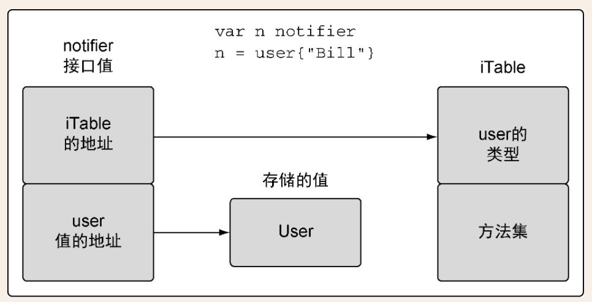

# 环境安装

## 关于gomod和gopath包管理方案不兼容问题

**问题**

```java
package xxxx is not in GOROOT (C:\xxxx)
```

**解决方案**

`go env -w GO111MODULE=off`

**原因**

因为它是报需要寻找GOROOT下的包，应该是`路径问题`，或者`环境设置问题`，输入go env检查了一下环境，发现GO111MODULE=on，编译器没有去gopath下找包。

gomod 和 gopath 两个包管理方案，并且相互不兼容。

在 gopath 查找包，按照 goroot 和多 gopath 目录下 src/xxx 依次查找。

在 gomod 下查找包，解析 go.mod 文件查找包，mod 包名就是包的前缀，里面的目录就后续路径了。在 gomod 模式下，查找包就不会去 gopath 查找，只是gomod包缓存在gopath/pkg/mod 里面。


# 概述


## 优点

- 标准的代码格式化，利于交付和阅读。
- 简化了解决依赖的算法，更快的编译速度。
- 使用占用内存更小的goroutine，作为并发策略。使用channel保证并发安全。
- 采用组合设计模式，允许用户对行为进行建模
- 更现代化的垃圾回收机制


# 基础语法

## 导包

```go
import (
	_ "awesomeProject1/matchers"
)
```


为了让GO语言对包做初始化，GO编译器不允许声明导入某个包而不使用，通过使用下划线让编译器接受这类导入。


## init方法

```go
func init() {
	// something
}
```

初始化方法会在main方法之前执行。


## 公开与私有函数

以大写字母开头的函数都是公开的函数，可以在包外访问。

以小写字母开头的函数不是公开的，不能在其他包中访问，但可以通过一个公开的函数进行返回，被外部访问。


## 变量的声明

```GO
var a string

// 统一类型声明
var b, c int = 1, 2

// 必须要有初始值
d := "string"
```


## defer关键字

关键字defer会安排随后的函数调用在函数返回时才执行。在使用完文件后，需要主动关闭文件。使用关键字defer来安排调用Close方法，可以保证这个函数一定会被调用。哪怕函数意外崩溃终止，也能保证关键字defer安排调用的函数会被执行。关键字defer可以缩短打开文件和关闭文件之间间隔的代码行数，有助于提高代码可读性，减少错误。


## 切片

```go
func main() {
	result := [5]string{"Hello0", "Hello1", "Hello2", "Hello3", "Hello4"}
	// 直接切片
	slice := append(result[0:2], "OK", "OK", "OK")
	slice[0] = "NO"
	fmt.Println(slice)
	fmt.Println(result)
}
/*
[NO Hello1 OK OK OK]
[NO Hello1 OK OK OK]
*/

// ===================================================

func main() {
	result := [5]string{"Hello0", "Hello1", "Hello2", "Hello3", "Hello4"}
   // 指定容量
	slice := append(result[0:2:2], "OK", "OK", "OK")
	slice[0] = "NO"
	fmt.Println(slice)
	fmt.Println(result)
}
/*
[NO Hello1 OK OK OK]
[Hello0 Hello1 Hello2 Hello3 Hello4]
*/
```


如果切片容量没有超过原数组，那么会更改原值，如果超过就会采用复制数组。

如果指定容量，或超过原值容量，那么会采用复制数组。


## 类型的本质

保持传递一致性的背后原则是，不要只关注某个方法是如何处理这个值，而是要关注这个值得本质是什么。

内置类型（数值、字符串、布尔）的本质是原始类型。对这些值的增加和删除的时候，会创建一个新值。推荐使用副本传递。

引用类型（切片、映射、通道、接口、函数类型），当声明此类变量的时候，创建的变量被称为`标头值`。每个引用类型创建的标头值是包含一个指向底层数据结构的指针。每个引用类型包含一组独特的字段，用于管理底层数据结构。标头值是为复制而设计的，所以永远不需要共享一个引用类型的值。标头值里面包含一个指针，因此`通过复制来传递一个引用类型的值的副本，本质上就是在共享底层数据结构`。

> 从技术细节上将，字符串也是引用类型。

结构类型，用来描述一组数据值，这组值得本质是原始的，也可以是非原始的。对操作结构类型的值应该关注类型的本质。

对于不能安全复制的类型，因为这类类型的实现使用了一种嵌入指针，指向一个未公开的类型正是这种`内嵌类型阻止了复制`。

> 是使用值接受者还是指针接受者，不应该由该方法是否修改了接收到的值决定。这个决策应该基于该类型的本质。
>
> 例外的是，需要让类型值符合某个接口的时候，即便类型的本质是非原始本质的，也可以选择使用值接受者声明方法。


## 多态是什么

多态是指根据类型的具体实现采取不同行为的能力。


## 什么是接口

用来定义行为的类型。被定义的行为不由接口直接实现，而是通过方法由用户定义的类型实现。如果某个定义的类型实现了接口声明的一组方法，那么这个用户定义的类型的值就可以赋值给这个接口类型的值。这个赋值会把用户定义类型的值存入接口类型的值。


一个接口值包含两个字长度的数据结构，第一个字包含一个指向内部表(iTable)的指针，包含了所存储的值得类型。iTable包含了已存储的值得类型信息以及与这个值相关联的一组方法。第二个字是一个指向所存储值得指针。

将类型信息和指针组合在一起，就将这两个值组成了一种特殊的关系。即接口值存储实际类型。




## 继承


## 并发


