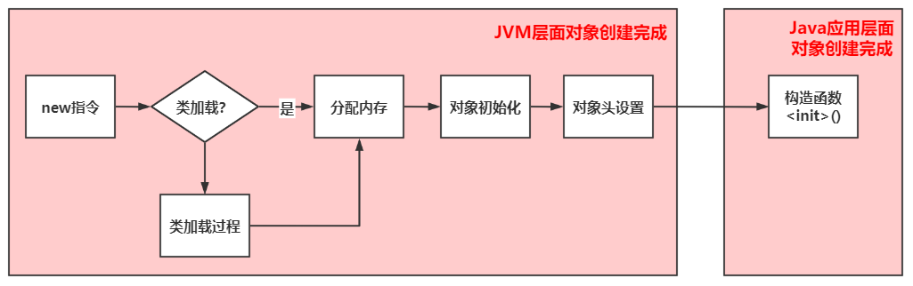

# 编码事项

## 1. 不要在构造器中造成异常

### 原因

如果创建对象的语句处于热点代码段，那么在高并发的情况下，一旦发生错误，将会导致内存中出现大量的无用对象，增加垃圾回收的压力，进而增加了GC的STW时间。

注意：构造失败，无法进行逃逸分析和栈上分配。


### 测试

测试代码：用于探究在构造器发生异常时，对象是否创建成功。

```java
public class TestQ1 {
	
	public TestQ1(String s) {
		System.out.println("在构造器中异常发生前，this != null：" + (this != null));
		if (s.isEmpty()) {
			throw new IllegalArgumentException("Invalid date");
		}
	}

	public static void main(String[] args) {
		TestQ1 t = null;
		try {
			t = new TestQ1(null);
			System.out.println(t != null);
		} catch (Exception e) {
			System.out.println("异常发生:不知道对象创建成功没有。t != null：" + (t != null));
		}
		
		try {
			Thread.sleep(10000000);
		} catch (InterruptedException e) {
			e.printStackTrace();
		}
		
		System.out.println(t);
	}
	
}
```

输出代码：

```
在构造器中异常发生前，this != null：true
异常发生:不知道对象创建成功没有。t != null：false
```

### 探究

使用VisualVM查看堆内存情况。


通过观察发现，在创建对象的过程中，如果在构造器中发生了异常。虽然在程序中指向该对象的引用为空，但在堆内存中这个对象是确实存在的。

### 原理

> 问：构造器都没有成功执行完成，对象是怎么产生的？

从JVM层面看对象的创建：



1. new指令

   从常量池中检查new指令的参数是否能定位到一个类的符号引用。

   符号引用代表的类是否已经完成类的加载过程。如果没有完成这个过程，需要先完成这个过程。

2. 分配内存

   内存分配可能因GC算法，出现指针碰撞或者空间链表两种分配方式。

3. 对象初始化

   在这一个步骤，会对成员属性赋予零值。这也是为什么成员变量不显式的初始化，也能正常使用的原因。

4. 对象头初始化

   对象头中的hash值会延迟加载；也会因为对象锁状态的不同，出现不同的对象头结构。

   在这一步，从JVM层面已经完成了对象的创建工作。

5. 执行`<init>()`方法

   该方法也就是Java程序层面的构造方法。构造方法中会对成员属性进行Java程序层面的初始化。

> 答：在构造器中发生异常，知识Java程序层面的对象创建失败。但是，从JVM层面看，在new指令到构造器执行之前对象已经创建完成。


