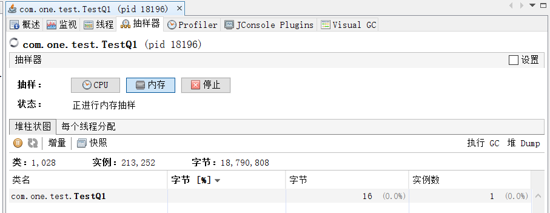

# 编码事项

## 1. 不要在构造器中造成异常

### 测试

测试代码：用于探究在构造器发生异常时，对象是否创建成功。

```java
public class TestQ1 {
	
	public TestQ1(String s) {
		System.out.println("在构造器中异常发生前，this != null：" + (this != null));
		if (s.isEmpty()) {
			throw new IllegalArgumentException("Invalid date");
		}
	}

	public static void main(String[] args) {
		TestQ1 t = null;
		try {
			t = new TestQ1(null);
			System.out.println(t != null);
		} catch (Exception e) {
			System.out.println("异常发生:不知道对象创建成功没有。t != null：" + (t != null));
		}
		
		try {
			Thread.sleep(10000000);
		} catch (InterruptedException e) {
			e.printStackTrace();
		}
		
		System.out.println(t);
	}
	
}
```

输出代码：

```
在构造器中异常发生前，this != null：true
异常发生:不知道对象创建成功没有。t != null：false
```

### 探究

使用VisualVM查看堆内存情况。



通过观察发现，在创建对象的过程中，如果在构造器中发生了异常。虽然在程序中指向该对象的引用为空，但在堆内存中这个对象是确实存在的。

### 原理

> 构造器都没有成功执行完成，对象是怎么产生的？

