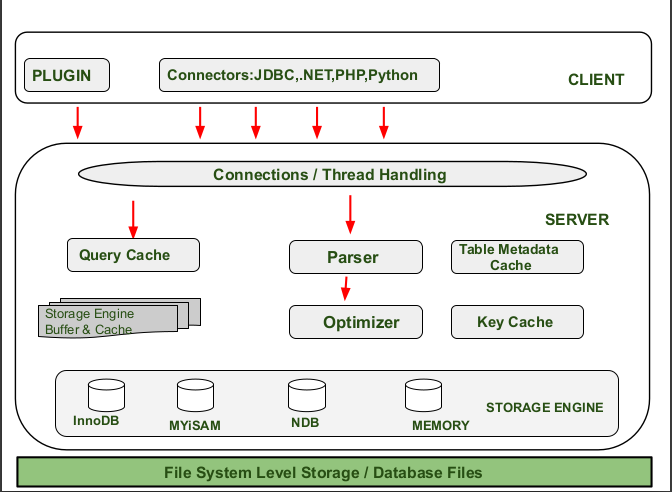

# MySQL体系结构和存储引擎

## 数据库和实例

- 数据库（database）

  各类型文件的集合；

  如，frm、MYD、MYI、ibd文件。

- 实例（instance）

  操作数据库文件；

  由后台线程以及一个共享内存区组成；

  共享内存可以被运行的后台线程所共享。


## 查看MySQL实例

```shell
# 启动MySQL
./mysqld_safe＆

# 查看启动进程
ps -ef|grep mysqld

mysql 7178 6872 0 10:31 ? 00:00:00 /usr/local/mysql/bin/mysqld
--basedir=/usr/local/mysql
--datadir=/data/mysql
--plugin-dir=/usr/local/mysql/lib/plugin
--user=mysql
--log-error=/data/mysql/mysql.err
--pid-file=/data/mysql/mysql.pid
--socket=/tmp/mysql.sock
--port=3306 # 运行在3306端口上的MySQL实例
```


## MySQL启动时加载配置文件

当启动实例时，MySQL数据库会去读取配置文件，根据配置文件的参数来启动数据库实例。在MySQL数据库中，可以没有配置文件，在这种情况下，MySQL会按照编译时的默认参数设置启动实例。

> Oracle启动会加载spfile参数文件，如果没有参数文件，在启动实例时会提示找不到该参数文件，数据库启动失败。

```shell
mysql --help|grep my.cnf
		order of preference, my.cnf, $MYSQL_TCP_PORT,
/etc/my.cnf /etc/mysql/my.cnf /usr/local/mysql/etc/my.cnf ~/.my.cnf
```

通过命令可以看到，MySQL配置文件的加载顺序是：

`/etc/my.cnf`、`/etc/mysql/my.cnf`、`/usr/local/mysql/etc/my.cnf`、`~/.my.cnf`


## datadir参数

datadir参数指定了数据库所在的路径。

在Linux操作系统下默认datadir为/usr/local/mysql/data，该路径是一个链接。

```shell
# 查看数据库所在路径
SHOW VARIABLES LIKE'datadir'\G;
*************************** 1. row ***************************
Variable_name: datadir
        Value: /data/mysql/
1 row in set (0.00 sec)

# 查看系统datadir下的文件列表
system ls -lh /data/mysql/

# 如果参数未被修改过，那么是存在这样一个超链接的
# lrwxrwxrwx 1 root mysql 16 Aug 6 16:05 data-＞/opt/mysql_data/
# 用户须保证/opt/mysql_data的用户和权限，使得只有mysql用户和组可以访问（通常MySQL数据库的权限为mysql∶mysql）
```


# DDL、DML、DCL、MDL、WAL

## DDL

Data Definition Language 数据库定义语言。如create、procedure、alter、drop。


## DML

Data Manipulation Language 数据操纵语言。如insert、delete、update、select。


## DCL

Data Control Language 数据库控制语言。如grant、deny、revoke等，只有管理员才有这样的权限。


## MDL

Metadata lock，元数据锁，MySQL为实现并发情况下的数据一致性引入的锁机制。


## WAL

WAL: Write-Ahead Logging

先写日志，再写磁盘。具体说，当有一条记录需要更新的时候，InnoDB引擎就会先把记录写到redo log里面，并更新内存，这个时候更新计算完成了。同时InnoDB引擎会在在系统比较空闲的时候，将这个操作记录更新到磁盘里。


WAL机制主要得益于两个方面：

redo log 和 binlog 都是顺序写，磁盘的顺序写比随机写速度要快；

组提交机制，可以大幅度降低磁盘的IOPS消耗。


只要redo log和binlog保证持久化到磁盘，就能确保MySQL异常重启后，数据可以回复。

redo log保证事务的持久性

undo log保证事务的一致性


# MySQL架构

❑连接池组件

❑管理服务和工具组件

❑SQL接口组件

❑查询分析器组件

❑优化器组件

❑缓冲（Cache）组件

❑插件式存储引擎

❑物理文件


## 连接MySQL

在通过TCP/IP连接到MySQL实例时，MySQL数据库会先检查一张`权限视图`，用来判断发起请求的客户端IP`是否允许连接`到MySQL实例。该视图在mysql架构下，表名为user。

```sql
-- 切换到mysql库
USE mysql;
-- 查询user表
SELECT host,user,password FROM user;

-- 通过%以控制IP的访问权限
-- host:192.168.24.%
-- user:root
```


## 命名管道和共享内存


# 常见面试题


## 如何设计一个关系型数据库

> 了解常见数据库的架构

**客户层、数据库、实例**

数据库用来存储数据、实例用来操作数据、实例提供统一接口供外部访问。



- 权限管理：为用户提供私密空间、认证授权、权限划分

  连接处理、身份验证、权限验证

- 连接管理：管理来自客户端的连接

- SQL解析

- Optimizer（SQL优化）

- 查询缓存：淘汰机制

  IO是数据库的主要瓶颈。

- 存储管理

- 日志管理

- 容灾机制

  异常容灾机制、怎么恢复、恢复到什么程度

- 索引管理

- 锁管理


## 为什么要使用索引

避免全表扫描、字典、快速查询数据


## 什么样的信息能成为索引

主键数据、唯一数据


## 索引的数据结构

> 二叉树、平衡二叉树、BTree、B+Tree、Hash


## 为什么不用二叉树

树高、在递增id下会变成链表、IO次数多


## 索引是什么

索引是为了加速对表中数据行的检索而创建的一种分散存储的数据结构。


## B-Tree

**什么是B-Tree？**

一种多路搜索平衡树。B-Tree结构可以显著减少定位记录所经历的中间过程，从而加快存取速度。


**基本结构：**

> 任意非叶子结点最多只有M个子节点，且M>2；
>
> 每个结点存放至少M/2-1（取上整）和至多M-1个关键字（至少2个关键字）；
>
> 根结点的子节点数为[2, M]；
>
> 非叶子结点的关键字个数=指向儿子的指针个数-1；


**特性：**

B-树的搜索，从根结点开始，对结点内的关键字（有序）序列进行二分查找，如果命中则结束，否则进入查询关键字所属范围的儿子结点；重复，直到所对应的儿子指针为空，或已经是叶子结点；

1. 关键字集合分布在整颗树中；
2. 任何一个关键字出现且只出现在一个结点中；
3. 搜索有可能在非叶子结点结束；
4. 其搜索性能等价于在关键字全集内做一次二分查找；
5. 自动层次控制；

由于M/2的限制，在插入结点时，如果结点已满，需要将结点分裂为两个各占M/2的结点；删除结点时，需将两个不足M/2的兄弟结点合并；


## 变体B+Tree


**基本结构：**

> 非叶子结点的子树指针与关键字个数相同；
>
> 非叶子结点的子树指针P[i]，指向关键字值属于[K[i], K[i+1])的子树（B-树是开区间）；
>
> 所有叶子结点都有一个链指针；


**特性：**

1. 所有关键字都出现在叶子结点的链表中（稠密索引），且链表中的关键字恰好是有序的；
2. 不可能在非叶子结点命中；
3. 非叶子结点相当于是叶子结点的索引（稀疏索引），叶子结点相当于是存储（关键字）数据的数据层；
4. 更适合文件索引系统；


## 扩展：B+Tree变体B\*树

在B+树的非根和非叶子结点再增加指向兄弟的指针。


**基本结构**

`B*树`定义了非叶子结点关键字个数至少为(2/3)*M，即块的最低使用率为2/3（代替B+树的1/2）；

**B+树的分裂**

当一个结点满时，分配一个新的结点，并将原结点中1/2的数据复制到新结点，最后在父结点中增加新结点的指针；B+树的分裂只影响原结点和父结点，而不会影响兄弟结点，所以它不需要指向兄弟的指针；

**B*树的分裂**

当一个结点满时，如果它的下一个兄弟结点未满，那么将一部分数据移到兄弟结点中，再在原结点插入关键字，最后修改父结点中兄弟结点的关键字（因为兄弟结点的关键字范围改变了）；如果兄弟也满了，则在原结点与兄弟结点之间增加新结点，并各复制1/3的数据到新结点，最后在父结点增加新结点的指针；

**总结**

B*树分配新结点的概率比B+树要低，空间使用率更高，将结点的最低利用率从1/2提高到2/3。


## Hash索引

1. 适用于精准查询；
2. 哈希索引只包含哈希值和行指针，而不存储字段值，所以不能使用索引中的值来避免读取行；
3. 哈希索引数据并不是按照索引值顺序存储的，所以也就无法用于排序；
4. 也不支持部分索引列匹配查找，因为哈希索引始终是使用索引列的全部内容来计算哈希值的；
5. 只支持等值比较查询，包括=、IN()、<>（注意<>和<=>是不同的操作），也不支持任何范围查询，例如WHERE price>100；
6. 访问哈希索引的数据非常快，除非有很多哈希冲突（不同的索引列值却有相同的哈希值）。当出现哈希冲突的时候，存储引擎必须遍历链表中所有的行指针，逐行进行比较，直到找到所有符合条件的行。
7. 如果哈希冲突很多的话，一些索引维护操作的代价也会很高。例如，如果在某个选择性很低（哈希冲突很多）的列上建立哈希索引，那么当从表中删除一行时，存储引擎需要遍历对应哈希值的链表中的每一个元素，找到并删除对应行的引用，冲突越多，代价越大。


## 自适应哈希

创建伪哈希索引的意义在于让B-Tree具备哈希索引的一些优点。

在B-Tree基础上创建一个伪哈希索引。这和真正的哈希索引不是一回事，因为还是使用B-Tree进行查找，但是它使用哈希值而不是键本身进行索引查找。你需要做的就是在查询的WHERE子句中手动指定使用哈希函数。

```sql
select id
from tb_url
where 
url = 'http://www.baidu.com' and 
url_crc = crc32('http://www.baidu.com') ;
```

优点：

性能比较高，MySQL的优化器会使用选择性较高而体积较小的url_crc列的索引来完成查找。

即使有多个记录有相同的索引值，只需要根据hash值做快速的整数比较就能找到索引条目，然后一一返回对应的行。

缺点：

需要手动维护hash值。


## BitMap索引

> Oracle数据支持


适用于固定种类数的静态数据，而不适合索引频繁更新的列。

适合于并发较少，统计较多的系统。

不适合高并发的联机系统，BitMap锁的粒度非常大，增删改的性能低下。

> 比如：
>
> 有这样一个字段busy，记录各个机器的繁忙与否，当机器忙碌时，busy为1，当机器不忙碌时，busy为0。
>
> 假设用户A使用update更新某个机器的busy值，比如update table set table.busy=1 where rowid=100;，但还没有commit，而用户B也使用update更新另一个机器的busy值，update table set table.busy=1 where rowid=12; 这个时候用户B怎么也更新不了，需要等待用户A commit。
>
> 用户A更新了某个机器的busy值为1，会导致所有busy为1的机器的位图向量发生改变，因此数据库会将busy＝1的所有行锁定，只有commit之后才解锁。


## 稀疏索引与密集索引

> 稀疏索引、密集索引、聚簇索引、聚集索引有什么联系？


密集索引与稀疏索引的区别：

> 关键区别在于索引与数据是否分离。在索引与数据分离的情况下，会出现两次查找。

- 一张表只能建立一个密集索引，但可以建立多个稀疏索引。
- 密集索引的叶子结点保存了键值和行数据，非叶子结点只保存键值；这样做的好处是可以让非叶子节点保存更多的键值信息，降低树的整体高度。
- 稀疏索引将键值和行数据保存在树的相应节点。
- 密集索引，索引与数据都保存在一个idb文件中；稀疏索引，索引与数据会分散保存在myi和myd文件中。

InnoDB：

- 若一个主键被定义，该主键则作为密集索引；
- 若没有主键被定义，该表的第一个唯一非空索引则作为密集索引；
- 若不满足以上条件，innodb内部会生成一个隐藏主键(密集索引)；
- 非主键索引存储相关键位和其对应的主键值，包含两次查找；


## 如何定位并优化慢查询

- 根据慢日志定位慢SQL；
- 使用explain工具分析SQL；
- 修改SQL或者尽量让SQL走索引。

### 定位慢日志

```SQL
-- 查询默认慢SQL时长
show variables like 'long_query_time';
-- long_query_time,10.000000(默认10秒)

-- 慢查询默认关闭状态
show variables like 'slow_query_log';
-- slow_query_log,OFF

-- 慢查询日志地址
show variables like 'slow_query_log_file';
-- slow_query_log_file,/data/mysql/localhost10-slow.log

-- 查询慢SQL的数量
show status like 'Slow_queries';
-- Slow_queries,0
```

### 配置慢查询属性

通过命令方式配置，重启数据库后配置会失效。

```SQL
-- 启动慢查询日志
set global slow_query_log = on;
-- 设置慢查询时间
set global long_query_time = 1;
```

### 查看慢查询日志文件

```shell
cat /data/mysql/localhost10-slow.log
```


## Explain

> https://www.cnblogs.com/lusaisai/p/13396071.html


**语法**

Explain + SQL 语句;


**SQL分析结果**

| 列名          | 描述                                                   |
| ------------- | ------------------------------------------------------ |
| id            | 在一个大的查询语句中每个SELECT关键字都对应一个唯一的id |
| select_type   | SELECT关键字对应的那个查询的类型                       |
| table         | 表名                                                   |
| partitions    | 匹配的分区信息                                         |
| type          | 针对单表的访问方法                                     |
| possible_keys | 可能用到的索引                                         |
| key           | 实际上使用的索引                                       |
| key_len       | 实际使用到的索引长度                                   |
| ref           | 当使用索引列等值查询时，与索引列进行等值匹配的对象信息 |
| rows          | 预估的需要读取的记录条数                               |
| filtered      | 某个表经过搜索条件过滤后剩余记录条数的百分比           |
| Extra         | 一些额外的信息                                         |

**id**

- 相同，执行顺序由上至下;
- 不同，如果是子查询，id号会递增，id值越大优先级越高，越先被执行;
- 相同和不同的情况同时存在;

**select_type**

- simple

  简单的select查询，查询中不包含子查询或者union查询。

- primary

  如果SQL语句中包含任何子查询，那么子查询的最外层会被标记为primary。

- subquery

  在 select 或者 where 里包含了子查询，那么子查询就会被标记为 subQquery。

- derived

  在from中包含的子查询，会被标记为衍生查询，会把查询结果放到一个临时表中。

- union 、union result

  如果有两个select查询语句，他们之间用union连起来查询，那么第二个select会被标记为union。union的结果被标记为union result，它的 id 为 null。

**type**

type 代表 MySQL 使用了哪种索引类型，不同的索引类型的查询效率也是不一样。

性能按type排序（从最好到最坏）：

```
system > const > eq_ref > ref > ref_or_null > index_merge > unique_subquery > index_subquery > range > index > ALL
```

一般来说，得保证查询至少达到range级别，最好能达到ref级别。

- range

  体现在对某个索引进行区间范围检索，一般出现在 where 条件中的 between、and、<、>、in 等范围查找中。

- ref

  不是主键索引，也不是唯一索引，就是普通的索引，可能会返回多个符合条件的行。

**extra**

- using  fileSort（重点优化）

  表示MySQL会对结果使用一个外部索引排序，而不是从表里按索引次序读到相关内容。可能在内存或者磁盘上进行排序。MySQL中无法利用索引完成的排序操作称为“文件排序”。

  在 order by 或者在 group by 排序的过程中，order by 的字段不是索引字段，或者 select 查询字段存在不是索引字段，或者 select 查询字段都是索引字段，但是 order by 字段和 select 索引字段的顺序不一致，都会导致 fileSort。

- using temporary（重点优化）

  使用了临时表保存中间结果，常见于 order by 和 group by 中。

- USING index（重点）
  表示相应的 select 操作中使用了覆盖索引（Coveing Index）,避免访问了表的数据行，效率不错！

  如果同时出现 using where，表明索引被用来执行索引键值的查找；如果没有同时出现 using where，表明索引用来读取数据而非执行查找动作。


## SQL:count

```sql
select count(1) from user;
```

统计SQL不需要返回具体的行内容，如果走密集索引会造成IO很多的无用列，浪费性能。如果走稀疏索引，那么就只会IO键值信息，会更加节省性能。

> MySQL尽可能使用索引，也尽可能的使用最严格的索引。
>
> 使用`force index (primary)`强制使用主键。


## 联合索引的最左匹配原则的成因

MySQL会一直向右匹配直到遇到范围查询就停止匹配。= 和 in 可以乱序，MySQL的查询优化器会帮你优化成索引可以识别的形式。

```sql
-- >、<、between、like
-- a = 3 and b = 4 and c > 5 and d = 6
-- 在c>5这一步，索引就停止了向后匹配。
```


## 索引是建立得越多越好吗

- 数据量下的表不需要建立索引，建立会增加额外的索引开销；
- 数据变更需要维护索引，因此更多的索引意味着更多的维护成本；
- 更多的索引意味着也需要更多的空间。


## 锁


## MyISAM与InnoDB关于锁方面的区别是什么

- MyISAM默认用的是表级锁，不支持行级锁
- InnoDB默认用的是行级锁，也支持表级锁

## 共享锁与排斥锁的兼容性

读锁：共享锁；写锁：排它锁。

 

## MyISAM与InnoDB的区别

**MyISAM**

- 适用于频繁执行全表扫描；
- MyISAM使用一个变量记录了全表的记录总数；
- 对数据的修改不高，查询频繁；
- 不支持事务。

**InnoDB**

- 数据增删改查相当频繁；
- 可靠性要求比较高；
- 要求支持事务。

## 锁分类

- 粒度：表级锁、行级锁、页级锁。
- 级别：共享锁、排它锁。
- 加锁方式：自动锁、显示锁。
- 操作：DML锁、DDL锁。
- 使用方式：乐观锁、悲观锁。

> 锁的粒度越细，代价越大；表级锁只需要对表直接加锁；行级锁需要扫描要加锁的行，对其上锁。


## 数据库事务的四大特性

- 原子性（Atomic）

  要么全部执行，要么全部失败回滚

- 一致性（Consistency）

  从一个正确的一致状态转换到另一个一致状态

- 隔离性（Isolation）

  一个事务的执行不会影响另一个事务的执行

- 持久性（Durability）

  一个事务的提交，它的修改应该永久保存在数据库中。持久性意味着当系统发生故障时，一个以提交的事务，他的更新不能丢失


## 事务隔离级别、并发访问问题

事务并发访问的问题

- 更新丢失
- 脏读
- 重复读
- 幻读


查看事务级别

```sql
select @@tx_isolation;
```


事务隔离级别：事务隔离级别越高，安全级别越高，串行化现象越严重。

 


设置事务隔离级别

```sql
-- read uncommitted
-- read committed
-- repeatable read
-- serializable
set session transaction isolation level repeatable read ;
```


## 可重复读隔离级别如何规避幻读

表象：快照读（非阻塞读）、伪MVCC：多版本并发控制

内在：next-key锁（行锁、GAP锁-间隙锁）

- 当前读

  select...lock in share mode，select...for update，update，delete，insert。

- 快照读

  不加锁的非阻塞读，select。

  创建快照的时机决定了读取数据的版本。


## RC、RR级别下的InnoDB的非阻塞读如何实现

数据行DB_TRX_ID、DB_ROLL_PTR、DB_ROW_ID字段

undo日志：保存老版本的数据、当一个老版本的事务需要读取数据时，需要从undo日志中找到一个满足可见性的数据记录。

read view：可见性判断、可见性代码。


## 索引全部命中与部分命中

当全部命中只会加行锁；当部分命中、全不命中则会加gap锁。


## 扩展

> 二叉树与平衡树实践
>
> WIn Redis 与 Linux Redis 区别
>
> 回忆性滤镜


**CVTE面试总结**

https://blog.csdn.net/qq_38056704/article/details/88656655


**CURD**

增加(Create)、检索(Retrieve)、更新(Update)、删除(Delete)


### 面试技巧

- 如何解决问题；
- 带来的效果；
- 加上自己对项目的理解、结合自己的技术栈。


### 用户画像

1. 实际用户的虚拟代表
2. 代表产品的主要受众和目标群体
3. 属性、行为、期待的结合