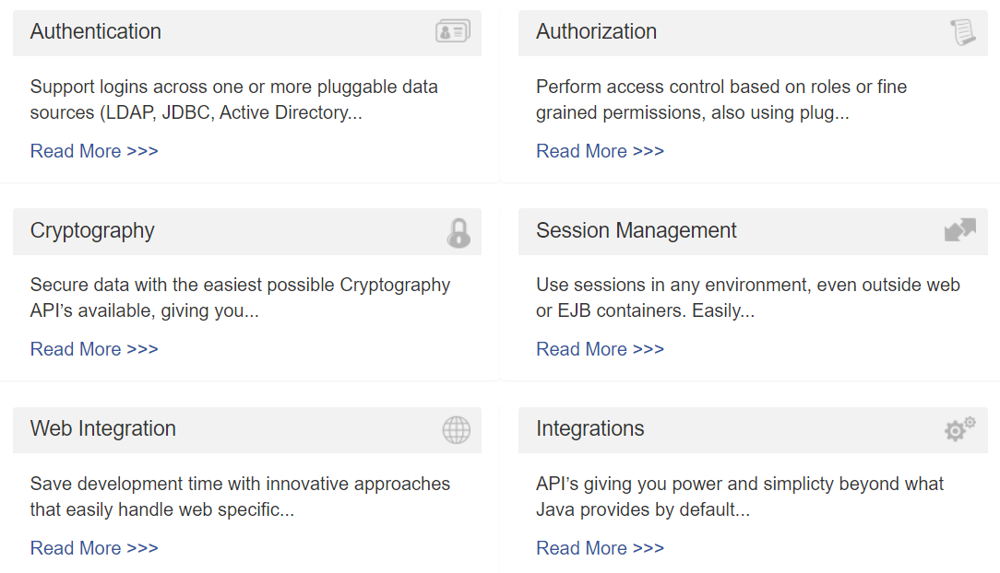

# 快速入门

> 要用到的Maven依赖
>
> ```xml
> <!-- Spring Boot 父工程 -->
> <parent>
>     <groupId>org.springframework.boot</groupId>
>     <artifactId>spring-boot-starter-parent</artifactId>
>     <version>1.5.4.RELEASE</version>
> </parent>
> 
> <!-- web支持，SpringMVC， Servlet支持等 -->
> <dependency>
>     <groupId>org.springframework.boot</groupId>
>     <artifactId>spring-boot-starter-web</artifactId>
> </dependency>
> 
> <!-- SpringBoot的Mybatis启动器 -->
> <dependency>
>     <groupId>org.mybatis.spring.boot</groupId>
>     <artifactId>mybatis-spring-boot-starter</artifactId>
>     <version>1.1.1</version>
> </dependency>
> 
> <!-- druid连接池 -->
> <dependency>
>     <groupId>com.alibaba</groupId>
>     <artifactId>druid</artifactId>
>     <version>1.0.9</version>
> </dependency>
> 
> <!-- mysql-->
> <dependency>
>     <groupId>mysql</groupId>
>     <artifactId>mysql-connector-java</artifactId>
> </dependency>
> 
> <!-- thymeleaf -->
> <dependency>
>     <groupId>org.springframework.boot</groupId>
>     <artifactId>spring-boot-starter-thymeleaf</artifactId>
> </dependency>
> 
> <!-- Spring对Shiro支持 -->
> <dependency>
>     <groupId>org.apache.shiro</groupId>
>     <artifactId>shiro-spring</artifactId>
>     <version>1.4.0</version>
> </dependency>
> 
> <!-- thymeleaf整合shiro标签 -->
> <dependency>
>     <groupId>com.github.theborakompanioni</groupId>
>     <artifactId>thymeleaf-extras-shiro</artifactId>
>     <version>2.0.0</version>
> </dependency>
> ```
>
> 


## 一、Shiro框架简介

> Apache Shiro是一个强大且易用的Java安全框架，执行身份验证、授权、密码学和会话管理。使用Shiro的易于理解的API,您可以快速、轻松地获得任何应用程序,从最小的移动应用程序到最大的网络和企业应用程序。



1. Authentication 认证--用户登陆
2. Authorization 授权--用户具有哪些权限
3. Cryptography 安全数据加密
4. Session Management 会话管理
5. Web Integration 系统集成
6. Integrations 集成其它应用，spring、缓存框架


## 二、整合SpringBoot实现用户认证

### （一）Shiro核心API

Subject：用户主题（把操作交给SecurityManager）

SecurityManager：安全管理器（管理Reaml）

Realm：Shiro连接数据的桥梁

### （二）整合

1. 依赖导入

   ```xml
   <dependency>
       <groupId>org.apache.shiro</groupId>
       <artifactId>shiro-spring</artifactId>
       <version>1.4.0</version>
   </dependency>
   ```

   

2. 自定义Realm类

   ```java
   /**
    * 自定义Realm
    * @author lenovo
    *
    */
   public class UserRealm extends AuthorizingRealm{
   
   	/**
   	 * 执行授权逻辑
   	 */
   	@Override
   	protected AuthorizationInfo doGetAuthorizationInfo(PrincipalCollection arg0) {
   		System.out.println("执行授权逻辑");
   		return null;
   	}
   
   	/**
   	 * 执行认证逻辑
   	 */
   	@Override
   	protected AuthenticationInfo doGetAuthenticationInfo(AuthenticationToken arg0) throws AuthenticationException {
   		System.out.println("执行认证逻辑");
   		return null;
   	}
   
   }
   ```

3. 配置类

   ```java
   /**
    * Shiro的配置类
    * @author lenovo
    *
    */
   @Configuration
   public class ShiroConfig {
   
   	/**
   	 * 创建ShiroFilterFactoryBean
   	 */
       @Bean
   	public ShiroFilterFactoryBean getShiroFilterFactoryBean(@Qualifier("securityManager")DefaultWebSecurityManager securityManager){
   		ShiroFilterFactoryBean shiroFilterFactoryBean = new ShiroFilterFactoryBean();
   		
   		//设置安全管理器
   		shiroFilterFactoryBean.setSecurityManager(securityManager);
   		
   		return shiroFilterFactoryBean;
   	}
   	
   	/**
   	 * 创建DefaultWebSecurityManager
   	 */
   	@Bean(name="securityManager")
   	public DefaultWebSecurityManager getDefaultWebSecurityManager(@Qualifier("userRealm")UserRealm userRealm){
   		DefaultWebSecurityManager securityManager = new DefaultWebSecurityManager();
   		//关联realm
   		securityManager.setRealm(userRealm);
   		return securityManager;
   	}
   	
   	/**
   	 * 创建Realm
   	 */
   	@Bean(name="userRealm")
   	public UserRealm getRealm(){
   		return new UserRealm();
   	}
   }
   ```


### （三）使用Shiro内置过滤器实现页面拦截

```java
/**
 * Shiro的配置类
 * @author lenovo
 *
 */
@Configuration
public class ShiroConfig {

	/**
	 * 创建ShiroFilterFactoryBean
	 */
	@Bean
	public ShiroFilterFactoryBean getShiroFilterFactoryBean(@Qualifier("securityManager")DefaultWebSecurityManager securityManager){
		ShiroFilterFactoryBean shiroFilterFactoryBean = new ShiroFilterFactoryBean();
		
		//设置安全管理器
		shiroFilterFactoryBean.setSecurityManager(securityManager);
		
		//添加Shiro内置过滤器
		/**
		 * Shiro内置过滤器，可以实现权限相关的拦截器
		 *    常用的过滤器：
		 *       anon: 无需认证（登录）可以访问
		 *       authc: 必须认证才可以访问
		 *       user: 如果使用rememberMe的功能可以直接访问
		 *       perms： 该资源必须得到资源权限才可以访问
		 *       role: 该资源必须得到角色权限才可以访问
		 */
		Map<String,String> filterMap = new LinkedHashMap<String,String>();
		/*filterMap.put("/add", "authc");
		filterMap.put("/update", "authc");*/
		
		filterMap.put("/testThymeleaf", "anon");
		
		filterMap.put("/*", "authc");
		
		//修改调整的登录页面
		shiroFilterFactoryBean.setLoginUrl("/toLogin");
		
		shiroFilterFactoryBean.setFilterChainDefinitionMap(filterMap);
		
		
		return shiroFilterFactoryBean;
	}
	
	/**
	 * 创建DefaultWebSecurityManager
	 */
	@Bean(name="securityManager")
	public DefaultWebSecurityManager getDefaultWebSecurityManager(@Qualifier("userRealm")UserRealm userRealm){
		DefaultWebSecurityManager securityManager = new DefaultWebSecurityManager();
		//关联realm
		securityManager.setRealm(userRealm);
		return securityManager;
	}
	
	/**
	 * 创建Realm
	 */
	@Bean(name="userRealm")
	public UserRealm getRealm(){
		return new UserRealm();
	}
}
```


### （四）实现用户认证（登录）操作

1. 设计登录页面

   ```html
   <!DOCTYPE html>
   <html>
   <head>
   <meta charset="UTF-8">
   <title>登录页面</title>
   </head>
   <body>
   <h3>登录</h3>
   <form method="post" action="login">
   	用户名:<input type="text" name="name"/><br/>
   	密码：<input type="password" name="password"/><br/>
   	<input type="submit" value="登录"/>
   </form>
   </body>
   </html>
   ```

2. 编写Controller的登录逻辑

   ```java
   
   /**
    * 登录逻辑处理
    */
   @RequestMapping("/login")
   public String login(String name,String password,Model model){
   
       /**
   	 * 使用Shiro编写认证操作
   	 */
       //1.获取Subject
       Subject subject = SecurityUtils.getSubject();
   
       //2.封装用户数据
       UsernamePasswordToken token = new UsernamePasswordToken(name,password);
   
       //3.执行登录方法
       try {
           subject.login(token);
   
           //登录成功
           //跳转到test.html
           return "redirect:/testThymeleaf";
       } catch (UnknownAccountException e) {
           //e.printStackTrace();
           //登录失败:用户名不存在
           model.addAttribute("msg", "用户名不存在");
           return "login";
       }catch (IncorrectCredentialsException e) {
           //e.printStackTrace();
           //登录失败:密码错误
           model.addAttribute("msg", "密码错误");
           return "login";
       }
   }
   ```

3. 编写Realm的判断逻辑

   ```java
   /**
    * 自定义Realm
    * @author lenovo
    *
    */
   public class UserRealm extends AuthorizingRealm{
   
   	/**
   	 * 执行授权逻辑
   	 */
   	@Override
   	protected AuthorizationInfo doGetAuthorizationInfo(PrincipalCollection arg0) {
   		System.out.println("执行授权逻辑");
   		return null;
   	}
   
   	/**
   	 * 执行认证逻辑
   	 */
   	@Override
   	protected AuthenticationInfo doGetAuthenticationInfo(AuthenticationToken arg0) throws AuthenticationException {
   		System.out.println("执行认证逻辑");
   		
   		//假设数据库的用户名和密码
   		String name = "eric";
   		String password = "123456";
   		
   		//编写shiro判断逻辑，判断用户名和密码
   		//1.判断用户名
   		UsernamePasswordToken token = (UsernamePasswordToken)arg0;
   		if(!token.getUsername().equals(name)){
   			//用户名不存在
   			return null;//shiro底层会抛出UnKnowAccountException
   		}
   		
   		//2.判断密码
   		return new SimpleAuthenticationInfo("",password,"");
   	}
   
   }
   ```


### （五）整合MyBatis实现登录

1. 导入mybatis相关的依赖

   ```xml
   <!-- 导入mybatis相关的依赖 -->
   <dependency>
       <groupId>com.alibaba</groupId>
       <artifactId>druid</artifactId>
       <version>1.0.9</version>
   </dependency>
   <!-- mysql -->
   <dependency>
       <groupId>mysql</groupId>
       <artifactId>mysql-connector-java</artifactId>
   </dependency>
   <!-- SpringBoot的Mybatis启动器 -->
   <dependency>
       <groupId>org.mybatis.spring.boot</groupId>
       <artifactId>mybatis-spring-boot-starter</artifactId>
       <version>1.1.1</version>
   </dependency>
   ```

2. application.properties

   ```properties
   spring.datasource.driverClassName=com.mysql.jdbc.Driver
   spring.datasource.url=jdbc:mysql://localhost:3306/test
   spring.datasource.username=root
   spring.datasource.password=root
   spring.datasource.type=com.alibaba.druid.pool.DruidDataSource
   mybatis.type-aliases-package=com.one.domain
   ```

3. 编写User 实体

   ```java
   public class User {
   	private Integer id;
   	private String name;
   	private String password;
   	public Integer getId() {
   		return id;
   	}
   	public void setId(Integer id) {
   		this.id = id;
   	}
   	public String getName() {
   		return name;
   	}
   	public void setName(String name) {
   		this.name = name;
   	}
   	public String getPassword() {
   		return password;
   	}
   	public void setPassword(String password) {
   		this.password = password;
   	}
   	
   }
   ```

4. 编写UserMapper接口

   ```java
   public interface UserMapper {
   	public User findByName(String name);
   }
   ```

5. UserMapper.xml

   ```xml
   <?xml version="1.0" encoding="UTF-8" ?>
   <!DOCTYPE mapper PUBLIC "-//mybatis.org//DTD Mapper 3.0//EN" "http://mybatis.org/dtd/mybatis-3-mapper.dtd">
   <mapper namespace="com.one.mapper.UserMapper">
   	<select id="findByName" parameterType="string" resultType="user">
   		SELECT 	id,  NAME,  PASSWORD
   		FROM  user 
   		where name = #{value}
   	</select>
   </mapper>
   ```

6. 编写业务接口和实现

   ```java
   public interface UserService {
   	public User findByName(String name);
   }
   
   // =====================================
   
   @Service
   public class UserServiceImpl implements UserService{
   	//注入Mapper接口
   	@Autowired
   	private UserMapper userMapper;
   	@Override
   	public User findByName(String name) {
   		return userMapper.findByName(name);
   	}
   }
   ```

7. 添加@MapperScan注解

   ```java
   /**
    * SpringBoot启动类
    * @author lenovo
    *
    */
   @SpringBootApplication
   @MapperScan("com.one.mapper")
   public class Application {
   	public static void main(String[] args) {
   		SpringApplication.run(Application.class, args);
   	}
   }
   ```

8. 修改UserRealm

   ```java
   /**
    * 自定义Realm
    * @author lenovo
    *
    */
   public class UserRealm extends AuthorizingRealm{
   
   	/**
   	 * 执行授权逻辑
   	 */
   	@Override
   	protected AuthorizationInfo doGetAuthorizationInfo(PrincipalCollection arg0) {
   		System.out.println("执行授权逻辑");
   		return null;
   	}
   	
   	@Autowired
   	private UserService userSerivce;
   
   	/**
   	 * 执行认证逻辑
   	 */
   	@Override
   	protected AuthenticationInfo doGetAuthenticationInfo(AuthenticationToken arg0) throws AuthenticationException {
   		System.out.println("执行认证逻辑");
   		
   		//编写shiro判断逻辑，判断用户名和密码
   		//1.判断用户名
   		UsernamePasswordToken token = (UsernamePasswordToken)arg0;
   		
   		User user = userSerivce.findByName(token.getUsername());
   		
   		if(user==null){
   			//用户名不存在
   			return null;//shiro底层会抛出UnKnowAccountException
   		}
   		
   		//2.判断密码
   		return new SimpleAuthenticationInfo("",user.getPassword(),"");
   	}
   
   }
   ```


## 三、整合SpringBoot实现用户授权

### （一）使用Shiro内置过滤器拦截资源

```java
/**
 * 创建ShiroFilterFactoryBean
 */
@Bean
public ShiroFilterFactoryBean getShiroFilterFactoryBean(@Qualifier("securityManager")DefaultWebSecurityManager securityManager){
    ShiroFilterFactoryBean shiroFilterFactoryBean = new ShiroFilterFactoryBean();

    //设置安全管理器
    shiroFilterFactoryBean.setSecurityManager(securityManager);

    //添加Shiro内置过滤器
    /**
		 * Shiro内置过滤器，可以实现权限相关的拦截器
		 *    常用的过滤器：
		 *       anon: 无需认证（登录）可以访问
		 *       authc: 必须认证才可以访问
		 *       user: 如果使用rememberMe的功能可以直接访问
		 *       perms： 该资源必须得到资源权限才可以访问
		 *       role: 该资源必须得到角色权限才可以访问
		 */
    Map<String,String> filterMap = new LinkedHashMap<String,String>();
    /*filterMap.put("/add", "authc");
		filterMap.put("/update", "authc");*/

    filterMap.put("/testThymeleaf", "anon");
    //放行login.html页面
    filterMap.put("/login", "anon");

    //授权过滤器
    //注意：当前授权拦截后，shiro会自动跳转到未授权页面
    filterMap.put("/add", "perms[user:add]");

    filterMap.put("/*", "authc");

    //修改调整的登录页面
    shiroFilterFactoryBean.setLoginUrl("/toLogin");
    //设置未授权提示页面
    shiroFilterFactoryBean.setUnauthorizedUrl("/noAuth");

    shiroFilterFactoryBean.setFilterChainDefinitionMap(filterMap);

    return shiroFilterFactoryBean;
}
```


### （二）完成Shiro的资源授权

```java
// class UserRealm
/**
 * 执行授权逻辑
 */
@Override
protected AuthorizationInfo doGetAuthorizationInfo(PrincipalCollection arg0) {
    System.out.println("执行授权逻辑");

    //给资源进行授权
    SimpleAuthorizationInfo info = new SimpleAuthorizationInfo();

    //添加资源的授权字符串
    info.addStringPermission("user:add");

    return info;
}
```


## 四、thymeleaf和shiro标签整合使用

### （一）导入依赖

```xml
<!-- thymel对shiro的扩展坐标 -->
<dependency>
    <groupId>com.github.theborakompanioni</groupId>
    <artifactId>thymeleaf-extras-shiro</artifactId>
    <version>2.0.0</version>
</dependency>
```


### （二）配置ShiroDialect

在ShiroConfig类里面添加getShiroDialect方法

```java
/**
 * 配置ShiroDialect，用于thymeleaf和shiro标签配合使用
 */
@Bean
public ShiroDialect getShiroDialect(){
    return new ShiroDialect();
}
```


### （三）在页面上使用shiro标签

```html
<!DOCTYPE html>
<html>
<head>
<meta charset="UTF-8">
<title>测试Thymeleaf的使用</title>
</head>
<body>
<h3 th:text="${name}"></h3>

<hr/>
<div shiro:hasPermission="user:add">
	进入用户添加功能： <a href="add">用户添加</a><br/>
</div>
<div shiro:hasPermission="user:update">
	进入用户更新功能： <a href="update">用户更新</a><br/>
</div>
<a href="toLogin">登录</a>
</body>
</html>
```


