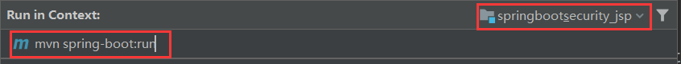

# 一、Spring Security简单入门(SSM + JSP)


## 1. 依赖

```xml
<dependency>
    <groupId>org.springframework.security</groupId>
    <artifactId>spring-security-taglibs</artifactId>
    <version>5.1.5.RELEASE</version>
</dependency>
<dependency>
    <groupId>org.springframework.security</groupId>
    <artifactId>spring-security-config</artifactId>
    <version>5.1.5.RELEASE</version>
</dependency>
```


## 2. web.xml

```xml
<!--Spring Security过滤器链，注意过滤器名称必须叫springSecurityFilterChain-->
<filter>
    <filter-name>springSecurityFilterChain</filter-name>
    <filter-class>org.springframework.web.filter.DelegatingFilterProxy</filter-class>
</filter>
<filter-mapping>
    <filter-name>springSecurityFilterChain</filter-name>
    <url-pattern>/*</url-pattern>
</filter-mapping>
```


## 3. spring-security.xml

```xml
<?xml version="1.0" encoding="UTF-8"?>
<beans 
        xmlns="http://www.springframework.org/schema/beans"
        xmlns:xsi="http://www.w3.org/2001/XMLSchema-instance"
        xmlns:context="http://www.springframework.org/schema/context"
        xmlns:aop="http://www.springframework.org/schema/aop"
        xmlns:tx="http://www.springframework.org/schema/tx"
        xmlns:security="http://www.springframework.org/schema/security"
        xsi:schemaLocation="http://www.springframework.org/schema/beans
        http://www.springframework.org/schema/beans/spring-beans.xsd
        http://www.springframework.org/schema/context
        http://www.springframework.org/schema/context/spring-context.xsd
        http://www.springframework.org/schema/aop
        http://www.springframework.org/schema/aop/spring-aop.xsd
        http://www.springframework.org/schema/tx
        http://www.springframework.org/schema/tx/spring-tx.xsd
        http://www.springframework.org/schema/security
        http://www.springframework.org/schema/security/spring-security.xsd">

    <!--设置可以用spring的el表达式配置Spring Security并自动生成对应配置组件（过滤器）-->
    <security:http auto-config="true" use-expressions="true">
        <!--使用spring的el表达式来指定项目所有资源访问都必须有ROLE_USER或ROLE_ADMIN角色-->
        <security:intercept-url pattern="/**" 
                                access="hasAnyRole('ROLE_USER','ROLE_ADMIN')"/>
    </security:http>
    <!--设置Spring Security认证用户信息的来源-->
    <security:authentication-manager>
        <security:authentication-provider>
            <security:user-service>
                <security:user name="user" 
                               password="{noop}user"
                               authorities="ROLE_USER" />
                <security:user name="admin" 
                               password="{noop}admin"
                               authorities="ROLE_ADMIN" />
            </security:user-service>
        </security:authentication-provider>
    </security:authentication-manager>

</beans>
```


## 4. 引入spring-security.xml

将spring-security.xml配置文件引入到applicationContext.xml中

```xml
<!--引入SpringSecurity主配置文件-->
<import resource="classpath:spring-security.xml"/>
```


## 5. 运行

http://localhost:8080/login


# 二、常用过滤器

## 1. SecurityContextPersistenceFilter

`org.springframework.security.web.context.SecurityContextPersistenceFilter`

会初始化一个Security的容器，之后的过滤器依赖该容器

> SecurityContextPersistenceFilter主要是使用SecurityContextRepository在session中保存或更新一个
> SecurityContext，并将SecurityContext给以后的过滤器使用，来为后续filter建立所需的上下文。
> SecurityContext中存储了当前用户的认证以及权限信息。


## 2. WebAsyncManagerIntegrationFilter

`org.springframework.security.web.context.request.async.WebAsyncManagerIntegrationFilter`

SpringSecurity与Spring整合需要借助该过滤器

> 此过滤器用于集成SecurityContext到Spring异步执行机制中的WebAsyncManager 


## 3. HeaderWriterFilter

`org.springframework.security.web.header.HeaderWriterFilter`

在这个过滤器中操作请求头信息

> 向请求的Header中添加相应的信息,可在http标签内部使用security:headers来控制


## 4. CsrfFilter

`org.springframework.security.web.csrf.CsrfFilter`

> csrf又称跨域请求伪造，SpringSecurity会对所有post请求验证是否包含系统生成的csrf的token信息，
> 如果不包含，则报错。起到防止csrf攻击的效果。


## 5. LogoutFilter

`org.springframework.security.web.authentication.logout.LogoutFilter`

> 匹配URL为/logout的请求，实现用户退出,清除认证信息。


## 6. UsernamePasswordAuthenticationFilter

`org.springframework.security.web.authentication.UsernamePasswordAuthenticationFilter`

认证操作的过滤器

> 认证操作全靠这个过滤器，默认匹配URL为/login且必须为POST请求。


## 7. DefaultLoginPageGeneratingFilter

`org.springframework.security.web.authentication.ui.DefaultLoginPageGeneratingFilter`

如果没有在配置文件中指定认证页面，则由该过滤器生成一个默认认证页面。


## 8.DefaultLogoutPageGeneratingFilter

`org.springframework.security.web.authentication.ui.DefaultLogoutPageGeneratingFilter`

由此过滤器可以生产一个默认的退出登录页面


## 9. BasicAuthenticationFilter

`org.springframework.security.web.authentication.www.BasicAuthenticationFilter`

头信息验证时用到

> 此过滤器会自动解析HTTP请求中头部名字为Authentication，且以Basic开头的头信息。


## 10. RequestCacheAwareFilter

`org.springframework.security.web.savedrequest.RequestCacheAwareFilter`

通过HttpSessionRequestCache内部维护了一个RequestCache，用于缓存HttpServletRequest


## 11. SecurityContextHolderAwareRequestFilter

`org.springframework.security.web.servletapi.SecurityContextHolderAwareRequestFilter`

针对ServletRequest进行了一次包装，使得request具有更加丰富的API


## 12. AnonymousAuthenticationFilter

`org.springframework.security.web.authentication.AnonymousAuthenticationFilter`

匿名操作的过滤器

> 当SecurityContextHolder中认证信息为空,则会创建一个匿名用户存入到SecurityContextHolder中。
> spring security为了兼容未登录的访问，也走了一套认证流程，只不过是一个匿名的身份。


## 13. SessionManagementFilter

`org.springframework.security.web.session.SessionManagementFilter`

SecurityContextRepository限制同一用户开启多个会话的数量


## 14. ExceptionTranslationFilter

`org.springframework.security.web.access.ExceptionTranslationFilter`

异常处理

> 异常转换过滤器位于整个springSecurityFilterChain的后方，用来转换整个链路中出现的异常


## 15. FilterSecurityInterceptor

`org.springframework.security.web.access.intercept.FilterSecurityInterceptor`

资源授权，规定了哪些资源可以访问，哪些资源不可以访问

> 获取所配置资源访问的授权信息，根据SecurityContextHolder中存储的用户信息来决定其是否有权
> 限。


# 三、自定义认证页面

## 1. spring-security.xml

```xml
<!--直接释放无需经过SpringSecurity过滤器的静态资源-->
<security:http pattern="/css/**" security="none"/>
<security:http pattern="/img/**" security="none"/>
<security:http pattern="/plugins/**" security="none"/>
<security:http pattern="/failer.jsp" security="none"/>
<security:http pattern="/favicon.ico" security="none"/>

<!--
	设置可以用spring的el表达式配置Spring Security并自动生成对应配置组件（过滤器）
	auto-config：true-自动加载SpringSecurity的配置文件
	use-expressions：使用Spring的EL表达式来配置SpringSecurity
-->
<security:http auto-config="true" use-expressions="true">

    <!-- 对URL进行授权，范围小的在前，范围大的在后 -->
    <!--
		指定login.jsp页面可以被匿名访问
		permitAll：始终授予访问权限
    -->
    <security:intercept-url pattern="/login.jsp" access="permitAll()"/>

    <!--
		使用spring的el表达式来指定项目所有资源访问都必须有ROLE_USER或ROLE_ADMIN角色
		hasAnyRole('ROLE_USER','ROLE_ADMIN')：只有ROLE_USER或ROLE_ADMIN可以访问资源
    -->
    <security:intercept-url pattern="/**" access="hasAnyRole('ROLE_USER','ROLE_ADMIN')"/>

    <!-- 指定自定义的认证页面 -->
    <security:form-login login-page="/login.jsp"
                         login-processing-url="/login"
                         default-target-url="/index.jsp"
                         authentication-failure-url="/failer.jsp"
                         username-parameter="username"
                         password-parameter="password"/>
    <!-- 退出登陆 -->
    <security:logout logout-url="/logout"
                     logout-success-url="/login.jsp"/>
</security:http>
```


## 2.login.jsp

请求地址：${pageContext.request.contextPath}/login

```jsp
<form action="${pageContext.request.contextPath}/login" method="post">
```


## 3. csrf防护

**CSRF（Cross-site request forgery）跨站请求伪造，是一种难以防范的网络攻击方式。**

1. 禁用csrf防护

   ```xml
   <security:http auto-config="true" use-expressions="true">
   	<!--禁用csrf防护机制-->
   	<security:csrf disabled="true"/>
   </security:http>
   ```

2. 在认证页面携带token请求

   ```jsp
   <%@ taglib prefix="security" uri="http://www.springframework.org/security/tags" %>
   
   ...
   
   <form action="${pageContext.request.contextPath}/login" method="post">
       <%-- 在认证token表单内携带token --%>
       <security:csrfInput/>
       
       ...
       
   </form>
   ```


# 四、整合数据库认证


## 1. 继承UserDetailsService

自己的UserService接口继承UserDetailsService

```java
public interface UserService extends UserDetailsService {
    ....
}
```


## 2. 实现loadUserByUsername方法

```java
@Service
@Transactional
public class UserServiceImpl implements UserService {
    /**
     * UserService接口继承UserDetailsService，SpringSecurity是只认UserDetailsService
     * 此处其实可以单独写一个类
     * @param username
     * @return
     * @throws UsernameNotFoundException
     */
    @Override
    public UserDetails loadUserByUsername(String username) 
        									throws UsernameNotFoundException {

        // 从数据库中查找当前用户
        SysUser sysUser = userDao.findByName(username);
        if (sysUser == null) {
            //若用户名不对，直接返回null，表示认证失败。
            return null;
        }

        // 权限列表
        List<SimpleGrantedAuthority> authorities = new ArrayList<>();

        // 从数据库中获得到权限
        List<SysRole> roles = sysUser.getRoles();
        for (SysRole role : roles) {
            // 添加到权限列表中
            authorities.add(new SimpleGrantedAuthority(role.getRoleName()));
        }

        // 三个参数：用户名、密码、权限
        //最终需要返回一个SpringSecurity的UserDetails对象，{noop}表示不加密认证。
        return new User(sysUser.getUsername(), sysUser.getPassword(), authorities);
        
        /*
        return new User(sysUser.getUsername(),
                sysUser.getPassword(),
                sysUser.getStatus()==1,// 用户状态的判断,是否可用
                true,// 账户是否失效
                true,// 密码是否失效
                true,// 账户是否锁定
                authorities);
        */
    }
    
    
    ...
    ...

}
```


## 3. 指定认证使用的业务对象

```xml
<!--
	设置Spring Security认证用户信息的来源
	SpringSecurity默认的认证是加密的，{noop}表示不加密
-->
<security:authentication-manager>
    <security:authentication-provider user-service-ref="userServiceImpl">
    </security:authentication-provider>
</security:authentication-manager>
```


## 4. 加密认证

```xml
<!--加密对象-->
<bean id="passwordEncoder" 
      class="org.springframework.security.crypto.bcrypt.BCryptPasswordEncoder"/>

<!--
	设置Spring Security认证用户信息的来源
	SpringSecurity默认的认证是加密的，{noop}表示不加密
-->
<security:authentication-manager>
    <security:authentication-provider user-service-ref="userServiceImpl">
        <!--
			指定认证使用的加密对象
            加密对象的id为passwordEncoder，此处可以不写
        -->
        <security:password-encoder ref="passwordEncoder"/>
    </security:authentication-provider>
</security:authentication-manager>
```


# 五、退出登录

> 一旦开启了csrf防护功能，logout处理器便只支持POST请求

```jsp
<form action="${pageContext.request.contextPath}/logout" method="post">
	<security:csrfInput/>
	<input type="submit" value="注销">
</form>

```


# 六、remember me

## 1. 页面

> name参数只能为remember-me
>
> value值可以为 true、no、yes、1

```jsp
<label><input type="checkbox" name="remember-me" value="true"> 记住 下次自动登录</label>
```


## 2. 开启remember me过滤器

> RememberMeAuthenticationFilter中功能非常简单，会在打开浏览器时，自动判断是否认证，如果没有则
> 调用autoLogin进行自动认证。

```xml
<security:http>
    ...
    ...
    <!--开启remember me过滤器，设置token存储时间为60秒-->
    <security:remember-me token-validity-seconds="60"/>
</security:http>
```


## 3. remember me安全性分析

记住我功能方便是大家看得见的，但是安全性却令人担忧。因为Cookie毕竟是保存在客户端的，很容易盗取，而且cookie的值还与用户名、密码这些敏感数据相关，虽然加密了，但是将敏感信息存在客户端，还是不太安全。那么这就要提醒喜欢使用此功能的，用完网站要及时手动退出登录，清空认证信息。

此外，SpringSecurity还提供了remember me的另一种相对更安全的实现机制 :在客户端的cookie中，仅保存一个无意义的加密串（与用户名、密码等敏感数据无关），然后在db中保存该加密串-用户信息的对应关系，自动登录时，用cookie中的加密串，到db中验证，如果通过，自动登录才算通过。


## 4. 持久化

1. SQL

   ```sql
   CREATE TABLE `persistent_logins` (
   	`username` varchar(64) NOT NULL,
   	`series` varchar(64) NOT NULL,
   	`token` varchar(64) NOT NULL,
   	`last_used` timestamp NOT NULL,
   	PRIMARY KEY (`series`)
   ) ENGINE=InnoDB DEFAULT CHARSET=utf8
   ```

2. xml

   ```xml
   <!--
   	开启remember me过滤器，
   	data-source-ref="dataSource" 指定数据库连接池
   	token-validity-seconds="60" 设置token存储时间为60秒 可省略
   	remember-me-parameter="remember-me" 指定记住的参数名 可省略
   -->
   <security:remember-me data-source-ref="dataSource"
                         token-validity-seconds="60"
                         remember-me-parameter="remember-me"/>
   ```

   


# 七、获取当前用户信息

> 获取当前用户名

```jsp
<span class="hidden-xs">
	<security:authentication property="principal.username" />
</span>
或者
<span class="hidden-xs">
	<security:authentication property="name" />
</span>

```


> 获取当前用户信息

```java
SysUser sysUser = (SysUser) SecurityContextHolder
    .getContext()
    .getAuthentication()
    .getPrincipal();
```


# 八、动态菜单与授权

## 1. 动态菜单

```jsp
<security:authorize access="hasAnyRole('ROLE_ADMIN')">
    ...
    ...
</security:authorize>
```

## 2. 授权

> 说明：SpringSecurity可以通过注解的方式来控制类或者方法的访问权限。注解需要对应的注解支持，若注解放在**controller**类中，对应注解支持应该放在**mvc**配置文件中，因为controller类是有mvc配置文件扫描并创建的，同理，注解放在**service**类中，对应注解支持应该放在**spring**配置文件中。由于我们现在是模拟业务操作，并没有service业务代码，所以就把注解放在controller类中了。


1. 开启授权的注解支持

   ```xml
   <!--
   	开启权限控制注解支持
   	jsr250-annotations="enabled"表示支持jsr250-api的注解，需要jsr250-api的jar包
   	pre-post-annotations="enabled"表示支持spring表达式注解
   	secured-annotations="enabled"这才是SpringSecurity提供的注解
   -->
   <security:global-method-security 
       jsr250-annotations="enabled"
   	pre-post-annotations="enabled"
   	secured-annotations="enabled"/>
   
   ```

2. 注解

   ```java
   @RolesAllowed({"ROLE_ADMIN","ROLE_PRODUCT"})//JSR-250注解
   
   @PreAuthorize("hasAnyRole('ROLE_ADMIN','ROLE_PRODUCT')")//spring表达式注解
   
   @Secured({"ROLE_ADMIN","ROLE_PRODUCT"})//SpringSecurity注解
   ```


# 九、权限不足异常处理

## 1. 在spring-security.xml配置文件中处理

```xml
<!--设置可以用spring的el表达式配置Spring Security并自动生成对应配置组件（过滤器）-->
<security:http auto-config="true" use-expressions="true">
    <!--省略其它配置-->
    <!--403异常处理-->
    <security:access-denied-handler error-page="/403.jsp"/>
</security:http>
```


## 2. 在web.xml中处理

```xml
<error-page>
    <error-code>403</error-code>
    <location>/403.jsp</location>
</error-page>
```


## 3. 编写异常处理器

```java
@ControllerAdvice
public class ControllerExceptionAdvice {
    //只有出现AccessDeniedException异常才调转403.jsp页面
    @ExceptionHandler(AccessDeniedException.class)
    public String exceptionAdvice(){
        return "forward:/403.jsp";
    }
}
```


# 十、SpringBoot + Security + JSP


## 1. 创建项目

1. pom

   ```xml
   <dependency>
       <groupId>org.springframework.boot</groupId>
       <artifactId>spring-boot-starter-security</artifactId>
   </dependency>
   <dependency>
       <groupId>org.springframework.security</groupId>
       <artifactId>spring-security-taglibs</artifactId>
       <version>5.2.5.RELEASE</version>
   </dependency>
   ```

2. 编写Controller

   ```java
   @Controller
   @RequestMapping("/product")
   public class ProductController {
   
       @RequestMapping
       @ResponseBody
       public String findAll() {
           return "success";
       }
   
   }
   ```

3. 访问接口

   > http://localhost:8080/product/

   访问接口出现如下界面，通过内置的`user`用户，加上随机生成的密码进行登陆

   

   

   


## 2. 加入JSP

> 通过SpringBoot启动类方式启动的项目不能识别JSP页面。

1. 加入tomcat启动器

   ```xml
   <dependency>
       <groupId>org.springframework.boot</groupId>
       <artifactId>spring-boot-starter-tomcat</artifactId>
   </dependency>
   <dependency>
       <groupId>org.apache.tomcat.embed</groupId>
       <artifactId>tomcat-embed-jasper</artifactId>
   </dependency>
   ```

   

2. 将项目更改为web项目


3. 导入静态资源

   

## 3. SecurityConfig配置类

   

   ```java
   @Configuration
   @EnableWebSecurity
   public class SecurityConfig extends WebSecurityConfigurerAdapter {
   
       // 认证用户的来源，内存或数据库
   
       @Override
       protected void configure(AuthenticationManagerBuilder auth) throws Exception {
           auth.inMemoryAuthentication()
                   .withUser("user")
                   .password("{noop}123")
                   .roles("USER");// 配置类中指定角色不要加上前缀
       }
   
   
       // 配置SpringSecurity相关信息-相当于spring-security.xml
       @Override
       protected void configure(HttpSecurity http) throws Exception {
           /*
               - 释放静态资源
               - 指定资源拦截规则
               - 指定自定义认证页面
               - 指定退出认证配置
               - csrf保护配置
            */
           http.authorizeRequests()
                   .antMatchers("/login.jsp","/failer.jsp","/css/**","/img/**","/plugins/**").permitAll()
                   .antMatchers("/**").hasAnyRole("USER").anyRequest().authenticated()
   
                   .and()
   
                   .formLogin()
                   .loginPage("/login.jsp")
                   .loginProcessingUrl("/login")
                   .successForwardUrl("/index.jsp")
                   .failureForwardUrl("/failer.jsp")
                   .permitAll()
   
                   .and()
   
                   .logout()
                   .logoutUrl("/logout")
                   .invalidateHttpSession(true)
                   .logoutSuccessUrl("/login.jsp")
                   .permitAll();
           /*
                   // 关闭csrf保护
                   .and()
                   .csrf()
                   .disable();
            */
       }
   }
   ```


## 4. 配置视图解析器

1. 配置文件properties

```properties
spring.mvc.view.prefix=/pages/
spring.mvc.view.suffix=.jsp
```

2. 修改controller

```java
@Controller
@RequestMapping("/product")
public class ProductController {

    @RequestMapping("/findAll")
    @ResponseBody
    public String findAll() {
        return "product-list";
    }

}
```


## 5. 使用tomcat插件启动项目

1. 命令启动



> 可能出现的问题：
>
> Error running 'springboot_security_jsp [spring-boot:run]': No valid Maven installation found. Either set the home directory in the configuration dialog or set the M2_HOME environment variable on your system.
>
> 解决方案：
>
> .

2. 登陆地址

> http://localhost:8080/


# 十一、SpringBoot整合数据库配置

## 1. pom

   ```xml
   <dependency>
       <groupId>mysql</groupId>
       <artifactId>mysql-connector-java</artifactId>
       <version>5.1.47</version>
   </dependency>
   <dependency>
       <groupId>tk.mybatis</groupId>
       <artifactId>mapper-spring-boot-starter</artifactId>
       <version>2.1.5</version>
   </dependency>
   ```

## 2. properties

   ```properties
   spring.datasource.url=jdbc:mysql:///security_authority?Unicode=true&characterEncoding=utf8&serverTimezone=GMT%2B8&useSSL=false
   spring.datasource.username=root
   spring.datasource.password=cqlwmsql147258az.
   
   # Hikari 连接池配置
   spring.datasource.type=com.zaxxer.hikari.HikariDataSource
   spring.datasource.driverClassName=com.mysql.jdbc.Driver
   
   mybatis.type-aliases-package=com.itheima.springboot_security_jsp.domain
   mybatis.configuration.map-underscore-to-camel-case=true
   
   logging.level.com.itheima=debug
   ```

## 3. 启动类添加到接口扫描注解

   ```java
   import tk.mybatis.spring.annotation.MapperScan;
   
   @MapperScan("com.itheima.springboot_security_jsp.mapper")
   ```

## 4. 角色对象

   ```java
   import com.fasterxml.jackson.annotation.JsonIgnore;
   import lombok.Data;
   import org.springframework.security.core.GrantedAuthority;
   
   @Data
   public class SysRole implements GrantedAuthority {
   
       private Integer id;
       private String roleName;
       private String roleDesc;
   
       @JsonIgnore
       @Override
       public String getAuthority() {
           return this.roleName;
       }
   }
   ```

## 5. 用户对象

   ```java
   import com.fasterxml.jackson.annotation.JsonIgnore;
   import lombok.Data;
   import org.springframework.security.core.userdetails.UserDetails;
   
   import java.util.ArrayList;
   import java.util.List;
   
   @Data
   public class SysUser implements UserDetails {
   
       private Integer id;
       private String username;
       private String password;
       private Integer status;
       private List<SysRole> roles = new ArrayList<>();
   
       @JsonIgnore
       @Override
       public List<SysRole> getAuthorities() {
           return roles;
       }
   
       @JsonIgnore
       @Override
       public String getPassword() {
           return this.password;
       }
   
       @JsonIgnore
       @Override
       public String getUsername() {
           return null;
       }
   
       @JsonIgnore
       @Override
       public boolean isAccountNonExpired() {
           return true;
       }
   
       @JsonIgnore
       @Override
       public boolean isAccountNonLocked() {
           return true;
       }
   
       @Override
       public boolean isCredentialsNonExpired() {
           return true;
       }
   
       @JsonIgnore
       @Override
       public boolean isEnabled() {
           return true;
       }
   }
   ```

## 6. mapper接口

   ```java
   // 角色mapper
   public interface RoleMapper extends Mapper<SysRole> {
   
       @Select("SELECT r.id, r.role_name roleName, r.role_desc roleDesc " +
               "FROM sys_role r, sys_user_role ur " +
               "WHERE r.id=ur.rid AND ur.uid=#{uid}")
       List<SysRole> findByUid(Integer uid);
   
   }
   
   // 用户mapper
   public interface UserMapper extends Mapper<SysUser> {
   
       @Select("select * from sys_user where username=#{username}")
               @Results({
                       @Result(id = true, property ="id", column ="id"),
                       @Result(property ="roles", column ="id", javaType = List.class,
                               many = @Many(select ="com.itheima.springboot_security_jsp.mapper.RoleMapper.findByUid"))
               })
               SysUser findByUsername(String username);
       
   }
   ```

## 7. service

   ```java
   // 接口
   public interface UserService extends UserDetailsService {
   }
   
   // 实现类
   @Service
   public class UserServiceImpl implements UserService {
   
       @Resource
       private UserMapper userMapper;
   
       @Override
       public UserDetails loadUserByUsername(String s) throws UsernameNotFoundException {
           return userMapper.findByUsername(s);
       }
   
   }
   ```

## 8. 把加密对象放入IOC容器

   ```java
   @Configuration
   public class BeanConfig {
   
       @Bean
       public BCryptPasswordEncoder passwordEncoder(){
           return new BCryptPasswordEncoder();
       }
       
   }
   ```

## 9. 修改SecurityConfig配置类

   ```java
   ...
   ...
   
       @Autowired
   	UserService userService;
   
   	@Autowired
   	private BCryptPasswordEncoder passwordEncoder;
   
   	// 认证用户的来源，内存或数据库
       @Override
       protected void configure(AuthenticationManagerBuilder auth) throws Exception {
           auth.userDetailsService(userService).passwordEncoder(passwordEncoder);
       }
   
   ...
   ...
   ```

## 10. 是用插件启动项目

> mvn spring-boot:run


# 十二、整合实现授权功能

## 1. 开启方法级的授权注解

在SecurityConfig配置类上添加注解

```java
@EnableGlobalMethodSecurity(securedEnabled = true)
```


## 2. 在处理器类上添加注解

```java
@Secured("ROLE_ADMIN")// 方法上添加
```


## 3. 自定义异常页面

```java
@ControllerAdvice
public class HandleControllerException {

    @ExceptionHandler(RuntimeException.class)
    public String exceptionHandler(RuntimeException e) {

        // AccessDeniedException:权限不足的异常
        if (e instanceof AccessDeniedException) {
            //如果是权限不足异常，则跳转到权限不足页面！
            return "redirect:/403.jsp";
        }
        //其余的异常都到500页面！
        return "redirect:/500.jsp";
    }

}
```


# 十三、Security整合SpringBoot分布式版


# OAoth2

