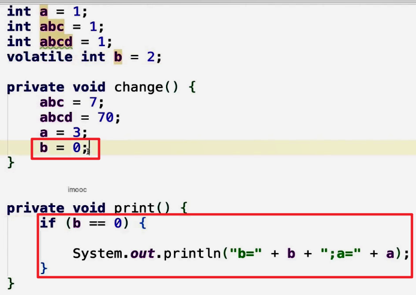

# 一、线程机制

> 并发编程使我们可以将程序划分为多个分离的、独立运行的任务。通过使用多线程机制，这些独立任务（子任务）中的每一个都将由执行线程来驱动。
>
> 一个线程就是一个在进程中的顺序控制流，单个进程可以拥有多个并发执行的任务（线程）。
>
> 线程模型简化了在单一程序中同时交织在一起的多个操作的处理。在使用线程时，CPU将轮流给每个任务分配其占用时间。每个任务都觉得自己在一直占用CPU，但事实上CPU时间是划分成片段分配给了所有的任务。线程的一大好处是可以使你从这个层次抽身出来，即代码不必知道它是运行在其具有一个还是多个CPU的机器上。


## 实现

**创建线程的方式有两种（Oracle官网）**


- 继承`Thread`类，并覆写Thread类的`run`方法。

```java
class PrimeThread extends Thread {
    long minPrime;
    PrimeThread(long minPrime) {
        this.minPrime = minPrime;
    }

    public void run() {
        // compute primes larger than minPrime
        . . .
    }
}

```


- 实现`Runnable`并实现`run`方法。

```java
class PrimeRun implements Runnable {
    long minPrime;
    PrimeRun(long minPrime) {
        this.minPrime = minPrime;
    }

    public void run() {
        // compute primes larger than minPrime
        . . .
    }
}
```


## 本质

无论继承`Thread`类还是实现`Runnable`的本质都是通过Thread类的`init`方法初始化Thread对象。唯一不同的是，继承Thread类，整个run方法被重写；实现Runnable接口，最终调用的是target.run()；

- Thread类的部分源码。

```java
private Runnable target;

// 构造器
public Thread() {
    init(null, null, "Thread-" + nextThreadNum(), 0);
}

public Thread(Runnable target) {
    init(null, target, "Thread-" + nextThreadNum(), 0);
}


// g 线程组、 target Runnable接口的实现类、 name 线程名字、stackSize当前线程的指定栈大小
private void init(ThreadGroup g, Runnable target, String name,
                  long stackSize) {
    init(g, target, name, stackSize, null, true);
}

private void init(ThreadGroup g, Runnable target, String name,
                  long stackSize, AccessControlContext acc,
                  boolean inheritThreadLocals) {
    ....
        
    this.target = target;// target != null
    
    ....
}

// 如果target不为null，执行target的run方法
@Override
public void run() {
    if (target != null) {
        target.run();
    }
}


/**
stackSize参数：
stackSize是Thread类的局部变量，官方给出的解释是：当前线程的指定栈大小，如果线程的创建者不指定大小，那默认值就是0，对这个数如何进行操作取决于JVM，有些JVM会忽略掉这个参数。

因此，设置这个参数以及这个参数是否生效取决于平台，和实际生产需要，如果设置了更小的栈深度，JVM能支持同时存活更多的线程，反之，单个线程拥有更大的递归深度，但是带来的是支持更少线程同时存活，因为我们的栈空间是一定的。

如果没有特殊的需求，尽量不要修改此参数，因为它本身的作用和范围取决于平台，在不同的VM上使用此参数，跨平台迁移时，如果以前已设定了对应值，需要检查是否需要修改这个参数。
**/
```


## 同用

```java
new Thread( ()->{
    System.out.println("Runnable run");
}) {
    @Override
    public void run() {
        System.out.println("Thread run");
    }
}.start();

// print:Thread run
```

从语法层面来将，Thread中虽然传入了Runnable的实现类对象，但是Thread的run方法又随之重写，所以在调用run方法的时候，子类存在run方法，所以会直接调用子类的run方法而略过父类的run方法。


## 总结

准确的的说，创建线程的方法只有一种，实现执行单元的方式有两种。


## 面试题

<font color=red>有多少种实现线程的方法？</font>

> 从不同的角度看，会有不同的答案。网上给出的答案也有很多种，但通过Oracle官方的文档找到的答案是两种。通过继承Thread类或者实现Runnable的接口两种方式。通过源码可以看出，虽然是两种方式，但创建线程的方法其实只有一种，都是通过构造器调用私有的init方法初始化Thread对象，但实现执行单元的方式有两种，继承Thread类，整个run方法被重写；实现Runnable接口，最终调用的是target.run()方法。其它方式如，线程池、Callable、定时器其本质都是如此。


<font color=red>实现Runnable接口和继承Thread类哪种方式更好</font>

> Runnable方式更好。
>
> 从代码架构角度看，实现Runnable接口避免了继承Thread类的单继承的局限性，也降低了线程对象和线程任务的耦合性，增强了程序的可扩展性。
>
> 继承thread类，每次新建一个任务就需要新建一个独立的线程，新建一个独立线程的开销是比较大的。而使用runnable的方式，有利于后续使用线程池之类的工具，这些工具可以大大减小创建线程和交互线程所带来的损耗。


# 二、start()与run()


## 区别

run方法存放的是线程所要执行的任务代码，而start方法调用的是native方法启动新的线程，使线程处于就绪（可运行）状态。


## 重复调用start()

重复调用start方法会抛出`java.lang.IllegalThreadStateException`（非法线程状态）异常。


- start方法源码

```java
public synchronized void start() {

    // 如果线程状态不对会抛出异常
    if (threadStatus != 0)
        throw new IllegalThreadStateException();

    // 加入线程组
    group.add(this);

    boolean started = false;
    try {
        // 调用start0()
        start0();
        started = true;
    } finally {
        try {
            if (!started) {
                group.threadStartFailed(this);
            }
        } catch (Throwable ignore) {

        }
    }
}

private native void start0();
```


# 三、停止线程


## 原理

使用interrupt来通知，而不是强制。


## 正确停止

通常的停止过程，在无外界干涉的情况下，代码运行结束，线程停止。

使用interrupt来请求停止线程。

- 普通情况

  ```java
  public class Main extends Thread {
  	@Override
      public void run() {
          int num = 0;
          while (!Thread.currentThread().isInterrupted() && num <= Integer.MAX_VALUE / 2) {
              if (num % 10000 == 0) {
                  System.out.println(num + "是10000的倍数");
              }
              num++;
          }
          System.out.println("任务运行结束了");
      }
  
      public static void main(String[] args) throws InterruptedException {
          Thread thread = new Main();
          thread.start();
          Thread.sleep(500);
          thread.interrupt();
      }
  }
  ```

  

- 线程可能被阻塞

  ```java
  public class Main {
  	public static void main(String[] args) throws InterruptedException {
          Runnable runnable = () -> {
              int num = 0;
              try {
                  while (num <= 300 && !Thread.currentThread().isInterrupted()) {
                      if (num % 100 == 0) {
                          System.out.println(num);
                      }
                      num++;
                  }
                  Thread.sleep(1000);
              } catch (InterruptedException e) {
                  e.printStackTrace();
                  // 中断处理
              }
          };
          Thread thread = new Thread(runnable);
          thread.start();
          Thread.sleep(500);
          thread.interrupt();
      }
  }
  ```

  通过处理`java.lang.InterruptedException`异常对线程中断进行处理。

  

- 每次工作迭代后都会阻塞

  如果在执行过程中，每次循环都会调用sleep或wait等方法，那么不需要每次迭代都检查是否已中断

  ```java
  public class Main {
  	public static void main(String[] args) throws InterruptedException {
          Runnable runnable = () -> {
              int num = 0;
              try {
                  while (num <= 10000) {
                      if (num % 100 == 0) {
                          System.out.println(num + "是100的倍数");
                      }
                      num++;
                      Thread.sleep(10);
                  }
              } catch (InterruptedException e) {
                  e.printStackTrace();
              }
          };
          Thread thread = new Thread(runnable);
          thread.start();
          Thread.sleep(5000);
          thread.interrupt();
      }
  }
  ```


## 最佳实践

实际开发中的最佳实践

1. 优先选择：传递中断。

   在catch到InterruptedException之后，优先选择：在方法签名中抛出异常。

   

2. 不想或无法传递：恢复中断 

   ```java
   public class Main  implements Runnable  {
   	@Override
       public void run() {
           while (true) {
               if (Thread.currentThread().isInterrupted()) {
                   System.out.println("Interrupted，程序运行结束");
                   break;
               }
               reInterrupt();
           }
       }
   
       private void reInterrupt() {
           try {
               Thread.sleep(2000);
           } catch (InterruptedException e) {
               Thread.currentThread().interrupt();// 中断恢复
               e.printStackTrace();
           }
       }
   
       public static void main(String[] args) throws InterruptedException {
           Thread thread = new Thread(new Main());
           thread.start();
           Thread.sleep(1000);
           thread.interrupt();
       }
   }
   ```

   

3. 不应屏蔽中断


## 响应中断的方法

```
Object.wait()/ wait( long)/ wait( long,int)
Thread.sleep( long)/sleep( long, int)
Thread.join)/ join( long)/ join( long, int)

java.util.concurrent.BlockingQueue.take()/put(E)
java.util.concurrent.locks.Lock.lockInterruptibly)
java.util.concurrent.CountDownLatch.await()
java.util.concurrent.CyclicBarrier. await)
java.util.concurrent.Exchanger. exchange(V)

java.nio.channels.InterruptibleChannel相关方法
java.nio.channels.Selector的相关方法
```


## 正确停止线程的好处

有些线程的代码非常重要，是否中断取决于被通知的代码本身，强行的中断线程可能导致数据的不完整。正确停止线程在实际开发中更加安全，也完成了资源清理等收尾工作，数据完整性得到了保障。


## 错误停止线程的方法

- 被弃用的`stop`,`suspend`和`resume`方法

  使用stop()来停止线程，会导致线程运行一半突然停止，无法完成一个基本单位的操作。会导致正常的流程被破坏


- 用`volatile`设置boolean标记位

  演示用volatile的局限，看似可行

  ```java
  public class WrongWayVolatile implements Runnable {
  
      private volatile boolean canceled = false;
  
      @Override
      public void run() {
          int num = 0;
          try {
              while (num <= 100000 && !canceled) {
                  if (num % 100 == 0) {
                      System.out.println(num + "是100的倍数。");
                  }
                  num++;
                  Thread.sleep(1);
              }
          } catch (InterruptedException e) {
              e.printStackTrace();
          }
      }
  
      public static void main(String[] args) throws InterruptedException {
          WrongWayVolatile r = new WrongWayVolatile();
          Thread thread = new Thread(r);
          thread.start();
          Thread.sleep(5000);
          r.canceled = true;
      }
  }
  ```

  

  演示用volatile的局限， 陷入阻塞时，volatile是无法停止线程的

  此例中，生产者的生产速度很快，消费者消费速度慢，所以阻塞队列满了以后，生产者会阻塞，等待消费者进一步消费。

  ```java
  public class WrongWayVolatileCantStop {
  
      public static void main(String[] args) throws InterruptedException {
          ArrayBlockingQueue storage = new ArrayBlockingQueue(10);
  
          Producer producer = new Producer(storage);
          Thread producerThread = new Thread(producer);
          producerThread.start();
          Thread.sleep(1000);
  
          Consumer consumer = new Consumer(storage);
          while (consumer.needMoreNums()) {
              System.out.println(consumer.storage.take()+"被消费了");
              Thread.sleep(100);
          }
          System.out.println("消费者不需要更多数据了。");
  
          //一旦消费不需要更多数据了，我们应该让生产者也停下来，但是实际情况
          producer.canceled=true;
          System.out.println(producer.canceled);
      }
  }
  
  // 生产者
  class Producer implements Runnable {
  
      public volatile boolean canceled = false;
  
      // 阻塞队列
      BlockingQueue storage;
  
      public Producer(BlockingQueue storage) {
          this.storage = storage;
      }
  
      @Override
      public void run() {
          int num = 0;
          try {
              while (num <= 100000 && !canceled) {
                  if (num % 100 == 0) {
                      storage.put(num);
                      System.out.println(num + "是100的倍数,被放到仓库中了。");
                  }
                  num++;
              }
          } catch (InterruptedException e) {
              e.printStackTrace();
          } finally {
              System.out.println("生产者结束运行");
          }
      }
  }
  
  // 消费者
  class Consumer {
  
      BlockingQueue storage;
  
      public Consumer(BlockingQueue storage) {
          this.storage = storage;
      }
  
      public boolean needMoreNums() {
          if (Math.random() > 0.95) {
              return false;
          }
          return true;
      }
  }
  ```


## 停止线程相关函数

- interrupt

- static boolean interrupted()

  返回当前线程是否被中断，并将中断状态设置为false（会清除线程中断状态）。

- boolean isInterrupted()

  返回当前线程是否被中断。

- Thread.interrupted()


## 面试题

<font color=red>如何停止线程</font>

> 对于停止线程，优先使用的应该是interrupt来请求，而不是强制。同时想要停止线程，要请求方（使用interrupt请求）、被停止方（对中断状态进行判断）、子方法被调用方（异常抛出）相互配合。
>
> 对于stop、suspend已被废弃，而使用volatile的boolean标记无法处理长时间阻塞的情况。

<font color=red>如何处理不可中断的阻塞</font>

> 对于这种情况没有通用的停止线程的方法，只能在我们编写代码的过程中尽可能的使用那些带有能够响应中断方法的类。


# 四、线程生命周期


## 六种状态转换

**New**

已经创建，但是还尚未启动的新线程。


**Runnable**

可运行。调用start方法之后就进入了Runnable状态。Runnable其实是对应操作系统中的两种状态，一种是可运行的，一种是运行中的。


**Blocked**

使用synchronized修改时的相关方法或代码块


**Waiting**

等待。


**Timed Waiting**

计时等待。


**Terminated**

终止。


# 五、Thread和Object类中的重要方法

## 概览


## wait，notify，notifyAll

作用：阻塞阶段、唤醒阶段、遇到中断

- wait

  使当前线程等待，直到另一个线程为此对象调用notify方法notifyAll方法。

- notify

  唤醒持当前锁等待的任意一个线程。

- notifyAll

  唤醒所有等待的线程。

## sleep

作用：只想让线程在预期的时间执行，其它时候不要占用cpu资源。

特点：

- 不释放锁，包括synchronized和lock；和wait不同，wait会释放锁，sleep在睡眠期间依旧持有锁。

- 响应中断，会抛出InterruptedException。响应中断之后会清楚中断状态。

  ```java
  // 睡眠的第二种写法，同样可以响应中断
  try {
      TimeUnit.SECONDS.sleep(3);
  } catch (InterruptedException e) {
      e.printStackTrace();
  }
  
  // TimeUnit.xxx.sleep(x);源码。对于小于0的值，不做处理。
  public void sleep(long timeout) throws InterruptedException {
      if (timeout > 0) {
          long ms = toMillis(timeout);
          int ns = excessNanos(timeout, ms);
          Thread.sleep(ms, ns);
      }
  }
  
  // Thread.sleep() 对于超出范围的参数会抛出错误
  public static void sleep(long millis, int nanos)
      throws InterruptedException {
      if (millis < 0) {
          throw new IllegalArgumentException("timeout value is negative");
      }
  
      if (nanos < 0 || nanos > 999999) {
          throw new IllegalArgumentException(
              "nanosecond timeout value out of range");
      }
  
      if (nanos >= 500000 || (nanos != 0 && millis == 0)) {
          millis++;
      }
  
      sleep(millis);
  }
  ```

sleep方法可以让线程进入waiting状态，并且不占用cpu资源，但是不释放锁，知道规定时间后再执行，休眠期间如果被中断，会抛出异常并清除中断状态。

## join

作用：因为新的线程加入，所以要等待加入的线程执行完成再继续。

用法：main等待thread-0执行完毕。

join()期间的线程状态：waiting。


**join原理**

- join源码

  从源码可以看出，join的底层是由wait实现的。而wait实质上是需要notify来进行唤醒，然我我们并没有在源码中找到notify的的相关代码。

  ```java
  public final void join() throws InterruptedException {
      join(0);
  }
  
  public final synchronized void join(long millis) throws InterruptedException {
      long base = System.currentTimeMillis();
      long now = 0;
  
      if (millis < 0) {
          throw new IllegalArgumentException("timeout value is negative");
      }
  
      if (millis == 0) {
          while (isAlive()) {
              wait(0);// join底层使用wait实现的
          }
      } else {
          while (isAlive()) {
              long delay = millis - now;
              if (delay <= 0) {
                  break;
              }
              wait(delay);
              now = System.currentTimeMillis() - base;
          }
      }
  }
  ```

- notify的唤醒操作其实是在jvm中实现的，通过jvm源码可以发现，当线程的run方法执行完毕之后，会调用notifyAll。

  详细源码看<a href="#openjdk-thread">opjdk thread 相关源码</a>

- 模拟join

**工具类**

- CountDownLatch
- CyclicBarrier


## yield

作用：释放使用的CPU时间片

定位：JVM不保证遵循

yield和sleep的区别：最关键的区别在于，是否随时可能被再次调度。


## Thread.currentThread()

获取当前线程


## start，run


## stop，suspend，resume


## 生产者消费者模式


## 面试题

<font color=red>为什么线程通信的方法wait()，notify()和notifyAll()被定义在Object类中？而sleep定义在Thread类中？</font>


<font color=red>用3种方法实现生产者模式，手写生产者消费者设计模式</font>

使用生产者消费者模式可以让生产者和消费者解耦，并且还能完成更好的配合。


<font color=red>join和sleep和wait期间线程的状态分别是什么？为什么？</font>


<font color=red>实现两个线程交替打印0到100的奇偶数</font>


<font color=red>为什么wait()需要在同步代码块内使用，而sleep()不需要</font>

使通信变得可靠，防止死锁或者永久等待的发生。因为wait()的使用是需要线程间的配合，如果不将wait()放在同步代码块中，可能会出现现执行wait之前突然切换线程执行notify的情况，导致wait永久等待，线程也因此无法得到释放。而sleep会定时结束，不需要其它线程的配合，所以可以不用放在同步代码块中。


<font color=red>为什么线程通信的方法wait，notify和notifyAll被定义在Object类里面？而sleep定义在Thread类里面？</font>

在Java中wait，notify都是锁级别的操作，锁是属于某一个对象的（每一个对象它的对象头都有标记位用来保存锁的状态），锁是绑定在某一个对象中，而不是线程中。如果将这些个方法定义到Thread类中，那么当一个线程持有多个锁的时候，就做不到在Object类中的灵活性。


<font color=red>wait方法是属于Object对象的，那调用Thread.wait会怎样？</font>

当一个线程被销毁的时候会调用notifyAll的方法，将所有等待中的线程唤醒，这可能会造成我们原本的执行流程被破坏。

当 Thread 执行完毕之后会调用 `notifyAll()` 方法，不过不是在 `Java` 源码中调用的，而是在 `jdk` 的 native code 里调用的。

<div id="openjdk-thread">openjdk 7 thread相关源码</div>里有：

**/jdk7/hotspot/src/os/linux/vm/os_linux.cpp**

```c++
int ret = pthread_create(&tid, &attr, (void* (*)(void*)) java_start, thread);

static void *java_start(Thread *thread) {
  ...
  thread->run();
  return 0;
}
```

参数里的 `thread` 其实是 `JavaThread` 的实例，而在 `JavaThread` 的内部实现中，在 `run` 方法执行结束之前会调用 `lock.notify_all(thread)` 通知所有 `join` 等待的线程。源码如下：

**/jdk7/hotspot/src/share/vm/runtime/thread.cpp**

```c++
void JavaThread::run() {
  ...
  thread_main_inner();
}

void JavaThread::thread_main_inner() {
  ...
  this->exit(false);
  delete this;
}

void JavaThread::exit(bool destroy_vm, ExitType exit_type) {
  ...
  // Notify waiters on thread object. This has to be done after exit() is called
  // on the thread (if the thread is the last thread in a daemon ThreadGroup the
  // group should have the destroyed bit set before waiters are notified).
  ensure_join(this);
  ...
}

static void ensure_join(JavaThread* thread) {
  // We do not need to grap the Threads_lock, since we are operating on ourself.
  Handle threadObj(thread, thread->threadObj());
  assert(threadObj.not_null(), "java thread object must exist");
  ObjectLocker lock(threadObj, thread);
  // Ignore pending exception (ThreadDeath), since we are exiting anyway
  thread->clear_pending_exception();
  // Thread is exiting. So set thread_status field in  java.lang.Thread class to TERMINATED.
  java_lang_Thread::set_thread_status(threadObj(), java_lang_Thread::TERMINATED);
  // Clear the native thread instance - this makes isAlive return false and allows the join()
  // to complete once we've done the notify_all below
  java_lang_Thread::set_thread(threadObj(), NULL);
  lock.notify_all(thread);
  // Ignore pending exception (ThreadDeath), since we are exiting anyway
  thread->clear_pending_exception();
}
```


<font color=red>notifyAll之后所有的线程都会再次抢夺锁，如果某线程抢夺失败怎么办？</font>

**<font color=green>TODO：执行notifyAll之后，未得到锁的线程状态是处于waiting还是blocked</font>**

如果说线程在notifyAll之后没有抢夺到这把锁，事实上只是会回到最初的状态，继续等待锁，知道线程调度，得到锁继续执行。

<font color=red>能否使用suspend和resume来阻塞线程</font>

由于安全问题两个方法已经被废弃。


<font color=red>wait/notify、sleep异同（方法属于哪个对象？线程状态怎么切换？）</font>

- 相同
  1. 都会让线程陷入阻塞
  2. 都能响应中断
- 不同
  1. wait/notify需要在同步方法中执行，这样可以是的使得线程更加安全避免死锁和永久等待；而sleep可以不需要在同步代码中执行。
  2. wait会释放锁；sleep不会释放。
  3. wait需要其它线程进行唤醒；sleep会在指定时间后恢复。
  4. 因为Java每一个对象它的对象头都有标记位用来保存锁的状态，将wait方法放在Object类中，可以让每一个锁都可以进行调用；sleep属于Thread或TimeUnit中的方法。


# 六、线程属性


## 线程Id

Id号是自增的。从1开始。JVM运行起来后，我们自己创建的线程Id早已不是0.

源码

```java
public long getId() {
    return tid;
}

private void init(ThreadGroup g, Runnable target, String name,
                      long stackSize, AccessControlContext acc,
                      boolean inheritThreadLocals) {
    .....
    .....
        
    /* Set thread ID */
    tid = nextThreadID();// tid再线程创建时被赋值。
}

/* For generating thread ID 默认值为0 */
private static long threadSeqNumber;

private static synchronized long nextThreadID() {
    return ++threadSeqNumber;// 先++再返回，所以线程id是以1开始。
}
```


## 线程名字

如果在创建线程时没有传入线程的名字，默认使用0、1、2、3...的形式递增设置线程名字

```java
public Thread() {
    init(null, null, "Thread-" + nextThreadNum(), 0);
}

public Thread(Runnable target) {
    init(null, target, "Thread-" + nextThreadNum(), 0);
}

private static int threadInitNumber;
private static synchronized int nextThreadNum() {
    return threadInitNumber++;// 返回自增之前的值
}
```


获取线程名字

```java
thread.getName();
// 或
Thread.currentThread().getName();
```


设置线程名字

```java
private volatile int threadStatus = 0;

public final synchronized void setName(String name) {
    checkAccess();
    if (name == null) {
        throw new NullPointerException("name cannot be null");
    }

    this.name = name;// 未启动之前直接修改name的属性
    if (threadStatus != 0) {
        setNativeName(name);// 如果已经启动，使用native方通过jvm修改源线程名字
    }
}
```


## 守护线程

作用：给用户线程提供服务。

特性：

线程类型默认继承自父线程

通常而言，所有的守护线程都是由jvm自动启动的，而不是由用户去启动。但是用户可以创建守护线程。在jvm启动时，启动的Main不是守护线程。

守护线程不会影响jvm的退出。


与普通线程的区别：

整体上无区别

唯一的区别在于是否影响jvm的离开


在守护线程中，编写代码要注意：守护线程不能持有任何需要关闭的资源，例如打开文件等，因为虚拟机退出时，守护线程没有任何机会来关闭文件，这会导致数据丢失。


## 线程优先级

Java中有10个优先级，默认5。所以创建出来的子线程会继承父线程的优先级，所以也是5。如果父线程的优先级被更改，子线程继承父线程优先级将不再是默认的5.

程序设计中不应该依赖于优先级。

- 线程的优先级高度依赖于操作系统，但是对于不同的操作系统对于优先级的理解是不一样的。比如windows系统的优先级只有7.

  | Java 线程优先级 | Linux | Windows                          | Apple | Bsd | Solaris |
| --------------- | ----- | -------------------------------- | ----- | --- | ------- |
| 1               | 4     | THREAD_PRIORITY_LOWEST(-2)       | 27    | 0   | 0       |
| 2               | 3     | THREAD_PRIORITY_LOWEST(-2)       | 28    | 3   | 32      |
| 3               | 2     | THREAD_PRIORITY_BELOW_NORMAL(-1) | 29    | 6   | 64      |
| 4               | 1     | THREAD_PRIORITY_BELOW_NORMAL(-1) | 30    | 10  | 96      |
| 5               | 0     | THREAD_PRIORITY_NORMAL(0)        | 31    | 15  | 127     |
| 6               | -1    | THREAD_PRIORITY_NORMAL(0)        | 32    | 18  | 127     |
| 7               | -2    | THREAD_PRIORITY_ABOVE_NORMAL(1)  | 33    | 21  | 127     |
| 8               | -3    | THREAD_PRIORITY_ABOVE_NORMAL(1)  | 34    | 25  | 127     |
| 9               | -4    | THREAD_PRIORITY_HIGHEST(2)       | 35    | 28  | 127     |
| 10              | -5    | THREAD_PRIORITY_HIGHEST(2)       | 36    | 31  | 127     |


- 优先级会被操作系统所修改

  在windows中存在一个优先级推进器，如果发现一个线程一直在努力想要被执行的话，就会越过优先级，优先为该线程分配时间。此时优先级的设置就不再器作用。

## 各属性总结


## 面试题

守护线程和普通线程的区别


我们是否需要给线程设置为守护线程？

一般我们不需要去设置守护线程，因为我们创建的守护线程会让我们的代码变得非常危险。如果守护线程中持有需要关闭的资源，而守护线程没有任何关闭资源的机会，这会导致数据丢失。


什么时候我们需要设置守护线程？


我们应该如何应用线程优先级来帮助程序运行？有哪些禁忌？

不应该使用优先级，因为不同的操作系统对优先级的映射和调度都不一样。


不同的操作系统如何处理优先级问题？


# 未捕获异常如何处理

线程未捕获异常UncaughtException应该如何处理？


为什么需要UncaughtExceptionHandler？

对于主线程可以轻松发现异常，子线程却不行。

子线程的异常无法使用传统方法捕获。try/catch只能捕获对应线程内的异常。

对于UncaughtException的捕获，可以提高程序的健壮性。


## 解决方案

一（不推荐）

在线程内try/catch


二、（推荐）

利用UncaughtExceptionHandler

```java
@FunctionalInterface
public interface UncaughtExceptionHandler {
    /**
         * Method invoked when the given thread terminates due to the
         * given uncaught exception.
         * <p>Any exception thrown by this method will be ignored by the
         * Java Virtual Machine.
         * @param t the thread
         * @param e the exception
         */
    void uncaughtException(Thread t, Throwable e);
}
```


异常处理器调用策略

```java
public void uncaughtException(Thread t, Throwable e) {
    // 默认情况下parent是null    
    if (parent != null) {
        parent.uncaughtException(t, e);
    } else {
        // 调用Thread.setDefaultUncaughtExceptionHandler(...)
        // 方法设置的全局handler进行处理
        Thread.UncaughtExceptionHandler ueh =
            Thread.getDefaultUncaughtExceptionHandler();
        if (ueh != null) {
            ueh.uncaughtException(t, e);
        } else if (!(e instanceof ThreadDeath)) {
            // 全局handler也不存在就输出堆栈信息
            System.err.print("Exception in thread \""
                             + t.getName() + "\" ");
            e.printStackTrace(System.err);
        }
    }
}
```

实现

- 给程序统一设置
- 给每个线程单独设置
- 给线程池设置

```java
/**
 * @author lwm
 * @date 2020-09-17 13:24
 * @description
 */
public class MyUncaughtException implements Thread.UncaughtExceptionHandler {

    @Override
    public void uncaughtException(Thread t, Throwable e) {
        Logger logger = Logger.getAnonymousLogger();
        logger.log(Level.WARNING, "线程异常终止了" + t.getName(), e);
    }
}


/**
 * @author lwm
 * @date 2020-09-17 13:29
 * @description
 */
public class TreadExceptionDemo implements Runnable {

    @Override
    public void run() {
        throw new RuntimeException();
    }

    public static void main(String[] args) {
        Thread.setDefaultUncaughtExceptionHandler(
                new MyUncaughtException()
        );
        new Thread(new TreadExceptionDemo(), "thread001").start();
        new Thread(new TreadExceptionDemo(), "thread002").start();
        new Thread(new TreadExceptionDemo(), "thread003").start();
    }
}
```


## 面试题

Java异常体系图


实际工作中，如何全局处理异常？为什么要全局处理？不处理行不行？


run方法是否可以抛出异常？如果抛出异常，线程状态是什么？


线程中如何处理某个未处理异常？


# 多线程可能导致的安全、性能问题

## 线程安全

什么是线程安全？

当多个线程访问一个对象时，如果不用考虑这些线程在运行时环境下的调度和交替执行，也不需要进行额外的同步或者在调用方法进行任何其它的协作操作，调用这个对象的行为都可以获得正确的结果，那么这个对象使线程安全的。


什么是线程不安全？

多线程访问一个对象时，对象没有一种对数据相应的保护机制，在出现多个线程同时对对象进行数据读写时，可能得到不正确的脏数据。


实现线程安全的代价：

会降低运行速度

设计成本的提高


什么情况下会出现线程安全问题，怎么避免？

- 运行结果错误
- 活跃性问题：死锁、活锁、饥饿
- 对象发布和初始化的时候的安全问题


各种需要考虑线程安全的情况

- 访问共享的变量或资源，会有并发风险，比如对象的属性、静态变量、共享缓存、数据库等。
- 所有依赖时序的操作，即使每一步操作都是线程安全的，还是存在并发问题：read-modify-write、check-then-act
- 不同的数据之间存在捆绑关系的时候
- 我们使用其他类的时候，如果对方没有声明自己是线程安全的。


性能问题有哪些体现、什么是性能问题

调度：上下文切换

什么时候会产生线程调度？

可运行的线程数超过了cup的数量，就会产生线程调度

什么是上下文？

上下文切换：挂起-保存线程状态


缓存开销

线程切换会让当前执行的线程大部分缓存失效


何时会导致密集的上下文切换

抢锁、IO


协作：内存同步


为什么多线程会带来性能问题、什么是性能问题


为什么多线程会带来性能问题


常见面试问题

一共有哪几类线程安全问题？

哪些场景需要额外注意线程安全问题？

什么是多线程上下文切换？

​	涉及操作系统、计算机组成原理

# synchronized

## 作用

> 同步方法支持一种简单的策略来防止线程干扰和内存一致性错误。如果一个对象对多个线程可见，则对该对象变量的所有读取或写入都是通过同步方法完成的。


synchronized关键字能够保证在同一时刻最多只有一个线程执行该段代码，以达到保证并发安全的效果。

是最基本的互斥同步手段。


## 用法

**对象锁**

- 方法锁（默认锁对象为this当前实例对象）
- 同步代码块锁（自己指定锁对象）


**类锁**

- 指synchronized修改时静态的方法或指定锁为class对象


多线程访问同步方法的7中情况

1. 两个线程同时访问一个对象的同步方法

   同时只能有一个线程持有，而另一个线程会进入阻塞状态。

   

2. 两个线程访问的是两个对象的同步方法

   synchronized不起作用，因为两个线程使用的是两个锁。

   

3. 两个线程访问的是synchronized的静态方法

   锁生效。

   

4. 同时访问同步方法与非同步方法

   不会影响非同步方法。

   

5. 访问同一个对象的不同的普通同步方法

6. 同时访问静态synchronized和非静态synchronized方法

   静态同步方法的背后是所在类的类锁.class。

   非静态的同步方法背后是当前类的实例本身this

7. 方法抛出异常之后，会释放锁


一把锁只能同时被一个线程获取，没有拿到锁的线程必须等待（对应1、5）

每个实例都对应有自己的一把锁，不同实例之间互不影响；例外，锁对象是*.class以及synchronized修饰的是static方法的时候，所有对象公用同一把锁（对应2、3、4、6种情况）

无论是方法正常执行完毕或者方法抛出异常，都会释放锁（对应7）

注意：在synchronized修饰的方法中调用非同步的方法，那么此时这个被synchronized修饰的方法便不再是安全的。


**synchronized性质**

可重入

指的是同一线程的外层函数获得锁之后，内层函数直接再次获取该锁。

好处：避免死锁、提升封装性。

粒度：可重复入的粒度是线程范围的而非调度范围。

不可中断

一旦这个锁已经被别人获得了，如果我还想获得，只能选择等待或者阻塞，直到别的线程释放这个锁。如果别人永远不释放锁，那么我只能永远的等下去。

# 自顶向下

遇到问题？

为什么会出现这样的问题？

怎么解决？

什么工具可以解决问题？

工具的基本原理？

从整体出发。从整体的知识结构出发。

# 并发编程底层原理

## 底层原理

> 面试必问。底层原理，JMM，Java内存模型。
>

从Java代码到CPU指令。

.

1. 编写.java文件
2. 在javac编译后产生Java字节码文件(.class)
3. jvm会执行生成的字节码文件，并把字节码文件转化为机器指令
4. 机器指令可以直接在CPU上运行，也就是最终地 程序执行。

JVM会根据操作系统和CPU平台的不同，将相同的代码翻译成不同的机器指令，因为不同的CPU的机器指令又千差万别，所以同样的代码就无法保证在不同的CPU上实现相同的并发效果。正是由于这样的问题，我们需要在翻译过程中遵守一定的规范和原则，以达到同样的代码能在不同平台实现相同的效果。

JVM实现会带来不同的“翻译”，不同的CPU平台的机器指令又千差万别，无法保证并发安全的效果一致。


## JVM内存结构

> IVM内存结构和Java虚拟机的运行时区域有关。

.

方法区和堆是所有线程共享的，而Java栈、本地方法区、程序计数器是每个线程私有的。

**堆（heap）**

整个运行区域最大的一块，占用内存最多。

通过new创建的实例对象、数组。

运行时动态分配内存，对象的创建和销毁都会体现在堆中。

**虚拟机栈（Java栈 VM stack）**

保存了各个基本数据类型，以及对各个对象的引用，编译时确定了大小，运行时不会改变。

**方法区**

已经加载的各个static静态变量，类信息，常量信息，永久引用（static的引用）

**本地方法栈**

保存地本地native方法。

**程序计数器**

所占内存最小，主要保存线程所要执行程序字节码的行号数，以及下一条的指令、分支、循环等内容。


## Java对象模型

> Java对象模型和Java在虚拟机中的表现形式有关。

.

因为Java是面向对象的，所以每一个对象在jvm中的存储都是有一定结构的。

Java对象自身的存储模型。

Jvm会给这个类创建一个instanceKlass，保存在方法区，用来在Jvm层表示该Java类。

当我们在Java代码中，使用new创建一个对象的时候，Jvm会创建一个instanceOopDesc对象，这个对象中包含了对象头以及实例数据。并将其对象保存在堆中。

当对象被引用的时候，其引用被保存在栈中。


## Java内存模型

> Java内存模型和Java并发编程有关。

**JMM是什么？**

JMM：Java内存模型（Java Memory Model），它是一组规范，需要各个Jvm的实现来遵守JMM规范。以便于开发者可以利用这些规范，更方便的开发多线程程序。由JVM、编译器、CPU共同遵守。

**为什么需要JMM？**

例如在C语言中就不存在内存模型的概念，所以很多行为是依赖处理器本身的内存一致性模型，由于这种模型是依赖于处理器的，不同的处理器又来自于不同的厂商，他们的内存一致性模型也存在着很多的差异，这种情况下，相同的代码无法在不同的CPU平台无法得到相同的运行结果，也就无法保证并发安全。（很多情况下，CPU会进行乱序，重排序）在这种情况下，我们需要一个标准，让多线程运行的结果能够达到可预期的状态。

如果没有这样的一个JMM内存模型来规范，那么很可能经过了不同JVM的不同规则的重排序之后，导致不同的虚拟机上运行的结果不一样，那是很大的问题。

JMM问题解决重排序、可见性、原子性问题。

**是工具类和关键字的原理**

例如volatile、synchronized、Lock等关键字的实现原理都是JMM。

如果没有JMM，那么就需要我们自己指定什么时候用内存栅栏（工作内存和主内存之间的拷贝和同步）等，那是相当麻烦的，有了JMM让我们只需要用同步工具和关键字就可以开发并发程序。

**最重要的3点内容：重排序、可见性、原子性**

- 重排序

  什么是重排序？

  带来的问题：

  带来的好处：减少了机器指令执行的数量，提高了程序的处理速度。

  重排序的3种情况：编译器优化、CPU指令重排序、内存的“重排序”

  重排序会将代码执行顺序进行重新排列，以减少开销。

  编译器优化：包括JVM、JIT编译器等

  CPU指令重排：就算编译器不发生重拍，CPU也可能对指令进行重拍

  内存的“重排序”：线程A的修改线程B却看不到，引出可见性问题。（表面现象重排序）

- 可见性

  什么是可见性

  可见性，是指线程之间的可见性，一个线程修改的状态对另一个线程是可见的。

  

  什么是可见性问题

  可见性问题：当一个线程执行写操作时，另外一个线程无法看见此时被更改的值。

  

  为什么会有可见性问题

  由于数据的写入没有及时的从本地内存更新到主内存，而线程间的数据又是不同步的，所以引发了可见性问题。

  .

  从内存到CPU的过程其实是有多重缓存的，从L3到L1依次会缓存上一级缓存中高频率被用到的数据，所以层级的向上每一层缓存的数据都在缩小，但速度都在逐渐增加。

  也体现了为什么不同的处理器之间，他们的值不一样。

  CPU有多级缓存，导致读的数据过期。高速缓存的容量比主内存小，但是速度仅次于寄存器，所以在CPU和主内存之间就多了Cache层。线程间的对于共享变量的可见性问题不是直接由多核引起的，而是由多级缓存而引起的。

  如果所有的核心都只用一个缓存，那么也就不存在内存可见性问题了。每个核心都会将自己需要的数据读到独占缓存中，数据修改后也是写入到缓存中，然后等待刷入到主存中。所以会导致有些核心读取的值是一个过期的值。

  

  JMM的抽象：主内存和本地内存

  Java作为高级语言，屏蔽了这些底层细节，用JMM定义了一套读写内存数据的规范，虽然我们不再需要关心一级缓存和二级缓存的问题，但是，JMM抽象了主内存和本地内存的概念。

  这里说的本地内存并不是真的是一块给每个线程分配的内存，而是JMM的一个抽象，对于寄存器、一级缓存、二级缓存等的抽象。

  cup + 本地内存 + 主存

  .

  

  主内存和本地内存

  .

  

  JMM规定：

  所有的变量都存储在主内存中，同时每个线程也有自己独立的工作内存，工作内存中的变量内容是内存中的拷贝。

  线程不能直接读写主内存中的变量，而是只能操作自己工作内存中的变量，然后再同步到主内存中。

  主内存是多个线程共享的，但线程间不桐乡工作内存，如果线程间需要通信，必须借助主内存中转来完成。

  所有的共享变量存在于主内存中，每个线程有自己的本地内存，而且线程读写共享数据也是通过本地内存交换的，而有时这样的交换不是实时的，所以才导致了可见性问题。

  

  Happens-Before原则

  单线程规则

  .

  

  

  锁操作（synchronized和Lock）

  .

  

  

  volatile变量

  .

  写线程完成写操作，读线程就能读到。

  

  线程启动

  子线程启动，默认能够读取它启动之前主线程的内容。

  

  

  线程join

  join之后的语句可以看到等待join之前的所有语句。

  

  传递性

  如果hb(A, B)而且hb(B, C)，那么可以推出hb(A, C)

  

  中断

  一个线程被其它线程interrupt时，那么检测中断（isInterrupted）或者抛出InterruptedException一定能看到。

  

  构造方法

  对象构造方法的最后一行指令happens-before于finalize()方法的第一行指令。

  

  工具类的Happens-Before原则

  ​	线程安全的容器get一定能看到再次之前的put等存入动作

  ​	CountDownLatch

  ​	Semaphore：信号量

  ​	Future：通过get得到任务的执行结果

  ​	线程池

  ​	CyclicBarrier

  

  

  

  volatile关键字

  > volatile关键字详解
  >
  > https://www.cnblogs.com/zhengbin/p/5654805.html

  Java语言提供了一种稍弱的同步机制，即volatile变量，用来确保将变量的更新操作通知到其他线程。当把变量声明为volatile类型后，编译器与运行时都会注意到这个变量是共享的，因此不会将该变量上的操作与其他内存操作一起重排序。volatile变量不会被缓存在寄存器或者对其他处理器不可见的地方，因此在读取volatile类型的变量时总会返回最新写入的值。

  

  

  给b加上volatile，不仅b被影响，也可以实现轻量级的同步。b之前的写入（对应b=a）对读取b后的代码（print b）都是可见的，所以在writerThread里对a的赋值，一定会对readerThread里的读取可见，所以这里的a即时不加volatile，只要b读取到3，就可以有happens-before原则保证了读取到的都是3而不可能读取到1。

  

  valatile是什么、有什么用

  volatile是一个关键字，同时它是一种同步机制，比synchronized或者Lock相关类更轻量，因为使用volatile并不会发生上下文切换等开销很大的行为。它仅仅只是做一次将值刷入主内存的操作。

  如果一个变量被修饰成volatile，那么JVM就知道了这个变量可能会被并发修改，而做出一些相应操作，例如禁止重排序。

  但是开销小，相应的能力也小，虽然说volatile是用来同步的保证线程安全的，但是volatile做不到synchronized那样的原子保护，volatile仅在很有限的场景下才能发挥作用。

  

  volatile的适用场景

  不适用：a++

  适用场合1：boolean flag，如果一个共享变量自始自终只被各个线程赋值，而没有其它的操作，那么就可以用volatile来代替synchronized或者代替原子变量，因为赋值自身是有原子性的，而volatile又保证了可见性，所以就足以保证线程安全。

  volatile修饰的变量只能进行诸如赋值的原子操作，不能依赖于之前的状态。

  适用场合2：作为刷新之前变量的触发器

  

  被作为触发器使用，对b进行写入之前的操作能够被确保看到，所以当读取到b==0时，之前的操作一定执行完成。

  

  

  

  

  volatile的作用：可见性、禁止重排序

  可见性：读一个volatile变量之前，需要先使相应的本地缓存失效，这样就必须到主内存读取最新值，写一个volatile属性会立即刷入到主内存。

  禁止指令重排序优化：解决单例双重锁乱序问题。

  

  volatile和synchronized的关系

  volatile在这方面可以看做是轻量版的synchronized：如果一个共享变量自始自终只被各个线程赋值，而没有其它的操作，那么就可以用volatile来代替synchronized或者代替原子变量，因为赋值自身是有原子性的，而volatile又保证了可见性，所以就足以保证线程安全。

  

  用volatile修正重排序问题

  

  小结

  volatile修饰符适用于以下场景：某个属性被多个线程共享，其中有一个线程修改了此属性，其他线程可以立即得到修改后的值，比如boolean flag；或者作为触发器，实现轻量级同步。

  volatile属性的读写操作都是无锁的，它不能替代synchronized。因为它没有提供原子性和互斥性。因为无锁，不需要话费时间在获取锁和释放锁上，所以它是低成本的。

  volatile只能作用于属性，我们用volatile修饰属性，这样compilers（编译器）就不会对这个属性做指令重排序。

  volatile提供了可见性，任何一个线程对其的修改将立马对其他线程可见。volatile属性不会被线程缓存，始终从主存中读取。

  volatile提供了happens-before保证，对volatile变量v的写入，happens-before所有其它线程后续对v的读操作。

  volatile可以使得long和double的赋值是原子的。

  

  

  能保证可见性的措施

  除了volatile可以让变量保证可见性外，synchronized、Lock、并发集合、Thread.join()和Thread.start()等都可以保证可见性（happens-before规定了一系列的可见性原则）

  

  对synchronized可见性的正确理解

  synchronized不仅保证了原子性，还保证了可见性。

  synchronized不仅让被保护的代码安全，并且还能让其之间的代码可见。

  

  

- 原子性

  什么是原子性

  一系列的操作，要么全部执行成功，要么全部不执行，不会出现执行一半的情况，是不可分割的。

  

  Java中原子操作有哪些

  除了long和double之外的基本类型（int，byte，boolean，short，char，float）的赋值操作

  所有引用reference的赋值操作，不管是32位还是64位的机器

  原子操作工具类Java.concurrent.Atomic.*

  

  long与double的原子性

  问题描述：官方文档、对于64位的值的写入，可以分为两个32位的操作进行写入，读取错误、使用volatile解决

  在32位上的JVM，long和double的操作不是原子的，但是在64位的JVM上是原子的。

  实际开发中，商用Java虚拟机中不会出现，已经实现了原子性。

  

  原子操作+原子操作!=原子操作

- 常见面试问题

  JMM应用实例：单例模式8种写法、单例和并发的关系（真实面试超频考点）

  单例模式：节省内存和计算、保证结果正确、方便管理

  适用场景：

  ​	无状态的工具类：比如日志工具类，不管是在哪里使用，我们需要的知识它帮助我们记录日志信息，除此之外，并不需要在它的实例对象上存储任何状态，这时候我们就只需要一个实例对象即可。

  ​	全局信息类：比如我们在一个类上记录网站的访问次数，我们不希望有的访问被记录在对象A上，有的却记录在对象B上，这时候我们就让这个类成为单例。

  饿汉式（静态常量）【可用】

  饿汉式（静态代码块）【可用】

  饿汉：简单，但是没有Lazy loading

  懒汉：有线程安全问题

  静态内部类：可用

  双重检查：面试用

  枚举：最好

- 用哪种单例的实现方案最好

  在《Effective Java》中有记录：使用枚举实现单例的方法虽然还没有广泛采用，但是单元素的枚举类型已经成为实现Singleton的最佳方法。

  写法简单

  线程安全有保障，底层由静态内部类实现。

  避免反序列化破坏单例。

- 各种写法的使用场合

  最好的方法是利用枚举，因为还可以防止反序列化重新创建新的对象。

  非线程同步的方法不能使用。

  如果程序一开始要加载的资源太多，那么就应该使用懒加载来提高启动速度。

  饿汉式如果是对象的创建需要配置文件就不适用。

  懒加载虽然好，但是静态内部类这种方式会引入编程复杂性。


单例模式面试常见问题

饿汉模式的缺点

懒汉模式的缺点

为什么要用双重检查？不用就不安全吗？

为什么双重检查模式要用volatile？

应该如何选择，用哪种单例的实现方案最好？

讲一讲什么是Java内存模型

起因、三种概念、是什么、三个部分、重排序的例子和好处、可见性-happens原则、volatile、与synchronized的关系、synchronized、原子性、Java中的原子类

volatile和synchronized的异同

什么是原子操作？Java中有哪些原子操作？生成对象的过程是不是原子操作？

什么是内存可见性？内存图

64位的double和long写入的时候是原子的吗？先说理论，再说商用。

# 并发死锁问题与企业级解决方案


死锁是什么？

发生在并发中。

互不相让：当两个（或更多）线程（或进程）相互持有对方所需要的资源，又不主动释放，导致所有人都无法继续前进，大致程序进入无尽的阻塞，这就是死锁。


多个线程造成死锁的情况？

如果多个线程之间的依赖关系是环形，存在环路的锁的依赖关系，那么也可能会发生死锁。


死锁的影响在不同系统中是不一样的，这取决于系统对死锁的处理能力。

数据库中：检测并放弃事务。

JVM中：无法自动处理，但有检测工具。

有什么危害（影响）？


几率不高但危害大？

一旦发生，多是高并发场景，影响用户多。

整个系统崩溃、子系统崩溃、性能降低，产生的影响取决于产生死锁所做的业务具体代码。

压力测试无法找出所有潜在的死锁。


发生死锁的例子

当类的对象flag=1时（T1），先锁定o1，睡眠500毫秒，然后锁定O2；

而T1在睡眠的时候另一个flag=0的对象T2线程启动，先锁定o2，睡眠500毫秒，等待T1释放o1.

T1睡眠结束后需要锁定O2才能继续执行，而此时O2已被T2锁定。

T2睡眠结束后需要锁定O1才能继续执行，而此时O1已被T1锁定。

T1、T2相互等待，都需要对方锁定的资源才能继续执行，从而死锁。

注意看退出信号：Process finished with exit code 130（Interrupted by signal 2：SIGINT）,是不正常退出的信号，对比正常结束的程序的结束信号是0


转账：


多人随机转账：


死锁发生的必要条件：当四个条件同时满足时，会发生死锁。

1. 线程互斥
2. 请求与保持条件
3. 不剥夺条件
4. 循环等待条件


如何定位死锁？

jstack

ThreadMXBean


修复死锁的策略

线上发生死锁应该怎么办

线上问题都需要防范于未然，不造成损失的扑灭几乎已经是不可能。

不可提前预料、蔓延速度快、危害大。

保存案发现场（堆栈信息），重启服务器。暂时保证线上服务的安全，然后在利用刚才保存地信息，排查死锁，修改代码，重新发版。

常见修复策略：

避免策略：哲学家就餐的换手方案、转账换序方案。避免相反的获取锁的顺序。

通过hashcode来决定获取锁的顺序、冲突时需要通过第三个锁来让线程共同争抢（加时赛）

有数据库通过主键的高低更方便


检查与恢复策略：一段时间检测是否有死锁，如果有就剥夺某一个资源，来打开死锁

鸵鸟策略：鸵鸟这种动物在遇到危险的时候，通常就会把头埋在地上，这样一来它就看不到危险了。而鸵鸟策略的意思就是说，如果我们发生死锁的概率极其低，那么我们就直接忽略它，直到死锁发生的时候，再人工修复。


死锁检测算法：锁的调用链路图

恢复方法1：进程终止

逐个终止线程，直到死锁消除

终止顺序：

1. 优先级（是前台交互还是后台处理）
2. 已占用资源、还需要的资源
3. 已经运行时间

资源抢占：

把已经分发出去的锁给收回来

让线程回退几步，这样就不用结束整个线程，成本比较低。

缺点：可能同一个线程一直被抢占，那就造成饥饿。


实际工程中如何避免死锁

1. 设置超时时间

   Lock的tryLock(long timeout, TimeUnit unit)

   获取锁失败：打日志、发报警邮件、重启等

   synchronized不具备尝试获取锁的能力

用truLock来避免死锁

ReentrantLock.class可重入锁

2. 多使用并发类而不是自己设计锁

   使用成熟的并发类可以帮助我们减少死锁的发生

   ConcurrentHashMap、ConcurrentLinkedQueue、AtomicBoolean等

   实际应用中java.util.concurrent.atomic十分有用，简单方便且效率比使用Lock更高

   多用并发集合少用同步集合，并发集合比同步集合的可扩展行更好，效率也更高。并发场景需要用到map。首先想到用ConcurrentHashMap（成熟、效率高）

3. 尽量降低锁的使用粒度：用不同的锁而不是一个锁。

4. 如果能使用同步代码块，就不使用同步方法：自己指定锁

5. 给线程起个有意义的名字：debug和排查时事半功倍，框架和JDK都遵循这个最佳实践

6. 避免锁的嵌套

7. 分配资源前先看能不能有可能收回资源

8. 尽量不要几个功能用同一个锁：专锁专用


其它活性故障。

活跃性问题。

死锁是最常见的活跃性问题，不过除了死锁之外，还有一些类似的问题，会导致程序无法顺利执行，统称为活跃性问题。

- 活锁（LiveLock）
- 饥饿


> Java语言规范
>
> https://docs.oracle.com/javase/specs/jls/se15/html/index.html
>
> JavaAPI
>
> https://docs.oracle.com/en/java/javase/15/docs/api/index.html