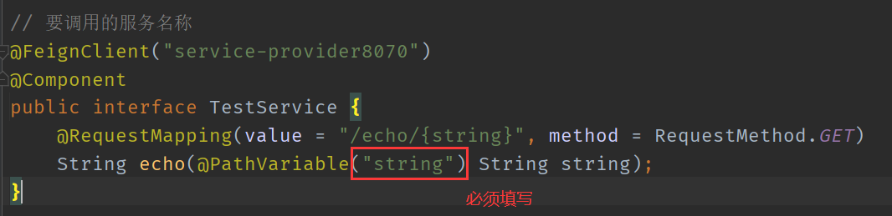
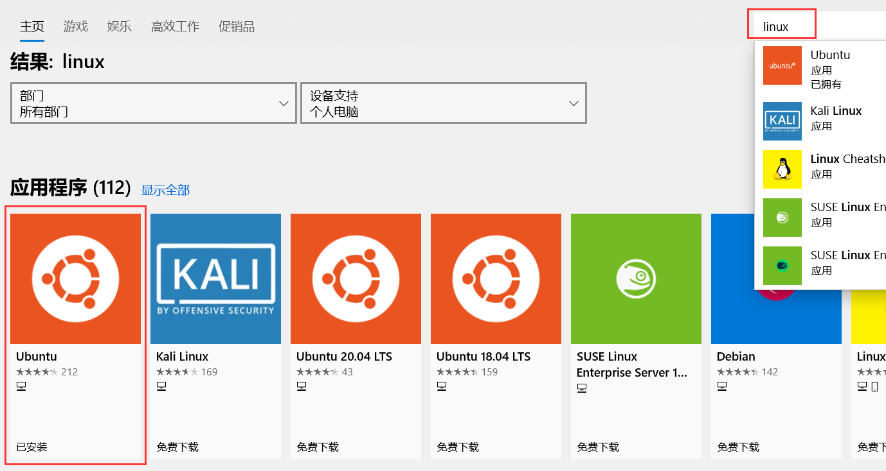

# Linux-MySQL安装

1. 下载地址

    Linux - Generic：https://dev.mysql.com/downloads/mysql/ 

    5.7.26：https://cdn.mysql.com/archives/mysql-5.7/mysql-5.7.26-linux-glibc2.12-x86_64.tar.gz

2. 解压

    `tar -xvf mysql-5.7.26-linux-glibc2.12-x86_64.tar `

3. 移动重命名

    `mv mysql-5.7.26-linux-glibc2.12-x86_64 /usr/local/mysql`

4. 创建MySQL用户组和用户并修改权限

    ```shell
    groupadd mysql
    useradd -r -g mysql mysql
    ```

5. 创建数据目录并赋予权限

    ```shell
    mkdir -p  /data/mysql              #创建目录
    chown mysql:mysql -R /data/mysql   #赋予权限
    ```

6. 配置my.cnf

    `vim /etc/my.cnf`

    ```properties
    [mysqld]
    bind-address=0.0.0.0
    port=3306
    user=mysql
    basedir=/usr/local/mysql
    datadir=/data/mysql
    socket=/tmp/mysql.sock
    log-error=/data/mysql/mysql.err
    pid-file=/data/mysql/mysql.pid
    #character config
    character_set_server=utf8mb4
    symbolic-links=0
    explicit_defaults_for_timestamp=true
    ```

7. 初始化数据库

    ```shell
    cd /usr/local/mysql/bin/
    
    ./mysqld --defaults-file=/etc/my.cnf --basedir=/usr/local/mysql/ --datadir=/data/mysql/ --user=mysql --initialize
    ```

    此步骤可能遇到的问题：

    > **问题1**
    >
    > ./mysqld: error while loading shared libraries: `libnuma.so.1`: cannot open shared object file: No such file or directory
    >
    > **解决**
    >
    > yum install -y `libnuma.so.1`（根据依赖选择安装）
    >
    > **问题2**
    >
    > Multilib version problems found.（多库版本问题）
    > 保护多库版本：`libstdc++`-4.8.5-39.el7.i686 != `libstdc++`-4.8.5-36.el7.x86_64
    >
    > **解决**
    >
    > yum install --setopt=protected_multilib=false libstdc++(根据库的不同修改)
    >
    > ```shell
    > # 可能会用到的
    > yum install -y ld-linux.so.2
    > yum install -y libaio.so.1
    > yum install --setopt=protected_multilib=false numactl-libs
    > yum install -y libnuma.so.1
    > yum install --setopt=protected_multilib=false libstdc++
    > yum install -y libstdc++.so.6
    > ```
    >
    > 

8. 查看密码

   `cat /data/mysql/mysql.err`

9. 启动mysql，并更改root密码

   ```shell
   # 先将mysql.server放置到/etc/init.d/mysql中
   cp /usr/local/mysql/support-files/mysql.server /etc/init.d/mysql
   # 启动
   service mysql start
   # 查看启动情况
   ps -ef|grep mysql
   ```

10.  **安装成功** 

11. 登录mysql

    `./mysql -u root -p   #bin目录下，使用之前的随机密码`

12. 更改密码

    ```shell
    SET PASSWORD = PASSWORD('123456');
    ALTER USER 'root'@'localhost' PASSWORD EXPIRE NEVER;
    FLUSH PRIVILEGES;                                 
    ```

13.  **配置远程连接** 

    ```shell
    use mysql                                            #访问mysql库
    update user set host = '%' where user = 'root';      #使root能再任何host访问
    FLUSH PRIVILEGES;                                    #刷新
    ```

14. 启动

    `ln -s  /usr/local/mysql/bin/mysql    /usr/bin`

15. 设置开机自启动

    ```shell
    # 目录可能不同
    cp /usr/local/mysql/support-files/mysql.server /etc/rc.d/init.d/mysqld
    
    # 赋予可执行权限
    chmod +x /etc/init.d/mysqld
    
    # 添加为服务
    chkconfig --add mysqld
    
    # 查看服务列表
    # 看到3、4、5状态为开或者为 on 则表示成功。如果是关或者off，则执行一下：chkconfig --level 345 mysqld on
    chkconfig --list
    
    # 重启
    reboot
    ```

    


# Linux-JDK8安装


 **一、yum一键安装** 

1. 首先执行以下命令查看可安装的jdk版本

   `yum -y list java*`

2. 2.选择自己需要的jdk版本进行安装

   `yum install -y java-1.8.0-openjdk-devel.x86_64`

3. 等待安装完成

   `java -version`

4. 可以在usr/lib/jvm下找到jdk


**二、包安装**


1. 准备安装文件

   ` jdk-8u181-linux-x64.tar.gz `

2. 解压，并将文件移动到`/usr/local/`目录下

   `tar zxvf jdk-8u181-linux-x64.tar.gz`

3. 配置环境变量

   `vim /etc/profile`

   ```properties
   export JAVA_HOME=/opt/jdk8
   export CLASSPATH=$:CLASSPATH:$JAVA_HOME/lib/ 
   export PATH=$PATH:$JAVA_HOME/bin
   ```

4. 刷新配置文件

   `source /etc/profile`

5. 查看安装情况

   ` java -version `


# Linux-Tomcat安装与配置


1. 准备文件：[https://tomcat.apache.org/download-80.cgi](https://tomcat.apache.org/download-80.cgi)

2. 解压

   `tar -zxvf apache-tomcat-8.5.50.tar.gz`

3. 移动

   `mv apache-tomcat-8.5.50 /usr/local/`

4. 在tomcat安装目录中启动tomcat

   `./startup.sh`

> 访问8080端口出现404错误：
>
> 1. 防火墙限制了端口访问，需要在防火墙配置中打开8080端口
> 2. 打开防火墙配置文件`vim /etc/sysconfig/iptables`
> 3. 在其中加入一行`-A INPUT -m state --state NEW -m tcp -p TCP --dport 8080 -j ACCEPT`即可打开8080端口
> 4. `service iptables restart`重启服务，即可成功访问
>
> 
>
> **注：**iptables命令只针对centos6版本,centos7采用firewalld代替了iptables。可以使用`yum -y install iptables`安装iptables，再使用`systemctl stop firewalld`关闭firewalld服务即可。建议使用firewall命令开放端口。


# Centos7开放及查看端口

1. 开放端口

   ```shell
   firewall-cmd --zone=public --add-port=5672/tcp --permanent   # 开放5672端口
   
   firewall-cmd --zone=public --remove-port=5672/tcp --permanent  #关闭5672端口
   
   firewall-cmd --reload   # 配置立即生效
   ```

2. 查看防火墙所有开放的端口

   ```shell
   firewall-cmd --zone=public --list-ports
   ```

3.  关闭防火墙

   ```shell
   # 如果要开放的端口太多，嫌麻烦，可以关闭防火墙，安全性自行评估
   systemctl stop firewalld.service
   ```

4. 查看防火墙状态

   ```shell
   firewall-cmd --state
   ```

5. 查看监听的端口

   ```shell
   netstat -lnpt
   # PS:centos7默认没有 netstat 命令，需要安装 net-tools 工具，yum install -y net-tools
   ```

6. 检查端口被哪个进程占用

   ```shell
   netstat -lnpt |grep 5672
   ```

7. 查看进程的详细信息

   ```shell
   ps 6832
   ```

8. 终止进程

   ```shell
   kill -9 6832
   ```


# maven依赖导入失败

**方案一**

设置setting.xml

```xml
<mirror>	
    <id>nexus-aliyun</id>	
    <mirrorOf>*</mirrorOf>	
    <name>Nexus aliyun</name>	
    <url>http://maven.aliyun.com/nexus/content/groups/public</url>	
</mirror>
```

**方案二**

在maven本地仓库目录下搜索` .lastUpdated `，删除所有` .lastUpdated `结尾的文件


# Ubuntu-启用root用户

1. 通过`sudo passwd`为root用户设置密码

2. 修改文件/usr/share/lightdm/lightdm.conf.d/50-unity-greeter.conf

   `sudo vi /usr/share/lightdm/lightdm.conf.d/50-unity-greeter.conf`

   添加如下信息：

   ```properties
   greeter-show-manual-login=true #手工输入登陆系统的用户名和密码
   all-guest=false #不允许guest登录(及游客)
   ```

3. 修改 /etc/pam.d/gdm-autologin文件

   `sudo vi /etc/pam.d/gdm-autologin`

   注释掉第三行`auth required pam_succeed_if.so user != root quiet_success`

4. 修改/etc/pam.d/gdm-password文件

   `sudo vim /etc/pam.d/gdm-password`

   注释掉第三行`auth required pam_succeed_if.so user != root quiet_success`

5. 修改/root/.profile文件

   `su root`
   `vim /root/.profile`
   将此文件中最后一行的`mesg n || true`修改成`tty -s && mesg n || true`


# Ubuntu-解决VI方向键变成字母

> VI为了兼容老机器，默认开启的兼容模式，兼容模式下方向键、退格键无法使用。
>
> VI打开文件默认就是命令模式，insert进入编辑模式。
>
> 将/etc/vim/vimrc.tiny文件中改为非兼容模式即可解决。

1. ` vi /etc/vim/vimrc.tiny `打开文件
2. 用方向键移动光标到set compatible的c字母，然后按INSERT进入编辑模式。 将“`set compatible`”（兼容模式）改成“`set nocompatible`”（非兼容模式） 
3. 接下来要解决Backspace键的问题也很简单，在刚才那句话后面再加一句：
   `set backspace=2 `
4. ESC，`:wq`保存并退出

# Ubuntu-root用户开启SSH

1. 安装` sudo apt-get install openssh-server openssh-client `

2. 修改配置文件

   `sudo vi /etc/ssh/sshd_config`

   修改配置

   ```
   port 22
   LoginGraceTime 2m
   PermitRootLogin yes
   StrictModes yes
   ```

3. 重启ssh

   `sudo service ssh restart`

# Ubuntu-开放端口

1. `sudo apt-get install openssh-server`
2. `sudo apt-get install ufw`
3. `sudo ufw enable`：开启防火墙
4. `sudo ufw allow 22`：开放端口

# centOS7 ：-bash: ifconfig: command not found

sudo yum install net-tools

# X Shell、X ftp

http://xiazai.xshellcn.com/wm/XshellPlus-6.0.0026_wm.exe

http://xiazai.xshellcn.com/wm/Xshell-6.0.0189_wm.exe

http://xiazai.xshellcn.com/wm/Xftp-6.0.0183_wm.exe

# 8小时时差问题

从数据库表中取Date类型时间，少8个小时的问题

```java
@JsonFormat(pattern = "yyyy-MM-dd HH:mm:ss",timezone="GMT+8")
```

插入数据库产生时差，url连接参数

```
serverTimezone=Asia/Shanghai
```


# tomcat 配置 HTTPS、添加HSTS特性


server.xml

```xml
<!-- 1 --->
<Connector port="80" protocol="HTTP/1.1"
               connectionTimeout="20000"
               redirectPort="443" />

<!-- 2 --->
<Connector port="443" protocol="org.apache.coyote.http11.Http11NioProtocol"
           maxThreads="150" SSLEnabled="true">
    <SSLHostConfig>
        <Certificate certificateKeystoreFile="conf/graceful.jks"
                     certificateKeystorePassword="203vy630dq"
                     type="RSA" />
    </SSLHostConfig>
</Connector>

<!-- 2 --->
<Connector port="8009" protocol="AJP/1.3" redirectPort="443" />
```


web.xml

```xml
<!-- 1 --->
<filter>
    <filter-name>httpHeaderSecurity</filter-name>
    <filter-class>org.apache.catalina.filters.HttpHeaderSecurityFilter</filter-class>
    <async-supported>true</async-supported>
	<init-param>
		<param-name>hstsMaxAgeSeconds</param-name>
		<param-value>31536000</param-value>
	</init-param>
</filter>

<!-- 2 --->
<filter-mapping>
	<filter-name>httpHeaderSecurity</filter-name>
	<url-pattern>/*</url-pattern>
	<dispatcher>REQUEST</dispatcher>
</filter-mapping>
```


# idea插件无法加载问题


# CentOS7 添加管理员用户

```shell
useradd testname
passwd testname
chmod -v u+w /etc/sudoers   # 增加 sudoers 文件的写的权限，默认为只读
vim /etc/sudoers # 修改 sudoers

## Allow root to run any commands anywhere
root		ALL=(ALL)       ALL
testname	ALL=(ALL)       ALL # 添加内容

chmod -v u-w /etc/sudoers # 删除 sudoers 的写的权限
```


# VMware黑屏问题

管理员身份依次执行以下五个命令，重启系统。

```shell
netsh winsock reset
net stop VMAuthdService
net start VMAuthdService
net stop VMwareHostd
net start VMwareHostd
```


# 解决IFrame拒绝的问题

```java
response.setHeader("X-Frame-Options", "SAMEORIGIN");// 解决IFrame拒绝的问题
```

# Redis安装


1. yum安装gcc依赖

   ```shell
   yum install gcc
   ```

2. 跳转到redis解压目录下

   ```
   cd redis
   ```

3. 编译安装

   ```shell
   make MALLOC=libc
   ```

4. 将/usr/local/redis-4.0.6/src目录下的文件加到/usr/local/bin目录

   ```shell
   cd src && make install
   ```

5. 启动redis的三种方式

   1. 直接启动

      ```shell
      ./redis-server
      ```

   2. 后台启动

      ```shell
      # 修改redis.conf文件
      daemonize yes
      
      # 设置远程以及密码
      bind 127.0.0.1 改为 # bind 127.0.0.1 (注释掉)
      protected-mode yes 改为 protected-mode no
      
      # 指定redis.conf文件启动
      ./redis-server /usr/local/redis/redis.conf
      ```

6. 关闭redis

   ```shell
   ps -aux | grep redis
   kill xxx
   ```

7. 设置redis开机自启动

   1. 在/etc目录下新建redis目录

      ```shell
      mkdir redis
      ```

   2. 将/usr/local/redis/redis.conf 文件复制一份到/etc/redis目录下，并命名为6379.conf

      ```shell
      cp /usr/local/redis/redis.conf /etc/redis/6379.conf
      ```

   3. 将redis的启动脚本复制一份放到/etc/init.d目录下

      ```shell
      cp /usr/local/redis/utils/redis_init_script /etc/init.d/redisd
      ```

   4. 切换到/etc/init.d目录下

      ```shell
      chkconfig redisd on
      ```

8. 服务

   ```shell
   service redisd start
   service redisd stop
   
   redis-cli -h 127.0.0.1 -p 6379 -a password shutdown
   
   pkill redis-server
   redis-server redis.conf
   ```

9. 验证是否可以远程访问

   ```shell
   netstat -nlt|grep 6379
   ```

   

10. 设置密码

    方式一：命令行

    ```shell
    # 查看密码
    config get requirepass
    # 设置密码
    config set requirepass "MX5rlP9I62"
    # 认证
    auth "MX5rlP9I62"
    # 持久化
    config rewrite
    ```

    方式二：修改配置文件redis.conf

    ```
    requirepass MX5rlP9I62
    ```

    重启

    ```
    redis-cli -h 127.0.0.1 -p 6379 -a password shutdown
    ```

    

    

# 数据库 禁用 "only_full_group_by"

**"this is incompatible with sql_mode=only_full_group_by"**

```shell
[mysqld]
# 或[mysql]
sql_mode=STRICT_TRANS_TABLES,NO_ZERO_IN_DATE,NO_ZERO_DATE,ERROR_FOR_DIVISION_BY_ZERO,NO_AUTO_CREATE_USER,NO_ENGINE_SUBSTITUTION
```


# 关于OpenFeign

在使用OpenFeign进行服务调用时，如果`@PathVariable("string")`不填写默认值，会导致service接口无法注入。




# 适用于 Linux 的 Windows 子系统安装指南

> windows系统官网：https://docs.microsoft.com/zh-cn/windows/wsl/install-win10


- 安装适用于 Linux 的 Windows 子系统

```powershell
dism.exe /online /enable-feature /featurename:Microsoft-Windows-Subsystem-Linux /all /norestart
```


- 启用Windows Subsystem for Linux可选组件

```powershell
Enable-WindowsOptionalFeature -Online -FeatureName Microsoft-Windows-Subsystem-Linux
```


- 打开windows store搜索linux

  

- 安装成功。启动输入用户名和密码。


# Windows10的Linux子系统(ubuntu)开启ssh

**重装ssh服务**

```shell
sudo apt remove --purge openssh-server

sudo apt install openssh-server
```


**修改默认配置**

```shell
sudo nano /etc/ssh/sshd_config

Port 22 # 把这一行前面的#去掉
PasswordAuthentication yes # 改成yes
PermitRootLogin no # 如果你需要用 root 直接登录系统则此处改为 yes;passwd root # 设置下密码
```


**重启服务**

```shell
sudo service ssh restart
```


# nginx

```shell
# 开始
start nginx.exe

# 停止
nginx.exe -s stop

# 完整有序的停止
nginx.exe -s quit

# 重新加载
nginx.exe -s reload

# 查看Nginx进程
tasklist /fi "imagename eq nginx.exe"

# 杀死进程
taskkill /im nginx.exe /f
```


# 通过Maven锁定JDK版本

```xml
<build>
    <pluginManagement>
        <plugins>
            <plugin>
                <groupId>org.apache.maven.plugins</groupId>
                <artifactId>maven-compiler-plugin</artifactId>
                <configuration>
                    <source>1.8</source>
                    <target>1.8</target>
                </configuration>
            </plugin>
        </plugins>
    </pluginManagement>
</build>
```


# final 参数方法

```java
public void testCollection() {
    Person hehe = new Person("hehe");
    this.test2(hehe);
    System.out.println(hehe.getName());
}

public void test2(final Person person) {
    person.setName("hha");
}

@Data
@AllArgsConstructor
@NoArgsConstructor
public static class Person {
    String name;
}
```

final修饰的参数在传递进去时本身 是不能被修改的，但属性可以被修改。


# centos7配置静态IP地址

设置静态IP地址与动态iIP差不多，也是要修改网卡配置文件 vi /etc/sysconfig/network-scripts/ifcfg-ens32    (最后一个为网卡名称)

（1）bootproto=static

（2）onboot=yes

（3）在最后加上几行，IP地址、子网掩码、网关、dns服务器

```
IPADDR=192.168.88.160
NETMASK=255.255.255.0
GATEWAY=192.168.88.2
DNS1=119.29.29.29
DNS2=223.5.5.5
```

（4）`systemctl restart network`


**配置动态IP**

（1）bootproto=dhcp

（2）onboot=yes

（3）`systemctl restart network`


# pip清华源

pip install --index https://mirrors.ustc.edu.cn/pypi/web/simple/  selenium


# 文件上传与下载: lrzsz

```she
yum install -y lrzsz
```

**上传**

```shell
# 会弹出本地文件选择的窗口
rz
```

**下载**

```shell
# 会弹出本地文件选择窗口
sz 文件名
```

