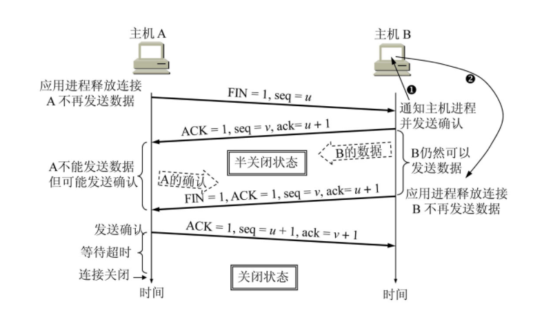
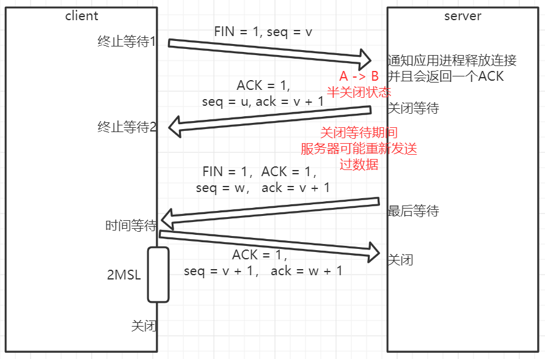
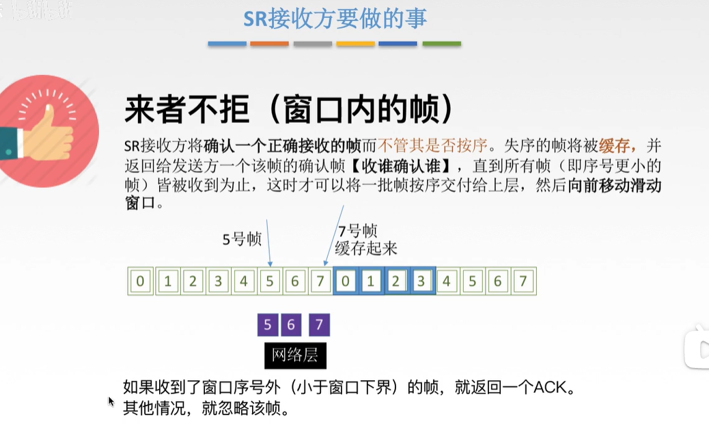
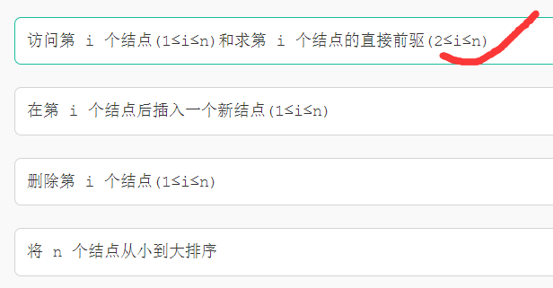
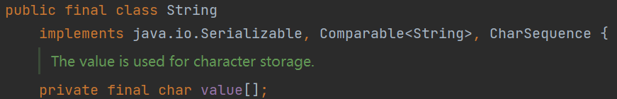
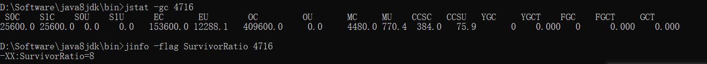

数据结构 与 算法

网络TCP-UDP

Java基础：基础语法、集合、线程、IO、jvm、JUC

操作系统

框架与分布式


jdk变化


脱离语言之外，专注于某一门语言。

C++

https://mp.weixin.qq.com/s/vkvQM8d78HBgJbUvY1KcLw

# 基础


```java
int cpuNum = Runtime.getRuntime().availableProcessors();
```


## 0. 谈谈你对Java的理解

- 面向对象
- 平台无关性
- 语言特性
- 类库
- 异常处理
- GC


## 1. 阅读程序

   ```java
public class HasStatic {
    private static int x = 100;

    public static void main(String args[]) {
        HasStatic hs1 = new HasStatic();
        hs1.x++;
        HasStatic hs2 = new HasStatic();
        hs2.x++;
        hs1 = new HasStatic();
        hs1.x++;
        HasStatic.x--;
        System.out.println("x=" + x);
    }
}
   ```

   > **结果**
   >
   > 程序通过编译，输出结果为：x=102
   >
   > **解析**
   >
   > - 一个类中的静态变量可以被它的对象所调用；也可以通过类名进行调用。
   > - 虽然x是私有的静态变量，但是在同一个类中依然可以被该类的对象或类名直接调用。
   > - 被static修饰的成员变量和成员方法独立于该类的任何对象。也就是说，它不依赖类特定的实例，被类的所有实例共享。所有的自增自减都是在对同一个x进行操作。
   > - 由于x是一个静态变量，所有可以在main方法中可以被直接调用。

## 2. 变量初始值

   - 成员变量：类的成员变量无需显式初始化，系统会自动对其进行默认初始化
     - 实例属性(不用static修饰)： 随着实例属性的存在而存在
     - 类属性(static修饰)：随着类的存在而存在
   - 局部变量：局部变量除了形参外，都必须显示初始化，也就是要指定一个初始值，否则不能访问
     - 方法形参(形式参数)：在整个方法内有效
     - 方法局部变量(方法内定义)：从定义这个变量开始到方法结束这一段时间内有效
     - 代码块局部变量(代码块内定义)：从定义这个变量开始到代码块结束这一段时间内有效

   

   ## 3. 实现接口中的方法：方法重写

实现接口的所有方法，相当于重写方法，方法的重写需要满足：两同两小一大

- 方法名、形参相同：即签名相同
- 返回类型<=重写前
- 抛出异常<=重写前
- 访问权限>=重写前

接口中的方法特点：

1. 接口中每一个方法是隐式抽象的，接口中的方法被隐式的指定为`public abstract` （只能是 public abstract，其他修饰符都会报错）。
2. 接口中可以含有变量，但是接口中的变量会被隐式的指定为`public static final`变量（并且只能是public，用 private、protected修饰会报编译错误。）
3. 接口中的方法是不能在接口中实现的，只能由实现接口的类来实现接口中的方法。


## 4. 几种数组复制方法：效率最高

1. `System.arraycopy()`：native方法+JVM手写函数，在JVM里预写好速度最快
2. `clone()`：native方法，但并未手写，需要JNI转换，速度其次
3. `Arrays.copyOf()`：本质是调用1的方法
4. `for()`：全是深复制，并且不是封装方法，最慢情有可原


## 5. switch不支持的类型

不支持：long、float、double、boolean

支持：byte、short、int、char、对应的封装类型、Enum、String

String类型实在Java7中加入的。


## 6. 数组声明

> Which statement declares a variable a which is suitable for referring to an array of 50 string objects?（Java）
>
> 声明了一个变量a，该变量适合引用50个字符串对象的数组

```java
String a[];
String[] a;
Object a[];
char a[][]; // err, 使用字符串对char数组赋值，必须使用toCharArray()方法进行转换
```


## 7. java的四种引用类型

> 对于一个对象来说，只要有强引用的存在，它就会一直存在于内存中。
> 如果一个对象仅持有虚引用，那么它就和没有任何引用一样，在任何时候都可能被垃圾回收器回收。
> 如果一个对象只具有软引用，则内存空间足够，垃圾回收器就不会回收它；如果内存空间不足了，就会回收这些对象的内存。
> 一旦发现了只具有弱引用的对象，不管当前内存空间足够与否，都会回收它的空间。

JDK1.2 之前，一个对象只有“已被引用”和"未被引用"两种状态，这将无法描述某些特殊情况下的对象，比如，当内存充足时需要保留，而内存紧张时才需要被抛弃的一类对象。所以在`JDK.1.2之后`，Java 对引用的概念进行了扩充，将引用分为了：`强引用`（Strong Reference）、`软引用`（Soft Reference）、`弱引用`（Weak Reference）、`虚引用`（Phantom Reference）4 种，这 4 种引用的强度依次减弱。

**一、强引用**

`Object obj = new Object();` 

只要obj还指向Object对象，Object对象就不会被回收。在强引用的情况下，垃圾回收器将永远不会回收被引用的对象，哪怕内存不足时，JVM也会直接抛出OutOfMemoryError，不会去回收。

一个对象赋给一个引用就是强引用，比如new一个对象，一个对象被赋值一个对象。

`obj = null;` 

如果想要切断强引用，可以显示的将强引用赋值为null，如此JVM就可以适时的回收对象了。

**二、软引用**

软引用是用来描述一些非必需但仍有用的对象。

在内存足够的时候，软引用对象不会被回收，只有在`内存不足`时，系统则会回收软引用对象，如果回收了软引用对象之后仍然没有足够的内存，才会抛出内存溢出异常。

这种特性常常被用来实现缓存技术，比如网页缓存，图片缓存等。

在JDK1.2之后，用`java.lang.ref.SoftReference`类来表示软引用。

一般不会轻易回收，只有内存不够才会回收。

**三、弱引用**

弱引用的引用强度比软引用要更弱一些，无论内存是否足够，只要JVM开始进行垃圾回收，那些被弱引用关联的对象都会被回收。

在JDK1.2之后，用`java.lang.ref.WeakReference`来表示弱引用。

一旦垃圾回收已启动，就会回收。

**四、虚引用**

虚引用是最弱的一种引用关系，如果一个对象仅持有虚引用，那么它就和没有任何引用一样，它随时可能会被回收，在JDK1.2之后，用`PhantomReference`类来表示，通过查看这个类的源码，发现它只有一个构造函数和一个 get() 方法，而且它的get()方法仅仅是返回一个null，也就是说将永远无法通过虚引用来获取对象，虚引用必须要和`ReferenceQueue`引用队列一起使用。

主要作用是跟踪对象被回收的状态。


## 8. 使线程释放锁资源

所谓的释放锁资源实际是通知对象内置的monitor对象进行释放，而只有所有对象都有内置的monitor对象才能实现任何对象的锁资源都可以释放。又因为所有类都继承自Object，所以wait(）就成了Object方法，也就是通过wait()来通知对象内置的monitor对象释放，而且事实上因为这涉及对硬件底层的操作，所以wait()方法是native方法，底层是用C写的。
其他都是Thread所有，所以其他3个是没有资格释放资源的
而join()有资格释放资源其实是通过调用wait()来实现的

`sleep()`不释放锁、`wait()`会释放锁、`join()`会释放锁、`yield()`不会释放锁


## 9. super

用来访问父类被隐藏的非私有成员变量；

用来调用父类中被重写的方法；

用来调用父类的构造函数


## 10. Java序列化

Java在序列化时不会实例化static变量和transient修饰的变量，因为static代表类的成员，transient代表对象的临时数据，被声明这两种类型的数据成员不能被序列化。


## 11. 集合类


## 12. 内部类


## 13. String的比较

```java
// JDK8
public class StringInternTest {

    public static void main(String args[]) {

        String s = new String("11");// 指向堆中对象，在堆和常量池中生成字符串
        s.intern();// 常量池中存在，返回常量池中字符串的地址
        String s2 = "11";// 常量池地址
        System.out.println(s == s2);// false

        // + 是 StringBuilder 的语法糖，在堆中创建对象
        String str2 = new String("str") + "01";//StringBuilder的toString()只会在堆中创建，不会再常量池中创建
        str2.intern();// 常量池中没有，将一份指向str2的引用放入常量池
        String str1 = "str01";// 直接去常量池中寻找，发现存在"str01"的引用，直接使用
        System.out.println(str2 == str1); // true
    }
}
```


## 14. i++ 与 ++i


## 15. Integer.MAX_VALUE

```java
Integer.MAX_VALUE + 1 == Integer.MIN_VALUE // 给过为true
```


## 16. 浮点数与二进制

```
# 十进制 转 二进制
0.625 = 0.101
0.625 * 2 = 1.25
0.25 * 2 = 0.5
0.5 * 2 = 1.0

# 二进制 转 十进制
0.1101 = 0.8125
1 * 0.5 + 1 * 0.25 + 0 * 0.125 + 1 * 0.0625
```


## 17. java.lang.String#compareTo

> 简述实现原理


## 18. AtomicReference

```java
AtomicReference<Integer> i = new AtomicReference<>(0);
```


# 集合-容器


**ArrayList和LinkedList的区别？**

- 线程不安全

- 底层结构

  ArrayList是数组

  LinkedList是双向链表，在1.6之前是循环链表。

- 插入和删除

  ArrayList底层是数组，在执行插入的时候如果是在尾部插入，时间复杂度是O(1)。指定位置插入和删除元素的话时间复杂度就为O(n)，因为会移动数组内的元素。

  LinkedList的底层是链表，对于插入和删除如果直接在尾部操作，时间复杂度为O(1)。制定位置的插入和删除需要遍历，所以时间复杂度为O(n)。

- 是否支持快速随机访问

  LinkedList 不支持高效的随机元素访问，而 ArrayList 支持。快速随机访问就是通过元素的序号快速获取元素对象方法。

- 内存空间占用

  在内存占用方面，ArrayList主要体现在连续的内存空间和数组中预留的元素空间。LinkedList的空间占用主要体现在每个元素的结构上会有直接后继和直接前驱以及数据。

> 引申出Vector、CopyOnWriteArrayList


**Vector**

底层是数组实现的，并发安全的。读写操作都添加了synchronized关键字，对整个数组进行了同步操作，读写效率低。

> 引申出synchronized


**CopyOnWriteArrayList-JUC**

1. CopyOnWriteArrayList实现了List接口，底层是数组，是一个线程安全集合类。
2. 所有写操作（add、set等等）都是通过对底层数组进行一次新的复制来实现的。并且在复制过程中会进行一个加锁。
3. 适用于读多写少的并发环境，比如缓存。
4. 没有像ArrayList那样的扩容机制，没写操作都是copy一个副本。

> 引申出ReentrantLock、ArrayList扩容机制


## JDK7：HashMap

## 1. 默认初始化大小是16（必须为2的幂），负载因子是0.75

```java
static final int DEFAULT_INITIAL_CAPACITY = 1 << 4; // aka 16
static final float DEFAULT_LOAD_FACTOR = 0.75f;
public HashMap() {
    this(DEFAULT_INITIAL_CAPACITY, DEFAULT_LOAD_FACTOR);
}
```


## 2. 最大容量2^30, 加载因子大于0

```java
// 最大容量1073741824, 最大容量是2的30次方
static final int MAXIMUM_CAPACITY = 1 << 30;
public HashMap(int initialCapacity, float loadFactor) {
    // 当初始化大小小于0，会抛出非法参数异常
    if (initialCapacity < 0)
        throw new IllegalArgumentException("Illegal initial capacity: " +
                                           	initialCapacity);
    // 超出最大容量
    if (initialCapacity > MAXIMUM_CAPACITY)
        initialCapacity = MAXIMUM_CAPACITY;
    
    // 加载因子大于0
    if (loadFactor <= 0 || Float.isNaN(loadFactor))
        throw new IllegalArgumentException("Illegal load factor: " +
                                           loadFactor);

    // 初始化加载因子
    this.loadFactor = loadFactor;
    
    // 初始阈值等于初始容量
    threshold = initialCapacity;
    
    // 空方法
    init();
}
```


## 3. get(key)

```java
public V get(Object key) {
    if (key == null)
        return getForNullKey();
    Entry<K,V> entry = getEntry(key);

    return null == entry ? null : entry.getValue();
}
```


## 4. put(k, v)

头插法


```java
public V put(K key, V value) {
    // 首次put会初始化
    //	1. 初始化数组的过程会将初始容量设置为大于等于这个数的最小二次幂数
    //  2. 初始化hashseed
    // 如果数组为空，进行一个初始化
    if (table == EMPTY_TABLE) {
        inflateTable(threshold);
    }
    
    // 空的分支
    if (key == null)
        return putForNullKey(value);
    
    // 根据key生成hash值
    int hash = hash(key);
    // 根据hash值和数组长度获取一个下标
    int i = indexFor(hash, table.length);
    
    // 遍历链表：看看是否存在，存在则替换value，返回oldValue
    for (Entry<K,V> e = table[i]; e != null; e = e.next) {
        Object k;
        // 值相同的条件：hash、key的地址、key的内容
        if (e.hash == hash && ((k = e.key) == key || key.equals(k))) {
            V oldValue = e.value;
            e.value = value;
            e.recordAccess(this);
            return oldValue;
        }
    }

    // 用于迭代器快速失败
    // 每一次结构的修改都会更改一次值
    modCount++;
    
    // 添加entry
    addEntry(hash, key, value, i);
    return null;
}
```


扩容的触发：

总数大于阈值，并且数组当前元素不为空。

resize的大小是现在的两倍长度


通过定义系统属性jdk.map.althashing.threshold可以覆盖此值。 属性值1强制始终使用替代哈希，而值-1确保从不使用替代哈希。


```java
private static class Holder {

    static final int ALTERNATIVE_HASHING_THRESHOLD;

    static {
        
        // System.getProperty(this.theProp)
        // 获取系统属性可能要用到代码没有的权限，使用doPrivileged不做权限检查
        String altThreshold = java.security.AccessController.doPrivileged(
            new sun.security.action.GetPropertyAction(
                "jdk.map.althashing.threshold"));

        int threshold;
        try {
            // 当系统变量中设置了jdk.map.althashing.threshold，那么threshold就为该系统值，否则为最大值整数值
            threshold = (null != altThreshold)
                ? Integer.parseInt(altThreshold)
                : ALTERNATIVE_HASHING_THRESHOLD_DEFAULT;

            // disable alternative hashing if -1
            if (threshold == -1) {
                threshold = Integer.MAX_VALUE;
            }

            if (threshold < 0) {
                throw new IllegalArgumentException("value must be positive integer.");
            }
        } catch(IllegalArgumentException failed) {
            throw new Error("Illegal value for 'jdk.map.althashing.threshold'", failed);
        }

        ALTERNATIVE_HASHING_THRESHOLD = threshold;
    }
}


final boolean initHashSeedAsNeeded(int capacity) {
    
    // 1. hashSeed不等于0
    boolean currentAltHashing = hashSeed != 0;
    // 2. 类加载器启动 且 容量大于等于ALTERNATIVE_HASHING_THRESHOLD， true&&false=false
    boolean useAltHashing = sun.misc.VM.isBooted() &&
        (capacity >= Holder.ALTERNATIVE_HASHING_THRESHOLD);
    
    // 不同为false ^ false
    boolean switching = currentAltHashing ^ useAltHashing;
    if (switching) {
        hashSeed = useAltHashing
            ? sun.misc.Hashing.randomHashSeed(this)
            : 0;
    }
    // false hashseed的值一般不会被改变
    return switching;
}
```


String.hash32()方法不是公有的，因此我只能通过查看HashMap的源码来找到调用String.hash32()的方法。答案是issun.misc.Hashing.stringHash32(String)。


不论get还是put方法都需要通过一个hash方法来计算出这个key应该放在底层数组的哪个元素上，就相当于要通过这个hash方法返回一个数组下标。

而要想hash方法返回一个数组下标，就必须要求底层数组的大小为一个2的幂次方数。

因为在hash方法的底层是通过传入的hash值与数组大小减一的值做的位与运算，数组大小减一的二进制表示中，它的高位为连续的0，低位为连续的1，这样的数与hash值位与运算之后，高位全部为0，低位只有同样为1的时候才为1，所以得到的这样一个值必定大于等于0，小于等于数组大小减一。

反之数组大小不是一个二的幂次方数，减一之后是不能得到低位全为一，高位全为0的二进制表示。同样这个方法也就不能正确的返回一个数组下标。

其实hash方法的功能就相当于用hash值对数组大小进行一个取模。


```java
void addEntry(int hash, K key, V value, int bucketIndex) {
    // KeyValue的个数已经大于阈值
    if ((size >= threshold) && (null != table[bucketIndex])) {
        resize(2 * table.length);
        hash = (null != key) ? hash(key) : 0;
        bucketIndex = indexFor(hash, table.length);
    }

    createEntry(hash, key, value, bucketIndex);
}
```

添加会涉及到一个扩容：KV总数大于阈值，并且数组当前元素不为空。

```java
void resize(int newCapacity) {
    Entry[] oldTable = table;
    int oldCapacity = oldTable.length;
    
    // 为什么这里是判断旧值，而不是新值
    // 因为capacity是2的n次方数
    if (oldCapacity == MAXIMUM_CAPACITY) {
        threshold = Integer.MAX_VALUE;
        return;
    }
    
    Entry[] newTable = new Entry[newCapacity];
    transfer(newTable, initHashSeedAsNeeded(newCapacity));
    table = newTable;
    threshold = (int)Math.min(newCapacity * loadFactor, MAXIMUM_CAPACITY + 1);
}
```

resize会判断当前数组大小是否已经达到最大容量值，就设置为最大整型数值。

否则就是当前数组的二倍大小，然后将元素转移到新的数组。


```java
void transfer(Entry[] newTable, boolean rehash) {
    int newCapacity = newTable.length;
    for (Entry<K,V> e : table) {
        while(null != e) {
            Entry<K,V> next = e.next;
            if (rehash) {
                e.hash = null == e.key ? 0 : hash(e.key);
            }
            int i = indexFor(e.hash, newCapacity);
            // 头插法，并发情况下会出现循环链表的问题
            e.next = newTable[i];
            newTable[i] = e;
            e = next;
        }
    }
}
```


为什么不把头部的元素移动到新的链表，扩容的目的是为了让链表变短，会让不同的Entry从新放到不同的数组元素上（或者说数组元素的链表上）。

提升get效率。


1 2 3 4 5 6

【0】2 4 6

【1】1 3 5

2 

【0】4

【1】1 5

【2】2 6

【3】3

 4

hashseed让hash值更散列更均匀


快速失败与安全失败

```java
if (modCount != expectedModCount)
    throw new ConcurrentModificationException();
```

一个线程在遍历，一个线程在移除会出现并发安全问题。使用迭代器自身的删除`iterator.remove()`。


> 面试题：
>
> 1. 说一下HashMap
>
>    在JDK8以前，HashMap主要是通过数组+链表的方式来实现的，数组是主体，链表则是为了解决hash冲突。
>
>    而JDK8中，HashMap从数组+链表的形式转成了数组+红黑树，当链表的长度大于8，且数组已经超过64的时候会转成红黑树的形式。
>
>    然后Hash是不安全的，在并发扩容的情况下会出现循环链表的情况。
>
> 2. HashMap的底层原理 `* 3`
>
>    数组+链表
>
>    数组+链表转红黑树
>
> 3. 链表过长怎么办
>
>    在jdk7里面链表过长会导致查询效率降低；在jdk8里面会转换为红黑树或者在数组长度不超过64的情况下发生扩容；
>
>    
>
> 4. 线程安全吗？
>
>    不安全，会产生循环链表
>
> 5. 什么是线程安全和不安全？
>
>    线程安全就是说多个现场访问同一段代码或者变量，不会产生不确定的结果。反之，会出现并发安全问题的都是不安全的。
>
> 6. HashMap为什么不是线程安全的？`* 2`
>
> 7. 什么结构导致线程不安全？
>
>    链表，扩容的时候使用的是头插法
>
> 8. 想用map保证线程安全怎么办？
>
>    Collections类的synchronizedMap方法，hashtable
>
>    concurrenthashmap
>
> 9. HashMap、Hashtable、ConcurrentHashMap大概介绍一下，区别是什么。
>
>    hashmap、concurrenthashmap 1.7\1.8
>
>    hashtable
>
>    线程安全
>
>    HashMap 是非线程安全的
>
>    HashTable 是线程安全的，因为 HashTable 内部的方法基本都经过synchronized 修饰。
>
>    
>
>    效率：
>
>    因为线程安全的问题，HashMap 要比 HashTable 效率高一些。另外，HashTable 基本被淘汰，不要在代码中使用它；
>
>    
>
>    对 Null key 和 Null value 的支持： 
>
>    HashMap 可以存储 null 的 key 和 value，但 null 作为键只能有一个，null 作为值可以有多个；
>
>    HashTable 不允许有 null 键和 null 值，否则会抛出 NullPointerException。
>
>    
>
>    初始容量大小和每次扩充容量大小的不同 ：
>
>     ① 
>
>    创建时如果不指定容量初始值，Hashtable 默认的初始大小为 11，之后每次扩充，容量变为原来的 2n+1。
>
>    HashMap 默认的初始化大小为 16。之后每次扩充，容量变为原来的 2 倍。
>
>    ② 
>
>    创建时如果给定了容量初始值，那么 Hashtable 会直接使用你给定的大小，而 HashMap 会将其扩充为 2 的幂次方大小
>
>    
>
>    底层数据结构：
>
>     JDK1.8 以后的 HashMap 在解决哈希冲突时有了较大的变化，当链表长度大于阈值（默认为 8）（将链表转换成红黑树前会判断，如果当前数组的长度小于 64，那么会选择先进行数组扩容，而不是转换为红黑树）时，将链表转化为红黑树，以减少搜索时间。Hashtable 没有这样的机制。
>
>    
>
>    底层数据结构： JDK1.7 的 ConcurrentHashMap 底层采用 分段的数组+链表 实现，JDK1.8 采用的数据结构跟 HashMap1.8 的结构一样，数组+链表/红黑二叉树。Hashtable 和 JDK1.8 之前的 HashMap 的底层数据结构类似都是采用 数组+链表 的形式，数组是 HashMap 的主体，链表则是主要为了解决哈希冲突而存在的；
>    实现线程安全的方式（重要）： ① 在 JDK1.7 的时候，ConcurrentHashMap（分段锁） 对整个桶数组进行了分割分段(Segment)，每一把锁只锁容器其中一部分数据，多线程访问容器里不同数据段的数据，就不会存在锁竞争，提高并发访问率。 到了 JDK1.8 的时候已经摒弃了 Segment 的概念，而是直接用 Node 数组+链表+红黑树的数据结构来实现，并发控制使用 synchronized 和 CAS 来操作。（JDK1.6 以后 对 synchronized 锁做了很多优化） 整个看起来就像是优化过且线程安全的 HashMap，虽然在 JDK1.8 中还能看到 Segment 的数据结构，但是已经简化了属性，只是为了兼容旧版本；② Hashtable(同一把锁) :使用 synchronized 来保证线程安全，效率非常低下。当一个线程访问同步方法时，其他线程也访问同步方法，可能会进入阻塞或轮询状态，如使用 put 添加元素，另一个线程不能使用 put 添加元素，也不能使用 get，竞争会越来越激烈效率越低。
>
>    
>
> 10. Vector、HashSet、HashMap用过吗？
>
>     Vector底层是数组，通过synchronized来保证并发安全。
>
>     HashSet底层是HashMap，能够不重复的元素。
>
>     HashMap是能够存放key-value形式的值，线程不安全，
>
> 11. HashMap、Hashtable 线程问题
>
> 12. 有了hashtable为什么还要有concorrethashmap
>
>     hashtable锁住了整个数组，并发效率低
>
> 13. hashmap遍历方法，迭代器取出的是什么
>
>     KeySet继承abstractSet类
>
> 14. concurrenthashmap介绍一下
>
> 15. hashmap的实现，初始容量，扩容方法
>
> 16. hashcode是什么，具体怎么实现的
>
> 17. HashMap不同版本，装填因子(作用)，默认值
>
> 18. Hash 实现 怎么扩展长度 （回答的是数据库hash的 linear hash 做法）
>
> 19. 如何优化Hashtable？
>
>     重写hashcode和equals方法
>
>     用一个arraylist或者数组存放多个hashtable，像1.7的concurrenthash那样实现。就是分段锁的思想。
>
> 20. Mysql索引底层实现结构，为什么不用hash( 不适合范围搜索)
>
>     B+树，hashmap元素越多，hash冲突的几率就越大，底层的红黑树的的高度就越高，搜索速度就会变慢。而且增加，删除，红黑树会进行频繁的调整，来保证红黑树的性质，浪费时间。
>
>     hash索引，等值查询效率高，不适合排序和范围查询
>
> 21. currentHashMap的底层原理知道么，具体的内存结构是怎样的？
>
> 22. B+树


## JDK7：ConcurrentHashMap

hashtable锁住了整个map，效率低

```java
// 默认大小
static final int DEFAULT_INITIAL_CAPACITY = 16;

// 加载因子
static final float DEFAULT_LOAD_FACTOR = 0.75f;

// 并发级别
static final int DEFAULT_CONCURRENCY_LEVEL = 16;
```


## JDK8：HashMap

https://snailclimb.gitee.io/javaguide/#/docs/java/collection/Java%E9%9B%86%E5%90%88%E6%A1%86%E6%9E%B6%E5%B8%B8%E8%A7%81%E9%9D%A2%E8%AF%95%E9%A2%98?id=_152-%e6%9f%a5%e6%89%be%e6%9b%bf%e6%8d%a2%e6%93%8d%e4%bd%9c


## JDK8：ConcurrentHashMap


## ArrayList

初始容量10

以无参数构造方法创建 ArrayList 时，实际上初始化赋值的是一个空数组。当真正对数组进行添加元素操作时，才真正分配容量。即向数组中添加第一个元素时，数组容量扩为 10。

JDK7 new无参构造的ArrayList对象时，直接创建了长度是10的Object[]数组elementData 。jdk7中的ArrayList的对象的创建类似于单例的饿汉式，而jdk8中的ArrayList的对象的创建类似于单例的懒汉式。

第一次add扩容一次，直到大于10，对旧数组进行1.5被扩容，直到最大整型容量减8，到最大整型容量


System.arraycopy() 和 Arrays.copyOf()方法

**联系：**

看两者源代码可以发现 `copyOf()`内部实际调用了 `System.arraycopy()` 方法

**区别：**

`arraycopy()` 需要目标数组，将原数组拷贝到你自己定义的数组里或者原数组，而且可以选择拷贝的起点和长度以及放入新数组中的位置 `copyOf()` 是系统自动在内部新建一个数组，并返回该数组。


# 三、多线程

**3-1. 什么是并发编程？**

并发编程就是将程序划分为多个分离的、独立运行的任务。通过多线程机制来执行这些独立的任务。


**3-2. 创建线程的两种方式**

从oracle官方文档上可以看到，创建线程的方式有两种。

1. 继承Thread类，并重写run方法。
2. 实现Runnable接口，并重写run方法。

> 通过源码可以看出，无论继承`Thread`类还是实现`Runnable`的本质都是通过Thread类的`init`方法初始化Thread对象。唯一不同的是，继承Thread类，整个run方法被重写；实现Runnable接口，最终调用的是target.run()；
>
> ```java
> // 如果target不为null，执行target的run方法
> @Override
> public void run() {
>     if (target != null) {
>         target.run();
>     }
> }
> ```
>
> 准确的说，实现线程的方法只有一种，定义run方法内容的方式有两种。
>
> *线程池、Callable、定时器其本质都是如此。(追问：见3-4)*


**3-3. 实现Runnable接口和继承Thread类哪种方式更好**

实现Runnable接口的方式更好。

- 从代码的结构上看：

  避免了Java单继承的局限性，同事减低了Thread对象于线程任务的耦合度，可展现更好。

- 如果使用了线程池工具类可以减少创建线程的开销。

> 引申出线程池，线程复用。底层是直接调用的Runnable的run方法，方法级的调用。


**3-4. 线程池的几个核心参数和执行流程**

线程池七大核心参数：

1. corePoolSize(核心线程数)

2. maxPoolSize(最大线程数)

   最大容纳数量是max+queue

3. keepAliveTime(空闲回收时间)

4. unit(回收时间单位)

5. workQueue(任务队列)

6. handler(拒绝策略)

7. threadFactory(线程工厂，用于创建线程，一般为默认线程工厂即可)

   Executors.defaultThreadFactory();

任务提交流程：


```java
private static final int COUNT_BITS = Integer.SIZE - 3;// 29
private static final int RUNNING    = -1 << COUNT_BITS;// -1 == (11111111111111111111111111111111):2
private static int ctlOf(int rs, int wc) { return rs | wc; }// 位或运算，有1为1，RUNNING == -536870912

// 存放线程池的运行状态 (runState) ，即线程池内有效线程的数量 (workerCount)，ctl.value=-536870912
private final AtomicInteger ctl = new AtomicInteger(ctlOf(RUNNING, 0));

/*
假设c=10
CAPACITY 11111111111111111111111111111
	   c 00000000000000000000000001010
	   &
	     00000000000000000000000001010
位与操作，同1为1。
*/
private static int workerCountOf(int c) {
    return c & CAPACITY;
}

private static final int COUNT_BITS = Integer.SIZE - 3;//29
private static final int SHUTDOWN   =  0 << COUNT_BITS;//0
private static boolean isRunning(int c) {
    // c < 0
    return c < SHUTDOWN;
}

//任务队列
private final BlockingQueue<Runnable> workQueue;

public void execute(Runnable command) {
    // 如果任务为null，则抛出异常。
    if (command == null)
        throw new NullPointerException();
    
    // 获取线程池内有效线程的数量
    int c = ctl.get();

    // 下面会涉及到 3 步 操作
    /*
    	1. 首先判断当前线程池中执行的任务数量是否小于corePoolSize
    	如果小于的话，通过addWorker(command, true)新建一个线程，并将任务(command)添加到该线程中；然后，启动该线程从而执行任务。
    */
    if (workerCountOf(c) < corePoolSize) {
        if (addWorker(command, true))
            return;
        c = ctl.get();
    }
    
    /*
    	2. 如果当前执行的任务数量大于等于corePoolSize的时候就会走到这里
    	通过isRunning方法判断线程池状态，即c小于0返回true
    	workQueue.offer(command)，返回队列是否可以加入更多内容
    	线程池处于RUNNING状态才会被并且队列可以加入任务，该任务才会被加入进去
    */
    if (isRunning(c) && workQueue.offer(command)) {
        int recheck = ctl.get();
        // 再次获取线程池状态，如果线程池状态不是RUNNING状态就需要从任务队列中移除任务，并尝试判断线程是否全部执行完毕。同时执行拒绝策略。
        if (!isRunning(recheck) && remove(command))
            reject(command);
        // 如果当前线程池为空就新创建一个线程并执行。
        else if (workerCountOf(recheck) == 0)
            addWorker(null, false);
    }
    
    /*
    	3. 通过addWorker(command, false)新建一个线程，并将任务(command)添加到该线程中；然后，启动该线程从而执行任务。
    	如果addWorker(command, false)执行失败，则通过reject()执行相应的拒绝策略的内容。
    */
    else if (!addWorker(command, false))
        reject(command);
}
```


任务执行流程：

1. 执行核心线程
2. 执行非核心线程
3. 执行工作队列


**Executors工具类不推荐使用**

线程池不允许使用Executors去创建，而是通过ThreadPoolExecutor的方式，这样处理方式让写的同学更加明确线程池运行规则，规避资源耗尽的风险。

说明：Executors返回的线程池对象的弊端如下

① FixedThreadPool和SingleThreadPool

允许的请求队列长度为Integer.MAX_VALUE，可能会堆积大量的请求，从而导致OOM。

② CachedThreadPool和ScheduledThreadPool

允许创建线程数量为Integer.MAX_VALUE，可能会创建大量的线程，导致OOM。


**拒绝策略**

当线程池的任务数达到最大容纳数量，即工作队列填满和有效线程数量达到maxPoolSize，此时会执行拒绝策略。


1. `AbortPolicy`

   丢弃任务并抛出`java.util.concurrent.RejectedExecutionException`异常

2. CallerRunsPolicy

   不会抛弃任务，也不抛出异常，而是将任务回退给调用者，从而降低新任务的流量。

   比如说，在main方法中调用`executor.execute(worker)`，当任务无法得到执行时，回退到main（主线程）方法所属的线程来进行执行。

3. DiscardPolicy

   丢弃任务，但是不抛出异常。

4. DiscardOldestPolicy

   丢弃队列最前面（即进入队列最久）的任务，然后重新提交被拒绝的任务。

5. 自己实现拒绝策略


**线程是不是越多越好**

1. 线程在Java中是一个对象，更会操作系统的资源，创建、销毁线程需要时间。如果创建时间+销毁时间>任务执行时间事实上是不划算的，
2. Java对象占用堆内存，操作系统线程占用系统内存，根据JVM规范，一个线程默认最大栈空间是1M，这个栈空间会从系统内存中分配。线程过多会消耗过多的内存。
3. 频繁的上下文切换影响性能。


**为什么要使用线程池**

线程池可以方便的控制线程数量，不至于让程序创建过多的线程导致系统假死。

同事能够节省系统资源，不需要频繁的创建和销毁线程。


**线程池原理**

1. 线程池管理器：用于创建并管理线程池，包括创建线程池，销毁线程池，添加新任务。
2. 工作线程：线程池中的线程，可循环的利用来执行任务，没有任务时处于等待状态。
3. 任务接口：每个任务必须实现的接口，以供工作线程调度任务的执行，它主要规定了任务的入口，任务执行完后的收尾工作，任务的执行状态等。
4. 任务队列：用于存放没有处理的任务。提供一种缓冲机制。


**线程池API-接口定义和实现类**

接口

- Executor最上层的接口，定义了执行任务的方法execute。
- ExecutorService，继承了Executor接口，拓展了Cllable、Future、关闭方法。
- ScheduledExecutorService，继承了ExecutorService，增加了定时任务相关的方法。

实现类

- ThreadPoolExecutor，基础标准的线程池
- ScheduledThreadPoolExecutor，继承了ThreadPoolExecutor，实现类了ScheduledExecutorService中相关定时任务的方法。

Executors工具类：不推荐使用。因为使用的都是无界队列。

- newFixedThreadPool(int nThreads);

  任务太多，工作队列满，会导致内存溢出。

- newCachedThreadPool();

  可能导致CPU100%（先出现），

  任务太多，工作队列满，会导致内存溢出（后出现）。

- newSingleThreadExecutor();

  任务太多，工作队列满，会导致内存溢出。

- newScheduledThreadPool(int corePoolSize);


实现类

- ThreadPoolExecutor，基础标准的线程池实现

  ```java
  ThreadPoolExecutor pool = new ThreadPoolExecutor(
      // 核心线程数5
      5,
      // 最大线程数10
      10,
      // 超出核心线程数量的线程存活时间
      5,
      // 秒
      TimeUnit.SECONDS,
      // 无界队列
      new LinkedBlockingQueue<Runnable>()
  );
  ```

  

- ScheduledThreadPoolExecutor，继承了ThreadPoolExecutor，实现类了ScheduledExecutorService中相关定时任务的方法。

  *Scheduled [ˈʃedjuːld]* 安排;为…安排时间;预定;

  ```java
  // 周期性执行方法。如果任务时间超过周期时间，那么当前任务执行完毕，立即执行下一个任务。
  public ScheduledFuture<?> scheduleAtFixedRate(Runnable command,
                                                long initialDelay,
                                                long period,
                                                TimeUnit unit);
  // 如果执行任务超过周期。那么执行完成后依然会等待period毫秒。
  public ScheduledFuture<?> scheduleWithFixedDelay(Runnable command,
                                                long initialDelay,
                                                long period,
                                                TimeUnit unit);
  ```

  

Executors工具类

- newFixedThreadPool(int nThreads);

  创建一个`固定大小`、`无界队列`线程池。`corePoolSize=maximumPoolSize=nThreads`。

  ```java
  public static ExecutorService newFixedThreadPool(int nThreads) {
      return new ThreadPoolExecutor(
          nThreads, nThreads,0L, TimeUnit.MILLISECONDS, new LinkedBlockingQueue<Runnable>()
      );
  }
  ```

  

- newCachedThreadPool();

  创建的是一个`大小无界的缓冲线程池`。它的任务队列是一个`同步队列`。任务加入到池中，如果池中有空闲线程，则用空闲线程执行。如无，则创建新的线程执行。池中的线程`空闲时间60秒`，将被销毁释放。线程数随任务的多少变化。适用于执行耗时较小的异步任务。池的`核心线程数=0`，`最大线程数=Integer.MAX_VALUE`。

  ```java
  public static ExecutorService newCachedThreadPool() {
      return new ThreadPoolExecutor(
          0, Integer.MAX_VALUE, 60L, TimeUnit.SECONDS, new SynchronousQueue<Runnable>()
      );
  }
  ```

  

- newSingleThreadExecutor()只有一个线程来执行`无界队列`的单一线程池。该线程池确保任务按加入的顺序一个一个依次执行。当唯一的线程因任务异常终止时，将创建一个新的线程来继续执行后继的任务。与newFixedThreadPool(1)的区别在于，单一线程池的池大小在newSingleThreadExecutor方法硬编码，不能再改变的。

  ```java
  public static ExecutorService newSingleThreadExecutor() {
      return new FinalizableDelegatedExecutorService
          (new ThreadPoolExecutor(1, 1,
                                  0L, TimeUnit.MILLISECONDS,
                                  new LinkedBlockingQueue<Runnable>()));
  }
  ```

  

- newScheduledThreadPool(int corePoolSize)能定时执行任务的线程池。该池的核心线程数由参数指定，最大线程数=Integer.MAX_VALUE。

  ```java
  public static ScheduledExecutorService newScheduledThreadPool(int corePoolSize) {
      return new ScheduledThreadPoolExecutor(corePoolSize);
  }
  // ==============
  public ScheduledThreadPoolExecutor(int corePoolSize) {
      super(corePoolSize, Integer.MAX_VALUE, 0, NANOSECONDS,new DelayedWorkQueue());
  }
  ```

  


**如何确定合适的线程数量**

根据任务类型调配：

CPU密集型，计算型任务：

CPU数量的1-2倍。


IO密集型：占用内存和磁盘比较多，CPU占用比较少。

I相比计算型任务，需要多一些线程。要根据具体的IO阻塞时长进行考量决定。

Tomcat默认最大线程数为200。

不断调试，一般能够达到CPU的80%的利用率。


**3-5. 线程池是怎么控制核心线程数和最大线程数的**

在创建线程池的时候可以通过构造器指定核心线程数与最大线程数，具体的值需要根据具体场景设置。一般分为CPU密集型和IO密集型。


**3-6. JUC包下了解什么工具**

> 如果不了解就回答ConcurrentHashMap（追问：concurrentHashMap的分段锁和使用场景）

除了常见的ConcurrentHashMap、CopyOnWriteArrayList之外，还有ThreadPoolExecutor、Executors、ReentrantLock。


**JUC：ReentrantLock**


**Thread.currentThread();**


**ThreadLocal**


**3-7. Atomic和CAS**


**3-8. 死锁产生的条件，怎么解决死锁**


**ReentrantLock**


volatile关键字：

1. 被volatile修饰的变量能够保证每个线程能够获取该变量的最新值，因此volatile关键字保证了线程间共享变量的可见性。

   被volatile修饰的变量会在store和write操作上加上lock锁，并通过cup总线嗅探机制保证变量的可见性。

   volatile保证可见性和有序性，但是不保证原子性。因此，在程序并发过程中，可能会因为CPU总线嗅探机制导致一些操作丢失或失效。

2. 同时volatile关键字保证了有序性

volatile：

- 线程对volatile变量的修改会立刻被其他线程所感知，即不会出现数据脏读的现象，从而保证数据的“可见性”。


Java内存模型规定，各个线程都会将共享变量从主内存中拷贝到工作内存，然后执行引擎会基于工作内存中的数据进行操作处理。


lock前缀指令。


# WEB

## 1. 什么是Spring

Spring是一个轻量级的IoC和AOP容器框架。是为Java应用程序提供基础性服务的一套框架，目的是用于简化企业应用程序的开发，它使得开发者只需要关心业务需求。Spring中的关键计数为控制反转IOC和面向切面编程AOP，Spring提供了对事务的支持，Spring还提供了对常见的各种持久层框架的无缝支持等。

## 2. Spring中Bean的作用域有哪些？

Spring框架支持以下五种bean的作用域：singleton : bean在每个Spring Ioc 容器中只有一个实例；prototype：一个bean的定义可以有多个实例；request：每次http请求都会创建一个bean，该作用域仅在基于web的Spring ApplicationContext情形下有效；session：在一个HTTP Session中，一个bean定义对应一个实例。该作用域仅在基于web的Spring ApplicationContext情形下有效；global-session：在一个全局的HTTP Session中，一个bean定义对应一个实例。该作用域仅在基于web的Spring ApplicationContext情形下有效。缺省的Spring bean 的作用域是Singleton。


**Spring中使用的设计模式**

BeanFactory和代理AOP


**Spring中的事务的隔离级别和传播特性**


# 计算机网络


## 3. OSI七层概念模型（四五七）

上层依赖下层

- 物理层

  物理层是最低的一层，它是OSI协议的基础，定义了物理设备的标准，还定义了电压跳变0和1的表示形式（编码），以及接收方如何识别发送方发送的比特（数模转换）。

- 数据链路层

  数据链路层的任务是将网络层交下来的 IP 数据报组装成帧，在两个相邻结点之间的链路上传输帧，每一帧包括数据和必要的控制信息（同步信息、地址信息、差错控制等）。

  数据链路层的协议有 PPP、CSMA/CD 等。

  数据链路层使用的中间设备是网桥或桥接器。

  

  在传输比特流的过程中可能会出现错传、传输不完整。然后就需要在数据链路层完成错误检测和纠正，以此提供了数据传输的可靠性。

  同时交换机工作在这一层，在发送数据的时候，还负责将上层提交的ip数据报封装成帧，在相邻节点的链路上进行传输。

- 网络层

  网络层负责为分组交换网上的不同主机提供通信服务，在发送数据时，会将传输层的报文段或用户数据报封装成分组或包进行一个点到点的数据传输。

  然后再在点对点通信的过程中，可能会有多个节点，如何找到目标节点和最佳路径，需要用到路由选择的能力，使网络中的路由器找到正确的目的主机。

  网络层的主要功能是将网络地址翻译成对应的物理地址，并将数据从发送方路由到接收方。

- 传输层

  为主机之间端到端的通信提供通用的数据传输服务。

  在传输层有主要的传输控制协议TCP协议，他提供面向链接可靠的数据传输服务（报文段）；

  用户数据报协议UDP协议，它提供无连接的、尽最大努力交付数据的传输服务（用户数据报）；

- 会话层

  当两个进程间的通信建立完毕，会话层会负责到会话的同步和管理，以及最后的结束会话。

- 表示层

  主要完成的一些数据的格式转换，解密加密，压缩恢复

- 应用层

  通过报文进行数据交互，直接为应用进程提供服务。

  应用层协议有域名系统 DNS、支持万维网应用的 HTTP、支持电子邮件的 SMTP


## 4. TCP的三次握手和四次挥手


**三次握手**

- 如果客户端和服务端都处于关闭的状态，那么服务端应该首先TCP服务器创建一个传输控制块TCB，然后服务器便处于一个监听状态。客户端要向服务器发起链接请求也应该建立一个传输控制块。

- 此时，客户端向服务器发起连接请求，tcp报文段中同步位SYN的值被置为1，报文段的seq序列号的值为一个系统生成的随机值。

  当请求报文段发送完毕之后，客户端请入同步已发送状态。

- 当服务器收到客户端的报文段，如果服务器同意建立连接，那么服务器会响应一个报文段给客户端。报文段的同步位SYN和确认位都为1，32位确认号为客户端传递过来的序列号的值加1，而服务器返回的序列号为一个系统生成的随机值。

  当响应的发送完毕，此时的服务器处于同步已接收的状态。

- 在客户端收到服务器的连接响应之后，在客户端看来，它已经能够向服务器发送报文段，并且能够得到服务器的响应。但在服务器来说，它只能确定能够收到客户端的数据，而服务确认客户端能够收到他的响应。

- 所以，客户端需要再次向服务端发起一个确认。其确认为ACK为1，确认号为服务器响应的序列号的值加1。而在TCP协议中规定，确认数据包是可以携带数据的，所以此时如果数据包中携带了数据，序列号seq的值应该加上数据的长度。如果没有携带数据，那么seq可以不用消耗，为之前服务器返回的确认码。

- 最后确认数据包发送完毕，客户端进入连接已建立的状态。而服务器在收到数据包之后也同样进入连接已建立状态。此时，客户端与服务器完成三次握手，连接建立。







**四次挥手**

-  首先客户端与服务器都处于连接已建立的状态。

- 客户端需要断开连接，需要主动向服务器发起一个连接释放报文段。结束位FIN置为1，序列号seq为已发送过的数据的最后一个字节的序列号加1。TCP规定FIN报文段不携带数据也要消耗一个序列号。

  客户端进入终止等待1阶段。

- 当服务器收到释放连接的报文段，回想客户端返回一个确认报文段，告诉客户端以收到断开连接的请求。报文段的确认位ACK=1，确认号ack=客户端传来的序列号加1，序列号seq为服务端已经发送的字节的最后一个序列加1。

  关闭等待状态。

- 而客户端在收到服务器的确认报文段之后，便不再向服务器发送报文段。但是对于服务器传来的消息，客户端依然可以收到。

  半关闭状态。客户端处于终止等待2阶段。

- 服务端同时也会通知对应的应用进程释放连接，当应用进程释放连接并不再发送数据，那么此时服务端会再次发送一个连接断开的报文段，结束位FIN和确认位ACK都置为1，确认号不变，如果在通知应用进程释放连接期间没有继续发送报文段，那么序列号seq不变。如果发送了报文段，则seq需要加上在此期间发送过的数据长度。

  服务端进入最后等待状态。

- 当客户端收到来自服务端的确认断开连接之后，客户端会再次发起确认，ACK为1，确认号为服务端返回的序列号+1，序列号为服务端返回的确认号 ，因为在此期间，客户端不能再发送数据。

  时间等待状态。

- 此时客户端会进入一个两倍最长报文寿命时间的等待期，以确保服务端在没有收到确认报文段的情况下再次发出的释放连接请求能够被收到。

- 服务端会在收到确认报文之后关闭，而客户端会在2倍MSL之后关闭。


## 5. 四次挥手中的第三次挥手之后，假如服务端一直等不到客户端的应答，会怎么样?

服务端超时重传，客户端2倍最长报文寿命时间等待。


## 6. 为什么客户端需要下TIME-WAIT状态等待2MSL的时间？

1. 保证客户端发送的最后一个ACK报文段能够到达服务端。因为ACK报文段有可能丢失，而使得处于LAST-ACK状态的服务端收不到ACK报文段。服务端会超时重传FIN报文段，而客户端在2MSL的时间里也能再次重传ACK报文段，并重新计时。最后客户端和服务端都能正常断开连接。
2. 防止“已失效的连接请求报文段”出现在本连接中。在2MSL时间内，本次连接所产生的报文段都能从网络中消失，就不会出现在新的连接中出现旧的连接的报文段。


## 7. 为什么连接的时候需要3次，而断开的时候需要四次？

这是由于TCP的半关闭造成的,因为TCP连接是全双工的（数据可在两个方向上同时传递）。所以进行关闭时每个方向上都要单独进行关闭,这个单方向的关闭就叫半关闭。关闭的方法是一方完成它的数据传输后,就发送一个FIN来向另一方通告将要终止这个方向的连接，收到这个FIN表示这个方向上再没有数据流动，但是收到FIN的那一端仍然可以发送数据。但在发生这个过程以后，服务端可能需要继续发送数据（这个阶段是close_wait）,在服务端也确保需要关闭的时候，服务端再发送FIN，尝试去关闭。


## 8. 客户端与服务端已经建立连接，但是客户端的主机突然出现故障。

在这种情况下，TCP他有一个**保活计时器**。然后服务器器每次发收到客户端的数据都会重新设置这个保活计时器的值。如果一段时间（两个消失）没有收到客户端的数据，服务器就会发送一个**探测报文段**，以后每隔一段时间（75秒）就发送一次。若一连发送10个探测报文段都没有得到客户端的响应，那么服务器就认为客户端已经故障，便会关闭这个连接。


## 9. 滑动窗口机制：流量控制

用于网络数据传输时的流量控制

https://www.cnblogs.com/huansky/p/13488234.html

https://www.bilibili.com/video/BV19E411D78Q?p=66


## 10. 可靠传输


1. 发完一个帧之后，必须保留它的副本
2. 数据帧和确认帧必须编号
3. 帧出错，直接丢弃，不反回ack





ACK 确认帧 事件 :

① 累计确认 : GBN 协议中 , 采用 累计确认 方式 , 如果收到一个确认帧 , 默认已经收到了 该帧 , 及之前的全部帧 ;

② 不逐一确认 : 接收方 不用 对每个 数据帧 逐一返回确认帧 , 可以每隔一段时间返回一个确认帧 ;


https://blog.csdn.net/shulianghan/article/details/108070859


## 11. 传输层

> 只有主机才有的层次。
>
> 为应用层提供服务，可以使用网络层的服务。
>
> 下层为上层提供服务。


## 12. HTTP

支持CS模式

基于请求与响应模式的无状态的协议，基于TCP的连接方式。

GET、POST、DELETE、PUT　

简单、灵活、任意类型数据

无连接

无状态

> 1.0 closed
>
> 1.1 keep-alive

socket 依靠共同维护一个文件，对文件进行读和写

# 计算机操作系统

## 1. 图像大小

`图像文件的字节数=图像分辨率*颜色深度/8`

颜色深度一般是24，即每个像素点占用空间。

> **问题**
>
> 小米max３的屏幕分辨率是2160*1080，长按电源键+音量下键截图，假设每个像素点占用空间24位bit，预计这张图片在无损保存的情况下，占用多大存储空间（）
>
> `2160 * 1080 *（24/8）/ 1024 * 1024 = 6.67419`
>
> 
>
> **存储容量单位换算**
>
> 1. 1B=1字节=8bit（比特）
> 2. 1KB=1024B（KB：千节字，也写作“K”，可读作“K”）
> 3. 1MB（1M）=1024KB（MB：兆字节，也可写作“M”，读作“兆”）


## 2. 进程同步

进程一次性申请全部所需资源”通过防止(请求保持)条件的出现实现死锁预防

> **解析**
>
> 产生死锁的必要条件
>
> - 互斥条件：某资源只能被一个进程使用，其他进程请求该资源时，只能等待，知道资源使用完毕后释放资源。
> - 请求和保持条件：程序已经保持了至少一个资源，但是又提出了新要求，而这个资源被其他进程占用，自己占用资源却保持不放。
> - 不可抢占条件：进程已获得的资源没有使用完，不能被抢占。
> - 循环等待条件：必然存在一个循环链。
>
> 根据题干“进程一次性申请全部所需资源”，这样运行期间就不会再提出资源要求，破坏了请求条件，即使有一种资源不能满足需求，也不会给它分配正在空闲的资源，这样它就没有资源，就破坏了保持条件，从而预防死锁的发生。

## 3. 操作系统的作业调度过程

1、先来先服务调度算法FCFS
2、短作业（进程）优先调度算法SJF（非抢占）/SPF（抢占）
3、高优先权优先调度算法HPF
4、基于时间片的轮转调度算法RR


# 计算机基础

## 1. strlen与sizeof

```c
void main()
{
    char a[10] = "abcd";
    printf("%d, %d\n", strlen(a), sizeof(a));
    // 10, 4
}

```

strlen计算有效字符长度，sizeof计算内存

数组长度一旦固定不能改变。


# 数据结构与算法


**二叉树的前序遍历**


## 1. 最小生成树

**用(a,b,c)表示节点a,b之间有一条权值为c的无向边。**对于图(1,2,3),(1,3,4),(1,5,1),(2,3,4),(2,4,6),(2,5,2),(3,5,1)。最小生成树的权值和为( 10   )


1. 将图还原（如上图）

2. 选择算法生成最小生成树（Prim是节点驱动的，而Kruskal是边驱动的），以Prim算法为例：

   任意选择一个起点作为初始子图，放入MST.node中（MST : Minimum Spanning Tree）；

   从当前子图所有对外连接的边中选择权最小的一条E（“对外连接”指的是：边的一端在当前子图内，而另一端不在当前子图内）；

   将E和对应的外部节点N纳入当前子图 MST 中，子图生长；

   重复第2步，直到 MST 包含了原图的所有节点；

3. Prim算法过程演示：

   选择 1 号节点作为初始子图 MST = (node, edge)；

   对外连接的边分别是：(1,5,1), (1,2,3), (1,3,4)，最小边是(1,5,1)；

   则将 5 号节点纳入当前子图，node = {1, 5}；

   对外连接的边分别是：(5,3,1), (5,2,2), (1,2,3), (1,3,4)，最小边是(5,3,1)；

   则将 3 号节点纳入当前子图，node = {1, 3, 5}；. . . . . .(如此重复直到包含了所有节点) . . . . . .

## 2. 顺序表

在 n 个结点的顺序表中,算法的时间复杂度是 O(1)的操作是（）:



- 表分为顺序表和链表。

  A、顺序表的特点就是随即存取，所以访问节点的时间复杂度为O(1)。 

  B、插入一个节点，那么这个节点之后的所有节点都分别要向后移动一个，所以时间复杂度为O(n)。 

  C、同样，删除一个节点，那么后面的所有节点都需要向掐移动一个，所以时间复杂度为O(n)。

  D、排序。。 常见的排序方法中最快的也是O(n)，即使是桶排序，也是不可能达到O(1)的。

  所以这道题选A。


## 1. 


# 数据库

## 1. 如何设计一个数据库


## 1. 数据库的各个模块

程序实例

​	- 存储管理

存储模块（文件系统）


https://blog.csdn.net/qq_22222499/article/details/79060495


# JVM


**JVM -Xss参数表示什么**

设置每个线程的堆栈大小


## 零、JVM概述与架构

### JVM是运行在操作系统之上的，它于硬件没有直接的交互。


### JVM整体架构

> 解释与即时编译并存


### Java代码执行流程

> .java源文件通过前端编译器（如javac）编译成.class字节码文件，由JVM解释执行。


### 栈的指令集架构和寄存器的指令集架构

Java编译器输入的指令流基本上是一种基于栈的的指令集架构，另外一种指令集架构则是基于寄存器的指令集架构。

基于栈的指令集架构：

- 设计和实现更简单。适用于资源受限的系统。
- 基于栈的指令集主要的操作有入栈与出栈两种。
- 操作都在内存中完成
- 避开了寄存器的分配难题：使用零地址指令方式分配。
- 指令流中的指令大部分是零地址指令，其执行过程依赖于操作栈。指令集更小，编译器容易实现。
- 不需要硬件支持，可移植性更好，可实现跨平台。
- 基于栈的指令集的缺点在于完成相同的操作，指令数量通常要比基于寄存器的指令集数量要多；

基于寄存器架构的特点：

- 典型的应用是x86的二进制指令集：比如传统的PC以及Android的Davlik虚拟机。
- 性能优秀和执行更高效。
- 花费更少的指令去完成一项操作。
- 在大部分情况下，基于寄存器架构的指令集往往都以一地址指令、二地址指令和三地址指令为主，而基于栈式架构的指令集是以零地址指令为主。
- 基于栈的指令集是在内存中完成操作的，而基于寄存器的指令集是直接由CPU来执行的，它是在高速缓冲区进行执行的，速度要快很多。
- 指令集架构则完全依赖硬件，可移植性差。


### 什么是零地址指令

**什么是零地址指令、一地址指令、二地址指令和三地址指令？**

> https://blog.csdn.net/qyb19970829/article/details/111874663

指令（又称机器指令）：是指计算机执行某种操作的命令，是计算机运行的最小功能单位。一台计算机所有的指令的集合构成该计算机的指令系统。指令是计算机的主要属性。

机器指令就是机器语言的一条语句，是一组有意义的二进制代码。

一条机器指令通常分为两个部分：

- 操作码：指出该指令应该执行什么样的操作，代表了该指令的功能。
- 地址码：指出该指令操作的对象，给出被操作对象的地址。


*假设指令字长及存储字长均为32位，操作码占8位。*

**零地址指令**

只给出了操作码，没有显示地址，一般用于：

- 不需要地址码的指令，所以指令集小，例如空操作、停机、关中断指令等；
- 堆栈计算机中，仅仅依靠入栈和出栈操作进行运算，典型的就是Java虚拟机


**一地址指令**


**二地址指令**


**三地址指令**


**四地址指令**


**example：执行2+3操作**

Java代码

```java
public static void main(String[] args) {
    int i = 2;
    int j = 3;
    int k = i + j;
}
```

基于栈

```assembly
iconst_2	// 常量2入操作数栈
istore_1	// 栈顶出栈，保存到局部变量表1位置
iconst_3	// 常量3入操作数栈
istore_2
iload_1		// 加载局部变量表1位置的数到操作数栈
iload_2
iadd		// 常量2、3出栈执行相加，相当于k = i + j
istore_3	// 结果保存到局部变量表第3个位置
return
```

基于寄存器

```assembly
mov eax,2	// 将eax值设为2
add eax,3	// 将eax值加3
```


### JVM生命周期

- 虚拟机的启动

  Java虚拟机的启动是通过引导类加载器（Bootstrap class loader）创建一个初始类（initial class）来完成的，这个类是由虚拟机的具体实现指定的。

- 虚拟机的执行

  一个运行中的Java虚拟机有着一个清晰的任务：执行Java程序。

  <span style="color: GoldEnrod;">程序开始执行时它才运行，程序结束它就停止。</span>

  <span style="color: GoldEnrod;">执行一个所谓的Java程序的时候，真真正正在执行的是一个叫做Java虚拟机的进程。</span>

- 虚拟机的推出

  - 程序正常执行结束；
  - 程序在执行过程中遇到了异常或错误而终止；
  - 由于操作系统出现错误而导致Java虚拟机进程终止；
  - 某线程调用Runtim类或System类的exit方法，或Runtime类的halt方法，并且Java安全管理器也允许这次exit或halt操作；
  - JNI（Java Native Interface）规范描述了用JNI Invocation API来加载或卸载Java虚拟机时，Java虚拟机的推出情况。

**常见的Java虚拟机**

- SUN Classic
- Exact VM
- HotSpot VM ：HotSpot指热点代码探测技术
- BEA JRockit：(BEA 已被Oracle收购) 专注于服务端应用，世界最快的jvm之一
- IBM J9
- Taobao JVM: 目前已经在淘宝、天猫上线，替换了Oracle官方JVM；
- Graal VM: Oracle 2018年4月公开，口号 Run Programs Faster Anywhere.最可能替代HotSpot的产品


## 一、类加载子系统


## 二、运行时数据区

## 三、执行引擎


### 执行引擎概述

执行引擎是Java虚拟机核心的组成部分之一。

“虚拟机”是一个相对于“物理机”的概念，这两种机器都有代码执行能力，其区别是物理机的执行引擎是直接建立在处理器、缓存、指令集和操作系统层面上的，而虚拟机的执行引擎则是由软件自行实现的，因此可以不受物理条件制约的定制指令集于执行引擎的结构体系，能够执行那些不被硬件直接支持的指令集格式。

*JVM一个跨平台的通用契约。*

<span style="color: GoldEnrod;">JVM的主要任务是负责装载字节码到其内部</span>，但字节码并不能够直接运行在操作系统上，因为字节码指令并非等价于本地机器指令，它内部包含的仅仅只是一些能够被JVM所识别的字节码指令、符号表，以及其他辅助信息。

如果想要让一个Java程序运行起来，<span style="color: GoldEnrod;">执行引擎（Execution Engine）的任务就是将字节码指令解释/编译为对应平台上的本地机器指令</span>才可以。简单来说，JVM中的执行引擎充当了将高级语言翻译为机器语言的译者。


从外观上来看，所有的Java虚拟机的执行引擎输入输出都是一致的：输入的是字节码二进制流，处理过程是字节码解析执行的等效过程，输出的是执行结果。

<span style="color: GoldEnrod;">执行引擎的工作过程：</span>

① 执行引擎在执行的过程中究竟需要执行什么样的字节码指令完全依赖于PC寄存器。

② 每当执行完一项指令操作后，PC寄存器就会更新下一条需要被执行的指令地址。

③ 当然方法在执行过程中，执行引擎有可能会通过存储在局部变量表中的对象引用准确定位到存储在Java堆区中的对象实例信息，以及通过对象头中的元数据指针定位到目标对象的类型信息、


### Java代码编译和执行的过程

对程序源码进行一个前端编译(javac，源码编译)，包含词法、语法的分析，生产对应的class文件。

JVM执行class文件，可以选择对class文件进行逐行解释执行，也可以选择直接编译生产目标代码，即机器指令。


Java字节码的执行都有JVM执行引擎来完成。


**问题：什么是解释器（Interpreter），什么是JIT（Just In Time Compiler）编译器？**

解释器：当Java虚拟机启动时会根据预定义的规范<span style="color: GoldEnrod;">对字节码采用逐行解释的方式执行</span>，将每条字节码文件中的内容“翻译”为对应平台的本地机器指令执行。

JIT编译器：虚拟机将源代码直接编译成和本地机器平台相关的机器语言。


**问题：为什么说Java是半编译半解释型语言？**

Java代码需要编译成class字节码被JVM执行引擎所执行。在执行class字节码的时候通常会将解释执行与编译执行结合起来进行。


### 字节码、汇编、机器指令

从高级语言到机器指令的转换需要经过低级语言。


字节码属于中间状态的二进制文件，需要直译器转译成为机器码。

字节码主要是为了实现特定软件运行和软件环境、与硬件环境无关。

字节码的实现方式是通过编译器和虚拟机。编译器将源码编译成字节码，特定平台上的虚拟机将字节码转译为可以直接执行的指令。


编译过程可以分为两个阶段：

- 编译过程：是读取源程序（字符流），对之进行词法和语法分析，将高级语言指令转换为功能等效的汇编代码。
- 汇编过程：实际上指把汇编语言代码翻译成目标机器指令的过程。


### 解释器

<span style="color: GoldEnrod;">为了满足Java程序实现跨平台的特性</span>，因此避免采用静态编译的方式直接生成本地机器指令，从而诞生了实现解释器在运行时采用逐行解释字节码执行程序的想法。


**工作机制**

解释器真正意义上所承担的角色就是一个运行时“翻译者”，将字节码文件中的内容“翻译”为对应平台的本地机器指令执行。

当一条字节码指令被解释执行完成后，接着再根据PC寄存器中记录的下一条需要被执行的字节码指令执行解释操作。


**问题：为什么选择将Java代码转换成class字节码解释运行，而不是直接对Java代码进行解释运行？**

1. **字节码更便于虚拟机读取**，不用在解析字符串，所以运行速度比直接解析源代码快。
2. 语法是会变的，而源代码中没有版本信息，而字节码中不但有版本信息，还可以**经由编译过程抹平一些语言层面的变化**（即语言语法虽然有变化，但字节码依然遵照原来的规则即可）。
3. **字节码也可以由其他语言生成**，如Groovy，Clojure，Scala。需要注意的事，既然这些语言可以编译成字节码，也就可以被Java或其他JVM语言调用。
4. **生成字节码过程中，编译器可以预先作语法错误或者安全性方面的检查**，出错机会更少。
5. 字节码比源码更加紧凑，文件尺寸更小，方便网络传输。


**解释器分类**

- 字节码解释器（过时）

  在执行时通过纯软件代码模拟字节码的执行，效率非常低下。

- 模板解释器

  模板解释器将每一条字节码和一个模板函数相关联，模板函数中直接产生这条字节码执行时的机器码，从而很大程度上提高了解释器的性能。

  > 在HotSpotVM中，解释器主要由Interpreter模块和Code模块构成。
  >
  > :small_orange_diamond: Interpreter模块：实现了解释器的核心功能。
  >
  > :small_orange_diamond: ​Code模块：用于管理HotSpotVM在运行时生成的本地机器指令。


**现状**

因为基于解释器执行效率较为低下，为了解决这个问题，<span style="color: GoldEnrod;">JVM平台支持一种叫做即时编译的技术。即使编译的目的是避免函数被解释执行，而是将整个函数体编译成为机器码，每次函数执行时，只执行编译后的机器码即可</span>，这种方式可以使执行效率大幅度提升。


### JIT编译器

HotSpot VM是目前市面上高性能虚拟机的代表作之一。它采用解释器与即时编译器并存的架构，解释器与即时编译器相互协作，尽力去选择最合适的方式来权衡编译本地代码的时间和直接解释执行代码的时间。


**问题：既然HotSpot VM中已经内置了JIT编译器，那么为什么还需要使用解释器来拖累程序的执行性能呢？**

当程序启动后，解释器可以马上发挥作用，省去编译的时间，立即执行。

编译器要想发挥作用，把代码编译成本地代码，需要一定的执行时间。但编译为本地代码后，执行效率高。

当Java虚拟机启动时，解释器可以首先发挥作用，而不必等待即时编译器全部编译完成后再执行，可以省去很多编译时间。随着时间的推移，编译器发挥作用，把越来越多的代码编译成本地代码，获得更高的执行效率。

解释执行在编译器进行**激进优化**不成立的时候，作为编译器的“逃生门”。


## 四、StringTable


### String的基本特性

String声明为<span style="color: GoldEnrod;">final的，不可被继承</span>。

String实现了Serializable接口：表示字符串是<span style="color: GoldEnrod;">支持序列化</span>>的。实现了Comparable接口：表示String<span style="color: GoldEnrod;">可以比较大小</span>。

String：代表不可变的字符序列，具有<span style="color: GoldEnrod;">不可变的特性</span>。

- 当对字符串重新赋值时，需要重写指定内存区域赋值，不能使用原有的value进行赋值。
- 当对现有的字符串进行连接操作时，也需要重新指定内存区域赋值，不能使用原有的value进行赋值。
- 当调用String的replace()方法修改指定字符或字符串时，也需要重新指定内存区域赋值，不能使用原有的value进行赋值。


<span style="color: GoldEnrod;">结构变更</span>：String在jdk8及以前内部定义了final char[] value用于存储字符串数据。jdk9时改为byte[]。

JDK8:



JDK9：


**问题：为什么会发生结构的变更？**

在大多数时候，字符串字符串所包含的字符自需要一个字节的存储空间，因此这样的字符串对象的内部字符数组（每个字符使用两个字节16位）中有一半的空间没有使用，而且字符串是存储在堆中的，造成了堆空间的浪费。

String类结构的改变，与字符串相关的类(如AbstractStringBuilder、StringBuilder和StringBuffer)将被更新为使用相同的表示，HotSpot VM的内置字符串操作也将被更新为使用相同的表示。


**StringTable**

通过字面量的方式（区别于new）给一个字符串赋值，此时的字符串值声明在字符串常量池中。

字符串常量池中是不会存储相同内容的字符串的。

- String的String Pool是一个固定大小的HashTable，默认值大小长度是1009。如果放进String Pool的String非常多，就会造成Hash冲突严重，从而导致链表会很长，而链表长了后直接会造成的影响就是当调用String.intern时性能大幅度下降。

- 使用`-XX:StringTableSize`可设置StringTable的长度

- 在JDK6中StringTable是固定的，就是1009的长度，所以如果常量池中的字符串过多就会导致效率下降。StringTableSize设置没有要求。

- 在JDK7中，StringTable的长度默认值是60013，StringTableSize设置没有要求。

- 在JDK8中，StringTable的长度最小值是1009。

  > StringTable size of 1000 is invalid; must be between 1009 and 2305843009213693951
  >
  > StringTable大小为1000无效；必须介于1009和2305843009213693951(`2^61 -1` )之间


### String的内存分配

在Java语言中有8种基本数据类型和一种比较特殊的类型String。这些类型为了使它们在运行过程中速度更快、更节省内存，都提供了一种常量池的概念。

Java语言规范里要求完全相同的字符串字面量，应该<span style="color: GoldEnrod;">包含相同的Unicode字符序列</span>（包含同一份码点序列的常量），并且必须是指向同一个String类实例。

常量池就类似一个Java系统级别提供的缓存。8种基本数据类型的常量池都是系统协调的，String类型的常量池比较特殊。它的主要使用方法有两种。

- 直接使用双引号（字面量）声明出来的String对象会直接存储在常量池中。
- 如果不是用双引号声明的String对象，可以使用String提供的intern()方法。


Java6及以前，字符串常量池存放在永久代。

Java7中，字符串常量池的位置调整到Java堆内。

- 所有的字符串都保存在堆中，和其他普通对象一样，这样在进行调优应用时仅需要调整堆大小。

Java8元空间，字符串常量在堆中。


**问题：StringTable为什么需要调整？**

JDK7中将StringTable放到了堆空间中。因为永久代的回收效率很低，在Full GC的时候才会触发。而Full GC是老年代空间不足、永久代空间不足时才会触发。这就导致StringTable回收效率不高。而我们开发中会有大量的字符串被创建，回收效率低，导致永久代内存不足。放到堆里，能及时回收内存。

- 永久代空间太小
- 回收效率低


### 字符串拼接操作

**常量池中不会存在相同内容的变量**

**编译期优化：常量与常量的拼接结果在常量池，原理是编译器优化。**

案例代码：

```java
@Test
public void test01() {
    String x = "a" + "b" + "c";// 此时，常量池中已经加入了"abc"
    String y = "abc";// 字面量形式的赋值会直接使用常量池中的字符串
    System.out.println(x == y);// true
    System.out.println(x.equals(y));// true
}
```

反编译字节码：


通过class字节码查看，加载的都是常量池中的同一个"abc"：


**只要其中有一个是变量，结果就在堆中。变量拼接的原理是StringBuilder。**

**如果拼接的结果调用intern()， 则主动将常量池中还没有的字符串对象放入池中，并返回此对象地址。**

案例代码：

```java
@Test
public void test02() {
    String s1 = "JAVAEE";
    String s2 = "JAVASE";

    String s3 = "JAVAEEJAVASE";
    String s4 = "JAVAEE" + "JAVASE";
    String s5 = s1 + "JAVASE";// StringBuilder
    String s6 = "JAVAEE" + s2;// StringBuilder
    String s7 = s1 + s2;// StringBuilder

    System.out.println(s3 == s4);//true
    System.out.println(s3 == s5);//false
    System.out.println(s3 == s6);//false
    System.out.println(s3 == s7);//false
    System.out.println(s5 == s6);//false
    System.out.println(s5 == s7);//false
    System.out.println(s6 == s7);//false

    String s8 = s7.intern();
    System.out.println(s3 == s8);//true
}
```

字节码分析：


使用`+`对变量做字符串拼接，底层是使用StringBuilder对象的append方法完成拼接，最后通过toString方法返回一个新的字符串。

toString源码：


**final修饰的变量通过+操作符拼接字符串并不会使用StringBuilder。**

案例代码：

```java
@Test
public void test03() {
    final String s1 = "a";
    final String s2 = "b";
    String s3 = "ab";
    String s4 = s1 + s2;// 常量与常量的拼接结果在常量池，原理是编译器优化
    System.out.println(s3 == s4);// true
}
```

反编译class字节码：


> 在开发中尽量使用StringBuilder进行字符串拼接，而不是+操作符。
>
> StringBuilder的append自始自终操作的都是同一个对象。而+操作符的字符串拼接会创建过多的StringBuilder以及toString方法创建的String对象，这会造成更多的内存暂用，效率也更低。
>
> 在使用StringBuilder的时候，如果能够确定整个操作过程中会被使用到的字符串的大致长度。
>
> 建议使用：`public StringBuilder(int capacity)`构造器，以减少扩容所引起的空间和时间消耗。


### intern()的使用

当字符串调用intern()方法时，如果常量池中已经包含一个与该字符串equals相等的字符串，则返回池中字符串。否则，将此String对象添加到池中，并返回对此String对象的引用。

<span style="color: GoldEnrod;">在任意字符串上调用intern()方法，那么其返回结果所指向的那个类实例，必须和直接以常量形式出现的字符串实例完全相同。intern方法确保字符串在内存里只有一份拷贝，这样可以节约内存空间。</span>

由此可见，对于任何两个字符串s和t，`s.intern() == t.intern()`是true当且仅当`s.equals(t)`是true 。


**问题：String c = new String("a")创建了几个对象？**

2个。

- 在堆中new了一个字符串对象。
- 在常量池中添加了一个字符串常量，在字节码指令中有一个ldc的指令。


**问题：String c = new String("a") + new String("b")创建了几个对象？**

6个。

1. 因为是字符串拼接，所以首先会new一个StringBuilder。
2. new String("a")堆
3. ldc "a"，将常量"a"加载到操作数栈
4. new ”b"
5. ldc "b"
6. new String(value, 0, count)只会创建一个对象，因为value是一个char数组。字节码文件指令中也没有ldc的相关操作。

class字节码指令如下：


**面试题：intern()的使用，JDK6 vs JDK7/8**

```java
public static void main(String[] args) {
    // new String("1")生成两个对象，一个在堆中，一个在常量池中。
    String s = new String("1");
    // 调用intern方法，因为常量池中已经存在这个字符串，所以返回常量池中字符串的地址。
    s.intern();
    // s2：常量池中已经存在的"1"
    String s2 = "1";
    // 比较结果为false，s是堆中的地址，s2是常量池中的地址
    System.out.println(s == s2);// JDK6: false, JDK7/8: false

    // 字符串拼接的底层实现是StringBuilder的append方法，返回的是toString创建的String对象(new String(value, 0, count))
    // 此String对象的创建，基于的是char数组，不是字符串字面量，所以只会在堆中创建对象，而不会在常量池中创建对象。
    String s3 = new String("1") + new String("1");
    // 在JDK6中调用intern方法，如果常量池中没有该字符串，则在常量池中创建一份字符串的拷贝。
    // 在JDK7中，如果常量池中没有对应的字符串，那么只会创建一份指向堆中字符串的引用，而不是拷贝，即常量池中是指向s3的引用。
    s3.intern();
    // JDK6中，s4指向的是常量池中的拷贝，即指向s3的拷贝
    // JDK7中，s4指向常量池中关于s3的引用，即依然指向s3
    String s4 = "11";
    // JDK6中，s3与s4（s3的拷贝）是不同地方的两个字符串，结果为false
    // JDK7中，s3与s4指向的其实是同一个字符串，所以为true
    System.out.println(s3 == s4);// JDK6: false, JDK7/8: true
}
```

图解：


**总结**

JDK6中，将这个字符串对象尝试放入串池。

- 如果串池中有，则并不会放入。返回已有的串池中的对象的地址。
- 如果没有，会把此<span style="color: GoldEnrod;">对象复制一份</span>，放入串池，并返回串池中的对象地址。

JDK7中，将这个字符串对象尝试放入串池。

- 如果串池中有，则并不会放入。返回已有的串池中的对象地址。
- 如果没有，则会把<span style="color: GoldEnrod;">对象的引用地址复制一份</span>，放入串池，并返回串池中的引用地址。

对于需要内存中大量存储字符串的应用场景，如果字符串都调用intern方法，就会明显降低内存的消耗。

使用`-XX:+PrintStringTableStatistics`打印字符串常量池的统计信息。


**扩展：Integer对[-128, 127]范围的数做了一个缓存，会在第一次使用时加载。可以通过`-XX:AutoBoxCacheMax=<size>`修改最大值。**


### G1中的String去重操作

背景：堆许多Java应用（有大的也有小的）做的测试得出以下结果：

- 堆存活数据集合里面String对象占了25%
- 堆存活数据集合里面重复的String对象有13.5%
- String对象的平均长度是45

堆上存在重复的对象必然是一种内存的浪费。G1垃圾收集器实现了自动持续对重复String对象进行去重，这样就能避免浪费内存。


**实现**

- 当垃圾收集器工作的时候，会访问堆上存活的对象。对每一个访问的对象都会检查是否是候选的要去重的String对象。
- 如果是，把这个对象的一个引用插入到队列中等待后续的处理。一个去重的线程在后台运行，处理这个队列。处理队列的一个元素意味着从队列删除这个元素，然后尝试去重它引用的String对象。
- 使用一个Hashtable来记录所有的被String对象使用的不重复的char数组。当去重的时候，会查这个hashtable，来看堆上是否已经存在一个相同的数组。
- 如果存在，String对象会被调整引用那个数组，释放对原来的数组的引用，最终被垃圾收集器回收掉。
- 如果查找失败，char数组会被插入到hashtable，这样以后的时候就可以共享这个数组了。


**命令行选项**

- UseStringDeduplication（bool）：开启String去重，默认是不开启的，需要手动开启。
- PrintStringDeduplicationStatistics（bool）：打印详细的去重统计信息
- StringDeduplicationAgeThreshold（uintx）：达到这个年龄的String对象被认为是去重的候选对象


## 五、垃圾回收概述


### 什么是垃圾

关于垃圾收集的三个经典问题：

- 哪些内存需要回收？
- 什么时候回收？
- 如何回收？


**问题：什么是垃圾？**

垃圾是指运行程序中没有任何指针指向的对象，这个对象就是需要被回收的垃圾。

如果不及时堆内存中的垃圾进行清理，那么这些垃圾对象所占用的内存空间会一直保留到应用进程结束，被保留的空间无法被其他对象使用。甚至可能导致内存溢出。


### 为什么需要GC

- 对不需要的内存空间进行清理， 防止内存过快的被占满，导致内存溢出。
- 可以将整理出的内存分配给新的对象，也能留出更大的连续内存空间供大对象使用。
- 保证应用程序的正常进行。


### Java垃圾回收机制

- 自动内存管理，无需开发人员手动参与内存的分配与回收，降低内存泄漏和内存溢出的风险。
- 自动内存管理机制，可以让开发者更专注于业务开发。


垃圾回收器可以对年轻代回收，也可以对老年代回收，甚至是全堆和方法区的回收。

Java堆是垃圾收集器的工作重点：

- 频繁收集Young区
- 较少收集Old区
- 基本不动Perm区


## 六、垃圾收集相关算法

垃圾收集器在进行回收之前，首先要确定堆中对象哪些存活哪些死亡，并对死亡的对象进行标记。这个过程称为<span style="color: GoldEnrod;">垃圾标记阶段</span>。

1. 判断存活对象
2. 标记死亡

对象死亡：不可能再被任何途径使用到的对象。

判断对象存活一般使用两种方式：<span style="color: GoldEnrod;">引用计算算法</span>和<span style="color: GoldEnrod;">可达性分析算法</span>。


### 标记阶段：引用计数算法

**基本原理**

对每一个对象添加一个引用计数器属性，每当有一个地方引用该对象时，计数器的值就加1。当有一个指向该对象的引用失效时就减1。任何时刻，计数器的值为0，表示该对象不会再被使用到，可以进行回收。

**优点**

- 实现简单，垃圾对象便于辨识；
- 判定效率高，回收没有延迟性。

**缺点**

- 它需要单独的字段存储计数器，这样的做法增加了存储空间的开销。

- 每次赋值或引用失效都要更新计数器，增加了时间开销。

- 无法处理程序中出现的循环引用。

  当p指向o1的引用失效，将不会再被使用到，应该被回收。但是，o1和o2处于互相引用的状态，计数器的值不为0，即不会被引用计数算法标记。这种情况下将会出现内存泄漏。

  

**python如何解决循环引用？**

- 手动解除：在合适的实际解除引用关系。
- 使用弱引用weakref，weakref是python提供的标准库，旨在解决循环引用。


### 标记阶段：可达性分析算法

相对于引用计数算法，可达性分析算法同样具备实现简单和执行高效等特点，更重要的是该算法可以有效解决在引用计数算法中循环引用的问题，防止内存泄漏的发生。

可达性分析算法又称，根搜索算法、追踪性垃圾收集算法。


**基本原理**

> GC Roots根集合，一组必须活跃的引用。

通过一系列称为GC Roots的根对象作为起始节点集，从这些节点开始，根据引用关系向下搜索，搜索过程所走的路径成为引用链。如果一个对象与根节点之间不存在引用链，那么从GC Roots到这个对象不可达，则证明这个对象不可能再被使用到，可以标记为垃圾对象。

被根节点直接或间接引用的对象为存活对象。


**GC Roots对象包括以下几种：**

- 虚拟机栈中引用的对象。

  本地变量表（方法参数、局部变量、临时变量）

- 方法区中类静态属性引用的对象

  类中引用类型的静态属性

- 方法区中常量引用的对象

  字符串常量池中的引用

- Java虚拟机内部的引用

  基本数据类型对应的class对象、常见的异常对象、系统类加载器

- 所有被synchronized同步锁持有的对象

- 在本地方法栈中JNI（本地方法）引用的对象

- 反应Java虚拟机内部情况的JMXBean、JVMTI中注册的回调、本地代码缓存等

- 根据垃圾收集器以及当前回收的内存区域不同，还可以有其他对象“临时性”加入，共同构成完整的GC Roots集合、

  比如：分代收集和局部回收（Partial GC）

  如果只针对Java堆中的某一块区域进行垃圾回收（比如新生代），必须考虑到内存区域是虚拟机自己的实现细节，更不是孤立封闭的，这个区域的对象完全有可能被其他区域的对象所引用，这时就需要将这些关联区域的对象一并加入到GC Roots集合中区考虑，才能保证可达性分析的准确性。

  <span style="color: GoldEnrod;">跨代引用，要考虑到老年代关联的对象加入到GC Roots。</span>

> 由于Root采用栈方式存放变量和指针，所以如果一个指针，它保存了堆内存里面的对象，但是自己又不存放在堆内存里面，那它就是一个Root。


如果要使用可达性分析算法来判断内存是否可回收，那么分析工作必须在一个能保障一致性的快照中进行。如果不能满足，分析结果的准确性就无法保证。

这点也是导致GC进行时必须“Stop The World”的一个重要原因。

即使是号称几乎不会发生停顿的CMS收集器中，枚举根节点时也是必须要停顿的。


**问题：为什么会发生STW？**

因为执行标记算法的时候必须在一个保障一致性的快照中进行，否则会导致算法结果的不准确。所以GC时产生了这样的一个停顿。


### finalization

Java语言提供了对象终止（finalization）机制来允许开发人员提供对象被销毁之前的自定义处理逻辑。

当垃圾回收器发现没有引用指向一个对象，即，垃圾回收此对象之前，总会先调用这个对象的finalize()方法。

finalize()方法允许在子类中被重写，用于在对象被回收时进行资源释放等一些操作，但并不建议这样使用也不建议使用这个方法。

理由：

- 直接使用try-finally或其他方法都能做得更好，更及时。且方法的执行没有保障，它完全由GC线程决定，若不发生GC，则该方法不会执行。

  对于关闭资源可以实现`AutoCloseable`接口，并结合`try-with`可以达到自动释放的目的。

- 在finalize()方法中可能导致对象复活。

- 如果finalize()方法执行过程中抛出异常或执行时间过长，该对象会回收失败。不确定性大。

- 如今已经被废弃。


由于finalize()方法的存在，虚拟机中的对象一般出于三种可能的状态：

- 可触及的：从根节点开始，可以到达这个对象。
- 可复活的：对象的所有引用都被释放，但是对象有可能在finalize()中复活。
- 不可触及的：对象的finalize()被调用，并且没有复活，那么就会进入不可触及状态。不可触及的对象不可能被复活，因此finalize()只会被调用一次。

只有对象出于不可触及的状态才可回收。


**使用finalize()方法复活对象。**

测试代码：

```java
public class FinalizeResurrection {

    public static FinalizeResurrection obj;

    @Override
    protected void finalize() throws Throwable {
        super.finalize();
        obj = this;
        System.out.println("obj 复活");
    }

    public static void main(String[] args) throws InterruptedException {

        obj = new FinalizeResurrection();
        
        // 重复代码1
        obj = null;
        System.gc();
        Thread.sleep(3000);
        if (obj == null) {
            System.out.println("obj Death");
        } else {
            System.out.println("obj Alive");
        }

        // 重复代码2
        obj = null;
        System.gc();
        Thread.sleep(3000);
        if (obj == null) {
            System.out.println("obj Death");
        } else {
            System.out.println("obj Alive");
        }

    }

}
```

测试输出：

```
obj 复活
obj Alive
obj Death
```

对于两段相同的代码结果却是一次复活成功，一次失败。这是因为任何一个finalize()只会被系统调用一次，如果对象面临下一次回收finalize()方法将不会被执行。

**一个对象的死亡至少要经历两次标记过程：**

如果对象在进行可达性分析后发现没有与GC Roots相连接的<span style="color: GoldEnrod;">引用链</span>，那它将会被第一次标记。

随后进行一次筛选，筛选的条件是此对象<span style="color: GoldEnrod;">是否有必要执行finalize()方法</span>。假如对象没有覆盖finalize()方法，或者finalize()方法已经被虚拟机调用过，那么虚拟机将这两种情况都视为“没有必要执行”。进行二次标记，之后被回收。

如果这个对象被判定为确有必要执行finalize()方法。那么该对象将会被放置在一个名为F-Queue的队列之中，并在稍后由一条由虚拟机自动建立的、低调度优先级的<span style="color: GoldEnrod;">Finalizer线程去执行它们的finalize()</span>方法。

这里所说的“执行”是指虚拟机会触发这个方法开始运行，但并不承诺一定会等待它运行结束。这样做的原因是，如果某个对象的finalize()方法执行缓慢，或者更极端地发生了死循环，将很可能导致F-Queue队列中的其他对象永久处于等待，甚至导致整个内存回收子系统的崩溃。

finalize()方法是对象逃脱死亡命运的最后一次机会，稍后收集器将对<span style="color: GoldEnrod;">F-Queue中的对象进行第二次小规模的标记</span>，如果对象要在finalize()中成功拯救自己——只要重新与引用链上的任何一个对象建立关联即可，譬如把自己（this关键字）赋值给某个类变量或者对象的成员变量，那在第二次标记时它将被移出“即将回收”的集合；

如果对象这时候还没有逃脱，那基本上它就真的要被<span style="color: GoldEnrod;">回收</span>了。


### MAT与JProfiler的GC Roots溯源

MAT是基于Eclipse开发的一款免费的性能分析工具。

**获取dump文件**

- 方式一：命令行使用`jmap`

  

- 方式二：使用JVisualVM导出

  捕获的heap dump文件是一个临时文件，关闭JVisualVM后自动删除，若要保留需要另存为。

  

**dump文件对比：**

捕获两个dump文件，进行对比分析：


发现垃圾回收只会确实有对象的实例数减少：


案例代码：

```java
public class FinalizeResurrection {

    public static FinalizeResurrection obj;

    @Override
    protected void finalize() throws Throwable {
        super.finalize();
        obj = this;
        System.out.println("obj 复活");
    }

    public static void main(String[] args) throws InterruptedException {
        Scanner in = new Scanner(System.in);

        obj = new FinalizeResurrection();

        // 重复代码1
        obj = null;
        System.gc();
        Thread.sleep(3000);
        if (obj == null) {
            System.out.println("obj Death");
        } else {
            System.out.println("obj Alive");
        }

        // 此处捕获dump文件后输入任意字符继续执行
        in.nextLine();

        // 重复代码2
        obj = null;
        System.gc();
        Thread.sleep(3000);
        if (obj == null) {
            System.out.println("obj Death");
        } else {
            System.out.println("obj Alive");
        }

        // 此处捕获dump文件后输入任意字符程序结束
        in.nextLine();
    }

}
```


dump文件另存为：


### 清除阶段：标记-清除算法


### 清除阶段：复制算法


### 清除阶段：标记-压缩算法


### 小结


### 分代收集算法


### 增量收集算法、分区算法


weakhashmap


对于Java不同版本新特性的学习：

1. 语法层面
2. API层面、底层代码、类结构、新增类
3. 底层优化、JVM优化、GC的变化与优化


调优：

代码调优

参数调优

回收器选择


JDK8默认

UseParallelGC

UseParallelOldGC

jinfo -flag UseG1GC 13396

-XX:-UseG1GC


## 1. 什么情况下会发生栈内存溢出？

在Java虚拟机规范中描述了两种异常：

1. 如果线程申请的栈深度大于虚拟机所允许的最大深度，将抛出StackOverflowError异常。
2. 如果虚拟机的栈内存允许动态扩展，当扩展栈容量无法申请到足够的内存时，将抛出OutOfMemoryError异常。

因为Java虚拟机规范允许Java虚拟机自行选择是否支持栈的动态扩展，而HotSpot虚拟机的选择是不支持栈的动态扩展，所以只会在创建线程申请内存时就因为无法获得足够的内存而抛出OutOfMemoryError异常，其他情况只会出现StackOverflowError异常。

## 2. JVM 内存结构


JVM的运行时数据区一共分为5块：

其中本地方法栈、Java虚拟机栈、程序计数器属于线程私有的数据区域，与线程生命周期一致。

- Java虚拟机栈

  Java虚拟机栈用来描述方法的线程内存模型：每个方法被执行的时候，Java虚拟机栈都会同步创建一个栈帧用于存储局部变量表、操作数栈、动态连接、方法出口以及一些附加信息。方法被调用完毕，也对应着Java虚拟机栈的一次出栈的过程。

  Java虚拟机规范对这个区域规定了两类异常状况：

  ① 如果执行线程申请的栈深度大于Java虚拟机栈的最大深度，将会抛出StackOverflowError异常。

  ② 如果Java虚拟机栈允许动态扩展，当扩展栈容量申请不到足够的内存时，将会抛出OutOfMemoryError异常。

  对于Hotspot虚拟机它不支持栈的动态扩展，因此不会出现扩展栈时申请不到内存而抛出的OOM。但是如果在创建线程时申请不到足够的栈内存，这种情况下会抛出OOM异常。

- 本地方法栈

  本地方法栈的功能与Java虚拟机栈的功能大致相同，主要的区别在于Java虚拟机栈是为Java方法提供服务，而本地方法栈是为本地方法提供服务。与Java虚拟机栈一样，会在栈深度溢出和栈扩展失败时抛出StackOverflowError和OutOfMemeryError异常。

- 程序计数器

  程序计数器是当前线程执行字节码指令的行号指示器。

  字节码解释器工作时通过改变程序计数器的值，来选择下一句要执行的字节码指令。

  比如当程序中发生分支、循环、异常处理都需要依赖程序计数器来选择到下一条要执行的指令。对于多线程的情况下，也需要用到程序计数器来帮助线程恢复到正确的执行位置。

  对于线程中正在执行的Java方法，程序计数器记录的是字节码指令的地址；如果说是本地方法，这个计数器的值为Undefined。

  程序计数器是Java虚拟机规范中唯一一处没有被规定OOM情况的区域。

Java堆和方法区为所有线程共享。

- 方法区

  １

- 堆


## 堆

### 1. 堆的核心概述

一个JVM实例只存在一个堆内存，堆也是Java内存管理的核心区域。

Java堆区在JVM启动的时候即被创建，其空间大小也就确定了。是JVM管理的最大一块内存空间。

> 可以通过参数进行调节。
>
> -Xms10M、-Mmx10M

《Java虚拟机规范》规定，堆可以处于物理上不连续的内存空间中，但在逻辑上它应该被视为连续的。

所有的线程共享Java堆，在这里还可以划分线程私有的缓冲区TLAB（Thread Local Allocation Buffer）。

*《Java虚拟机规范》中对Java堆得描述是：所有的对象实例以及数据都应当在运行时分配在堆上。*

*对象和数组可能永远不会存储在栈上，因为栈帧中保存引用，这个引用指向对象或者数组在堆中的位置。*

在方法结束后，堆中的对象不会马上被移除，仅仅在垃圾手机的时候才会被移除。

堆是GC执行垃圾回收的重点区域。

**内存细分**

Java7及以前堆内存逻辑上分为三部分：

- 新生区（Eden区、Survivor区）Young Generation Space/New
- 养老区 Tenure Generation Space/Old
- 永久区 Permanent Space

Java8及以后堆内存逻辑上分为三部分：新生区、养老区、元空间

- 新生区
- 养老区
- 元空间 Meta Space

### 2. 设置堆内存大小与OOM

Java堆区用于存储Java对象实例，那么堆得大小在JVM启动时就已经设定好了。

- -Xms参数设置起始内存，等价于-XX:InitialHeapSize，年轻代+老年代

  -X jvm的运行参数

  ms memory start缩写

- -Xmx设置堆区最大内存，等价于-XX:MaxHeapSize

一旦堆区中的内存超过“-Xmx”所指定的最大内存时，将会抛出OutOfMemoryError异常。

**通常会将-Xms和-Xmx配置相同的值，目的是为了能够在Java垃圾回收机制清理完堆区后不需要重新分配计算堆区的大小，从而提高性能**。

默认情况下:

- 初始内存大小：计算机内存大小/64
- 最大内存大小：计算机内存/4


**手动设置，查看设置的参数**

查看设置的参数：

- 方式一：`jps`查看进程、`jstat -gc 进程id`查看内存使用情况
- 方式二：`-XX:+PrintGCDetails`

测试代码：

```java
package org.lpro.jvmstudy.the7;

import java.util.concurrent.atomic.AtomicReference;

/**
 * @author lwm
 * @date 2021-02-08 10:51
 * @description
 */
public class IsSafeTest {

    public static void main(String[] args) {
        // 获取当前Java应用程序关联的运行时对象
        Runtime runtime = Runtime.getRuntime();
        // 返回虚拟机总内存（初始化）
        long totalMemory = runtime.totalMemory()  / 1024 / 1024;
        // 返回最大内存
        long maxMemory = runtime.maxMemory()  / 1024 / 1024;
        
        System.out.println("虚拟机总内存：" + totalMemory + "M");
        System.out.println("虚拟机最大内存：" + maxMemory + "M");

        System.out.println("系统内存大小：" + totalMemory * 64.0 / 1024 + "G");
        System.out.println("系统内存大小：" + maxMemory * 4.0 / 1024 + "G");

    }
}
```


默认参数：

```
虚拟机总内存：245
虚拟机最大内存：3616
系统内存大小：15.3125
系统内存大小：14.125
```

可以验证到，虚拟机堆得初始化内存为计算机`可用`总内存得60分之一；而最大内存为计算机总内存得四分之一。


手动设置JVM参数：

- `-Xms600m -Xmx600m`

  设置为一样大小，有利于提高性能。

```
虚拟机总内存：575
虚拟机最大内存：575
```

> 为什么设置的600m，最终输出的却不足600m？

通过工具查看程序运行情况和内存使用情况：


`堆空间的总内存 = (S0C + S1C + EC + OC ) / 1024 = 600`

`堆空间的总内存 = (S0C + EC + OC ) / 1024 = 575`

> 因为Hotspot对堆区采用的是标记赋值的垃圾回收算法。
>
> Appel式回收算法把新生代分为一块较大的Eden区和两块较小的Survivor区，每次分配内存只使用Eden区和其中一块Survivor区。发生垃圾回收时，将Eden区和Survivor中仍然存活的对象一次性复制到另外一块survivor区中，然后直接清理掉已经Eden区和已用过的那块Survivor区的内存空间。
>
> Eden:survivor = 8:1
>
> 也就是说，每次新生代的可用容量为90%。
>
> 如果超过10%的堆空间容量的对象存活，即当Survivor空间不足以容纳一次Minor GC之后存活的对象时，就需要依赖其它内存区域（通常是老年代）进行分配担保（Handle Promotion）。


通过配置`-XX:+PrintGCDetails`参数查看内存信息：


### 3. 年轻代与老年代

存储在JVM中的Java对象可以被划分成为两类：

- 一类是生命周期较短的瞬时对象，这类对象的创建和消亡都非常迅速。
- 另一类对象的生命周期却非常长，在某些极端的情况下还能够与JVM的生命周期保持一致。

Java堆区进一步细分的话，可以划分为年轻代（YoungGen）和老年代（OldGen）

其中年轻代又可以分为Eden空间、Survivor0空间和Survivor1空间（有时也叫作from区、to区）。


**配置新生代与老年代在堆结构的占比**

新生代与老年代的占比情况：在生命周期比较长的对象偏多的时候，可以考虑将内存调大一些。

- 默认-XX:NewRatio=2，表示新生代占1，老年代占2，新生代占整个堆得三分之一。
- 可以修改-XX:NewRatio=4，表示新生代占1，老年代占4，新生代占整个堆得五分之一。


**配置Eden与Survivor空间占比**

在HotSpot中，Eden空间和另外两个Survivor空间默认占比是8:1:1。



- 注意：查看-XX:SurvivorRatio为Eden:Survivor=8:1，但是实际计算Eden的153600与25600的比例是Eden:Survivor=6:1

  这是因为自适应的内存分配策略，可以使用`-XX:-UseAdaptiveSizePolicy`参数来进行关闭。但似乎并没有什么效果。

  

  可以通过`-XX:SurvivorRatio`参数调整这个空间比例，手动设置`-XX:SurvivorRatio=8`

  


几乎所有的对象都在Eden区被new出来的，同时绝大部分的Java对象的销毁也都在新生代进行。


**新生代最大内存大小**

`-Xmn`设置新生代最大内存大小，当与`-XX:NewRatio`同时设置的时候，以`-Xmn`为准。


> 可以通过`jinfo -flag SurvivorRatio 线程id`查看-XX:SurvivorRatio ，通过`jinfo -flag NewRatio 线程id` 查看-XX:NewRatio


### 4. 对象分配过程

对象的分配应考虑到：

- 内存如何分配
- 在哪里分配
- 内存分配算法与内存回收算法密切相关，还需要考虑到GC之后是否会产生碎片问题。

分配过程：


1. new的一个对象会有限放在Eden区。

   Eden区如果能够放得下，将在Eden为对象完成内存得分配。

   如果在Eden区放不下，将会触发一次YoungGC。然后再看Eden区是否能够放得下。

2. 如果创建的是一个超大内存得对象，那么Eden区可能依然放不下。就会直接放在入老年代。

   如果老年代能够放得下，将完成内存的分配。否则，将触发FullGC。

3. 此时，如果依然不能为对象分配内存，将触发OOM异常。


当Eden区满，发生YoungGC：

1. YoungGC发生时会对Eden区和有对象存放的Survivor区进行回收
2. 将幸存下来的对象全部移动到第二块Survivor区
3. 在之后的每一次Eden区满时，YoungGC之后幸存的对象都会来回的在空闲的Survivor空间中移动
4. 当survivor满或者对象年龄超过阈值的时候会晋升到老年代
5. 如果YoungGC，Survivor区装不下幸存下来的对象，有对象超过阈值的和多余的全部装入老年代。

> 阈值可以通过`-XX:MaxTenuringThreshold=<N>`进行设置
>
> 最大值是15，默认值15。CMS默认是6。


### 5. Minor GC、Major GC、Full GC


如果Eden区设置的过于大，那么一次GC之后幸存的对象可能偏多，有可能导致Survivor区装不下或对象的年龄没有达到阈值就就提前进入老年区。

Eden区过小，YoungGC出现的频率过高


### 6. 堆空间分代思想


### 7. 内存分配策略


### 8. 为对象分配内存：TLAB


### 9. 堆空间的参数设置


### 10. 堆是分配对象的唯一选择吗？

开启服务器

是

虽然有这样一个逃逸分析和标量替换，但确实所有对象都还是在堆上分配

还可以对对象进行一个栈上分配


从另外的一个角度减少GC

逃逸分析：对象是否逃逸出栈，没有逃出就栈上分配。


优化策略-代码优化

开发中能使用局部变量，就不要使用在方法外定义。逃逸分析

如果未发生逃逸，会将对象拆分成多个变量来来做一个替换，整个过程叫做标量替换


代码规范到底有哪些

比如尽量在方法内定义局部变量，而不是定义成很多属性

为什么要代码review

除了互相之间学习发现人别写的好的，改正自己的开发错误

发现代码中一些小的或严重的问题

能够让每个成员对自己任务之外的代码能够有一个熟悉

很有可能自己之后的开发会用到被人写的类、或工具


为什么要自定义类加载器，如何自定义


共用产生的线程安全问题


记录依次OOM异常wxzx


各种排序算法


JVM重排序


## 11. 直接内存

> 直接内存（Direct Memory）

- 不是虚拟机运行时数据区的一部分，也不是《Java虚拟机规范》中定义的内存区域。
- 直接内存是在Java堆外的、直接向系统申请的内存区间。
- 来源于NIO，通过存在堆中的DirectByteBuffer操作Native内存。
- 通常，访问直接内存的速度会优于Java堆。即读写性能高。
  - 因此出于性能考虑，读写频繁的场合可能会考虑使用直接内存。
  - Java的NIO库允许Java程序使用直接内存，用于数据缓冲区。


## 12. 执行引擎


### 1. 执行引擎概述


### 2. Java代码编译和执行过程


### 3. 机器码、指令、汇编语言


### 4. 解释器


### 5. JIT编译器


# 设计模式


## 策略模式


## 动态代理

**JDK实现**

1. 定义一个接口及其实现类；
2. 自定义 `InvocationHandler` 并重写`invoke`方法，在 `invoke` 方法中我们会调用原生方法（被代理类的方法）并自定义一些处理逻辑；
3. 通过 `Proxy.newProxyInstance(ClassLoader loader,Class<?>[] interfaces,InvocationHandler h)` 方法创建代理对象；

> 被代理的类必须实现一个接口。
>
> 重写InvocationHandler的invoke方法，并在该方法中对要代理的类进行增强
>
> 通过newProxyInstance方法创建代理类


**CGLIB**

1. 定义一个类；
2. 自定义 `MethodInterceptor` 并重写 `intercept` 方法，`intercept` 用于拦截增强被代理类的方法，和 JDK 动态代理中的 `invoke` 方法类似；
3. 通过 `Enhancer` 类的 `create()`创建代理类；

> 创建被代理的类
>
> 通过重写MethodInterceptor的intercept方法，拦截被代理的类
>
> 通过Enhancer的create()方法创建代理类


**区别**

1. **JDK 动态代理只能只能代理实现了接口的类，而 CGLIB 可以代理未实现任何接口的类。** 另外， CGLIB 动态代理是通过生成一个被代理类的子类来拦截被代理类的方法调用，因此**不能代理声明为 final 类型的类和方法**。
2. 就二者的效率来说，大部分情况都是 JDK 动态代理更优秀，随着 JDK 版本的升级，这个优势更加明显。


# SQL


SQL题，三张表：部门、员工、工资，查询某个部门2019年年薪超过12万的员工


# 场景题


在一个服务中调用另一个服务的接口保证数据一致性，例如：提交订单不会提交两次（分布式锁？其他不清楚了） 


高并发场景下数据库压力很大，怎么解决？（使用索引，使用缓存，分库分表？当然还存在IO瓶颈）


# 面试题

设计模式：模板方法


作者：chaseBAT
链接：https://www.nowcoder.com/discuss/592079
来源：牛客网

1、分别说说spring、springmvc、springboot的作用 


 2、说说spring怎么解决循环依赖 

 3、spring底层beanFactory和FactoryBean的关系 

 4、springboot为什么要内置Tomcat ？ 

 5、tomcat跟spring的关系是什么？ 

 6、使用spring和springboot过程中用过的注解有哪些？@bean有什么用？ 

 7、大体介绍下elasticSearch,你的[项目]()里是怎么用elasticSearch的？

 8、[项目]()中你的数据是怎么灌入ES的？

 9、ES你是用过什么样的接口去搜索的？比如搜索一个关键字，你是怎么去搜索的 

 10、title的类型是什么类型(设置ES索引的时候)？text类型和keyword类型有什么区别？ 

 11、ES更新一个文档，它的操作步骤是什么样子的？ 

 12、ES应用你是怎么部署的？ES是怎么样去运行的？跑了几个节点？ 

 13、mysql索引底层数据结构是什么？为什么要用b+树？b+树叶子节点存的是什么？里面的数据到底是什么数据？