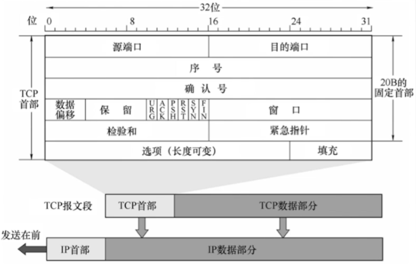
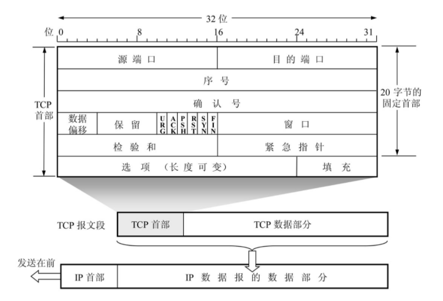

## 传输层

> 为应用层提供服务，使用网络层的服务。
>
> 传输层要向会话层提供通信服务的可靠性，避免报文的出错、丢失、延迟时间紊乱、重复、乱序等差错。

### 传输层的功能

1. 传输层提供进程和进程间的逻辑通信

2. 复用和分用（按端口号寻址）

   由于一个主机同时运行多个进程，因此运输层具有复用和分用功能

3. 流量控制、数据确认和重传

4. 分割与重组数据

5. 提供TCP和UDP协议

### TCP与UDP的区别

|                        TCP（报文段）                         |                UDP（用户数据报）                 |
| :----------------------------------------------------------: | :----------------------------------------------: |
|           `面向连接`的`传输控制协议`，`面向字节流`           |      `无连接`的`用户数据报协议`，`面向报文`      |
| 传输数据之前必须经过**三次会话**建立连接，数据传输完成需要经过**四次挥手**释放连接。 | 传输数据不需要连接，收到用户数据报之后无需确认。 |
|                    不提供广播和多播服务。                    |               提供广播和多播服务。               |
| 由于需要提供可靠的面向连接的服务，增加了开销：确认、流量控制、计时器及连接管理。 |                  UDP无拥塞控制                   |
|                  时延大，适用于大文件传输。                  |               时延小适用于及时通信               |
|                          首部20字节                          |                      8字节                       |
|                                                              |                                                  |
|                                                              |                                                  |
|                                                              |                                                  |

### 什么是端口寻址（分用复用）

复用：应用层所有的应用程序都可以通过传输层再传输到网络层。

分用：传输层从网络层收到的数据都可以交付到指定的应用进程。

### 什么时套接字

Socket =  主机IP + 端口号

### 常见端口

| 应用程序 | 端口号 |
| -------- | ------ |
| FTP      | 21     |
| TELNET   | 23     |
| SMTP     | 25     |
| DNS      | 53     |
| TFTP     | 69     |
| HTTP     | 80     |
| SNMP     | 161    |
| HTTPS    | 443    |

### UDP

UDP只在IP数据报服务之上增加了很少功能，即复用分用和差错检测功能。

UDP的主要特点：

1. UDP是无连接的，减少开销和发送数据之前的时延。
2. UDP使用最努力交付，即不保证可靠交付。
3. UDP是面向报文的，适合一次性传输少量数据的网络应用。
4. UDP无拥塞控制，适合很多实时应用。
5. UDP首部开销小，8字节，TCP要20字节。

### UDP的首部

分用时找不到对应的目的端口号，就丢弃报文，并给发送方发送ICMP“端口不可达”差错报告报文。

### UDP校验

伪首部只有在计算检验和时才出现，不向下传送也不向上递交。

17：封装UDP报文的IP数据报首部协议字段是17。

UDP长度：UDP首部8字节+数据部分长度（不包括伪首部）。

**发送端**

1. 填上伪首部
2. 全0填充检验和字段
3. 在数据部分长度不足4字节的整数倍时，通过全0补足。
4. 伪首部 + 首部 + 数据部分采用16位二进制反码运算求和，然后求反码
5. 填入检验和字段
6. 去掉首部向下传递给网络层

**接收端**

1. 添上伪首部
2. 伪首部 + 首部 + 数据部分采用二进制反码运算求和
3. 结果全为1，则无差错。否则丢弃数据报或者交给应用层附上出差错的警告。

**为什么接收端全为1表示无差错**

因为在发送的时候计算的是所有字段反码运算求和之后的反码，而在发送时参与运算的检验和字段全为0，不会影响最后的计算结果，而最后将计算得到的反码添加到检验和相当于是做了一个互补的操作。

### TCP协议的特点

1. TCP是面向连接的传输协议。

2. 每一条TCP连接只能由两个端点，每一条TCP连接只能是点对点的。

3. TCP提供可靠交付的服务，无差错、不丢失、不重复、按需到达。

4. TCP提供全双工通信。

   发送缓存：准备发送的数据&已发送但未收到确认的数据。

   接收缓存：按需需到达但没有被应用程序读取的数据；非有序到达的数据。

5. TCP面向字节流

   TCP把应用程序提交下来的数据堪称仅仅是一连串的无结构字节流。

### TCP报文段的首部

**序号**

在一个TCP连接中传送的字节流中的每一个字节都按顺序编号，序号字段表示当前报文所发送数据的第一个字节序号。

**确认号**

期望收到对方下一个报文段的第一个数据字节的序号。若确认号为N，则证明到序号N-1为止的所有数据都已正确收到。

**数据偏移（首部长度）**

TCP报文段的数据起始处距离TCP报文段的起始处的距离，以4B为单位，一个数值是4B。

**紧急位URG**

URG位1时，标明此字段中有紧急数据，是高优先级的数据，应尽快传送，不用再缓存里排队，配合紧急指针字段使用。

**确认位ACK**

ACK=1时确认号有效，在连接建立后所有传送的报文段都必须把ACK置为1。

**推送位PSH**

PSH=1时，接收方尽快交付接收应用程序，不再等到缓存填满再向上交付。

**复位RST**

RST=1时，表明TCP连接中出现严重差错，必须释放连接，然后再重新建立传输连接。

**同步位SYN**

SYN＝１时，表明是一个连接请求／连接接受的报文。

**终止位FIN**

FIN = 1时，表明此报文段发送的是一个数据已发完，要求释放连接。

**窗口**

指的是发送本报文段的一方的接收窗口，即现在允许对方发送的数据量。

**校验和**

校验首部 + 数据，校验时要加上12B伪首部，第四个字段为6.

**紧急指针**

URG=1时才有意义，指出本段报文中紧急数据的字段字节。

**选项**

最大报文段长度MSS、窗口扩大、时间戳、选择确认....

**填充**

当选项字段不满4B的整数倍时，用0填充。

### TCP三次握手

### SYN洪泛攻击

SYN洪泛攻击发生在OSI第四层，这种方式利用TCP协议的特性，就是三次握手。攻击者发送TCP SYN， SYN是TCP三次握手中的第一个数据报，而服务器返回ACK后，改攻击者就不对其进行再确认，那这个TCP连接就处于挂起状态，也就是半连接状态，服务器收不到再确认的话，还会重复发送ACK给攻击者。这样更加会浪费服务器的资源。攻击者就对服务器发送非常大量的这种TCP连接，由于每一个都没法完成三次握手，所以再服务器上，这些TCP连接会因为挂起状态而消耗CPU和内存，最后导致服务器可能死机，就无法为正常用户提供服务。

**防范措施**

1. 降低SYN timeout时间，使得主机尽快释放半连接的占用。

2. 采用SYN cookie设置，如果短时间内收到了某个IP的重复SYN请求，我们就认为受到了攻击。

   在TCP服务器收到TCP SYN包并返回TCP SYN+ACK包时，不分配一个专门的数据区，而是根据这个SYN包计算出一个cookie值。在收到TCP ACK包时，TCP服务器在根据那个cookie值检查这个TCP ACK包的合法性。如果合法，再分配专门的数据区进行处理未来的TCP连接。

3. 可以考虑防火墙拦截部分外部网络。

### 四次挥手

### TCP可靠传输

> 可靠：保证接收方进程从缓存读出的字节流与发送方发出的字节流是完全一样的。

**TCP实现可靠传输的机制**

1. 校验

   增加伪首部,反码运算求伪首部、首部、数据部分的和，添加到校验和字段。

   在接收方同样的方法进行反码求和，看结果是否全为1.如果是数据正确。如果不是，丢弃或者标记错误提交给应用层处理。

2. 序号

   一个字节占一个序号，通过序号字段标记每次报文段的第一个字节的序号。

3. 确认、重传

   确认重传不分家。

   TCP的发送方在规定时间内没有收到ACK确认，就重传已发送的报文段。

   TCP改用自适应算法，动态改变重传时间RTTs（加权平均往返时间）。

**冗余ACK（冗余确认、快速重传）**

发送一个冗余ACK，指明下一个期待字节的序号。

服务器收到三次来自客户端的冗余ACK就会定义该报文段丢失，然后重传。

### TCP流量控制 - 滑动窗口

流量控制：让**发送方慢**点，要让接收方来得及接收。

TCP利用滑动窗口机制实现流量控制。

在通信过程中，接收方根据自己**接收缓存的大小**，动态的调整发送方的**发送窗口**大小，即接收窗口rwnd（接收方设置确认报文段的窗口字段来讲rwnd通知给发送方）。发送方的发送窗口取接收窗口rwnd和拥塞窗口cwnd的最小值。

### 流量控制的方法

**停止-等待协议**

每发完一个报文段就停止发送，等待对方确认，在收到确认后再发送下一个帧。

**滑动窗口协议**

- 后退N帧协议(GBN)

  发送窗口>1，接收窗口=1

- 选择重传协议(SR)

  发送窗口>1，接收窗口>1

### 零窗口探测报文段

TCP为每一个连接设有一个持续计时器，只要TCP连接的一方收到对方的零窗口通知，就启动持续计时器。

如果持续计时器的时间到期，就发送一个零窗口探测报文段。接收方收到探测报文段时给出现在的窗口值。

若窗口值仍然时0，那么就重新设置持续计时器的值。

### 流量控制与拥塞控制的区别

流量控制是接收端来不及接收发送端发送的数据，通知发送端降低发送的速度。端到端的控制。

拥塞控制是A与B之间的网络发生堵塞导致传输过慢或者丢包，来不及传输。防止过多的数据注入到网络中，这样可以使网络中的路由器或链路不至于过载。拥塞控制是一个全局性的过程，涉及到所有的主机、路由器，以及与降低网络性能有关的所有因素。

### 拥塞控制算法

> 拥塞窗口：根据自己对网络拥塞程度的评估设置窗口值，反应网络当前容量。

**满开始与拥塞避免**

**快重传与快恢复**

### 建立连接后，Client出现故障怎么办？

## 常见面试题

### 1. 数据传输速率S的单位是

`bps`

### 2. TCP/IP

支持异种计算机网络互联的通信协议

### 3. OSI七层概念模型（四五七）

上层依赖下层

- 物理层

  物理层是最低的一层，它是OSI协议的基础，定义了物理设备的标准，还定义了电压跳变0和1的表示形式（编码），以及接收方如何识别发送方发送的比特（数模转换）。

- 数据链路层

  数据链路层的任务是将网络层交下来的 IP 数据报组装成帧，在两个相邻结点之间的链路上传输帧，每一帧包括数据和必要的控制信息（同步信息、地址信息、差错控制等）。

  数据链路层的协议有 PPP、CSMA/CD 等。

  数据链路层使用的中间设备是网桥或桥接器。

  

  在传输比特流的过程中可能会出现错传、传输不完整。然后就需要在数据链路层完成错误检测和纠正，以此提供了数据传输的可靠性。

  同时交换机工作在这一层，在发送数据的时候，还负责将上层提交的ip数据报封装成帧，在相邻节点的链路上进行传输。

- 网络层

  网络层负责为分组交换网上的不同主机提供通信服务，在发送数据时，会将传输层的报文段或用户数据报封装成分组或包进行一个点到点的数据传输。

  然后再在点对点通信的过程中，可能会有多个节点，如何找到目标节点和最佳路径，需要用到路由选择的能力，使网络中的路由器找到正确的目的主机。

  网络层的主要功能是将网络地址翻译成对应的物理地址，并将数据从发送方路由到接收方。

- 传输层

  为主机之间端到端的通信提供通用的数据传输服务。

  在传输层有主要的传输控制协议TCP协议，他提供面向链接可靠的数据传输服务（报文段）；

  用户数据报协议UDP协议，它提供无连接的、尽最大努力交付数据的传输服务（用户数据报）；

- 会话层

  当两个进程间的通信建立完毕，会话层会负责到会话的同步和管理，以及最后的结束会话。

- 表示层

  主要完成的一些数据的格式转换，解密加密，压缩恢复

- 应用层

  通过报文进行数据交互，直接为应用进程提供服务。

  应用层协议有域名系统 DNS、支持万维网应用的 HTTP、支持电子邮件的 SMTP

### 4. TCP的三次握手和四次挥手

**三次握手**

- 如果客户端和服务端都处于关闭的状态，那么服务端应该首先TCP服务器创建一个传输控制块TCB，然后服务器便处于一个监听状态。客户端要向服务器发起链接请求也应该建立一个传输控制块。

- 此时，客户端向服务器发起连接请求，tcp报文段中同步位SYN的值被置为1，报文段的seq序列号的值为一个系统生成的随机值。

  当请求报文段发送完毕之后，客户端请入同步已发送状态。

- 当服务器收到客户端的报文段，如果服务器同意建立连接，那么服务器会响应一个报文段给客户端。报文段的同步位SYN和确认位都为1，32位确认号为客户端传递过来的序列号的值加1，而服务器返回的序列号为一个系统生成的随机值。

  当响应的发送完毕，此时的服务器处于同步已接收的状态。

- 在客户端收到服务器的连接响应之后，在客户端看来，它已经能够向服务器发送报文段，并且能够得到服务器的响应。但在服务器来说，它只能确定能够收到客户端的数据，而服务确认客户端能够收到他的响应。

- 所以，客户端需要再次向服务端发起一个确认。其确认为ACK为1，确认号为服务器响应的序列号的值加1。而在TCP协议中规定，确认数据包是可以携带数据的，所以此时如果数据包中携带了数据，序列号seq的值应该加上数据的长度。如果没有携带数据，那么seq可以不用消耗，为之前服务器返回的确认码。

- 最后确认数据包发送完毕，客户端进入连接已建立的状态。而服务器在收到数据包之后也同样进入连接已建立状态。此时，客户端与服务器完成三次握手，连接建立。

**四次挥手**

-  首先客户端与服务器都处于连接已建立的状态。

- 客户端需要断开连接，需要主动向服务器发起一个连接释放报文段。结束位FIN置为1，序列号seq为已发送过的数据的最后一个字节的序列号加1。TCP规定FIN报文段不携带数据也要消耗一个序列号。

  客户端进入终止等待1阶段。

- 当服务器收到释放连接的报文段，回想客户端返回一个确认报文段，告诉客户端以收到断开连接的请求。报文段的确认位ACK=1，确认号ack=客户端传来的序列号加1，序列号seq为服务端已经发送的字节的最后一个序列加1。

  关闭等待状态。

- 而客户端在收到服务器的确认报文段之后，便不再向服务器发送报文段。但是对于服务器传来的消息，客户端依然可以收到。

  半关闭状态。客户端处于终止等待2阶段。

- 服务端同时也会通知对应的应用进程释放连接，当应用进程释放连接并不再发送数据，那么此时服务端会再次发送一个连接断开的报文段，结束位FIN和确认位ACK都置为1，确认号不变，如果在通知应用进程释放连接期间没有继续发送报文段，那么序列号seq不变。如果发送了报文段，则seq需要加上在此期间发送过的数据长度。

  服务端进入最后等待状态。

- 当客户端收到来自服务端的确认断开连接之后，客户端会再次发起确认，ACK为1，确认号为服务端返回的序列号+1，序列号为服务端返回的确认号 ，因为在此期间，客户端不能再发送数据。

  时间等待状态。

- 此时客户端会进入一个两倍最长报文寿命时间的等待期，以确保服务端在没有收到确认报文段的情况下再次发出的释放连接请求能够被收到。

- 服务端会在收到确认报文之后关闭，而客户端会在2倍MSL之后关闭。

### 5. 四次挥手中的第三次挥手之后，假如服务端一直等不到客户端的应答，会怎么样?

服务端超时重传，客户端2倍最长报文寿命时间等待。

### 6. 为什么客户端需要下TIME-WAIT状态等待2MSL的时间？

1. 保证客户端发送的最后一个ACK报文段能够到达服务端。因为ACK报文段有可能丢失，而使得处于LAST-ACK状态的服务端收不到ACK报文段。服务端会超时重传FIN报文段，而客户端在2MSL的时间里也能再次重传ACK报文段，并重新计时。最后客户端和服务端都能正常断开连接。
2. 防止“已失效的连接请求报文段”出现在新连接中。在2MSL时间内，本次连接所产生的报文段都能从网络中消失，就不会出现在新的连接中出现旧的连接的报文段。

### 7. 为什么连接的时候需要3次，而断开的时候需要四次？

这是由于TCP的半关闭造成的,因为TCP连接是全双工的（数据可在两个方向上同时传递）。所以进行关闭时每个方向上都要单独进行关闭,这个单方向的关闭就叫半关闭。关闭的方法是一方完成它的数据传输后,就发送一个FIN来向另一方通告将要终止这个方向的连接，收到这个FIN表示这个方向上再没有数据流动，但是收到FIN的那一端仍然可以发送数据。但在发生这个过程以后，服务端可能需要继续发送数据（这个阶段是close_wait）,在服务端也确保需要关闭的时候，服务端再发送FIN，尝试去关闭。

### 8. 客户端与服务端已经建立连接，但是客户端的主机突然出现故障。

在这种情况下，TCP他有一个**保活计时器**。然后服务器器每次发收到客户端的数据都会重新设置这个保活计时器的值。如果一段时间（两个消失）没有收到客户端的数据，服务器就会发送一个**探测报文段**，以后每隔一段时间（75秒）就发送一次。若一连发送10个探测报文段都没有得到客户端的响应，那么服务器就认为客户端已经故障，便会关闭这个连接。

### 9. 滑动窗口机制：流量控制

滑动窗口机制主要被TCP用来实现流量控制，以防止发送方发送数据的速度过快，导致接收方接收不过来。

采用的方法组要是通过接收方根据自己接收的缓存的大小，在返回的ACK确认报文段的首部对窗口字段进行设置，接收端根据这个窗口值动态的调整自己的发送窗口，以达到流量控制的目的。

## 应用层

### 域名系统DNS

> 域名系统（英文：Domain Name System，缩写：DNS）是互联网的一项服务。它作为将域名和IP地址相互映射的一个分布式数据库，能够使人更方便地访问互联网。DNS使用TCP和UDP端口53。当前，对于每一级域名长度的限制是63个字符，域名总长度则不能超过253个字符。

