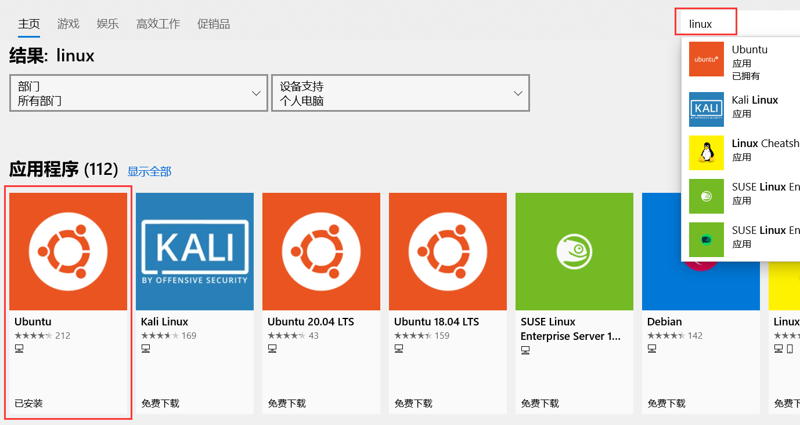

# 适用于 Linux 的 Windows 子系统安装指南

> windows系统官网：https://docs.microsoft.com/zh-cn/windows/wsl/install-win10


- 安装适用于 Linux 的 Windows 子系统

```powershell
dism.exe /online /enable-feature /featurename:Microsoft-Windows-Subsystem-Linux /all /norestart
```


- 启用Windows Subsystem for Linux可选组件

```powershell
Enable-WindowsOptionalFeature -Online -FeatureName Microsoft-Windows-Subsystem-Linux
```


- 打开windows store搜索linux

  

- 安装成功。启动输入用户名和密码。


# Windows10的Linux子系统(ubuntu)开启ssh

**重装ssh服务**

```shell
sudo apt remove --purge openssh-server

sudo apt install openssh-server
```


**修改默认配置**

```shell
sudo nano /etc/ssh/sshd_config

Port 22 # 把这一行前面的#去掉
PasswordAuthentication yes # 改成yes
PermitRootLogin no # 如果你需要用 root 直接登录系统则此处改为 yes;passwd root # 设置下密码
```


**重启服务**

```shell
sudo service ssh restart
```